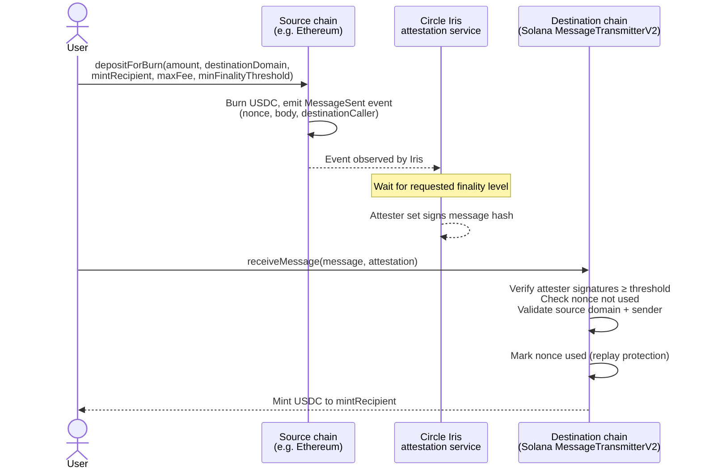
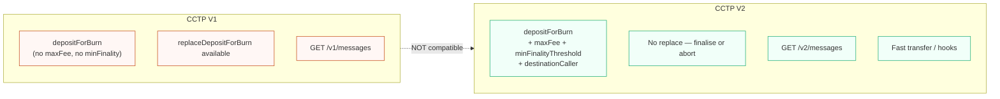
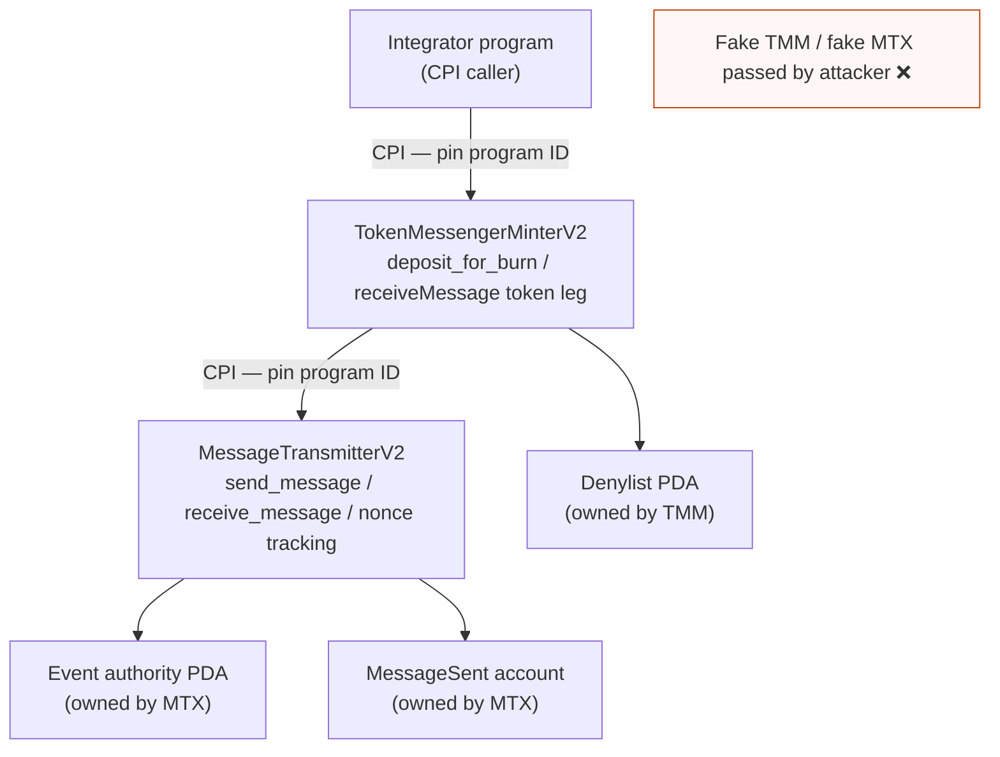
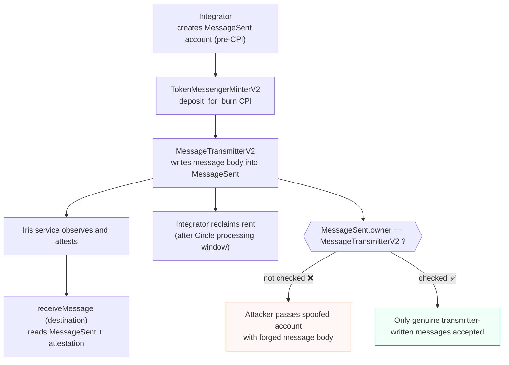
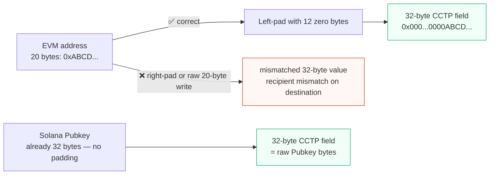
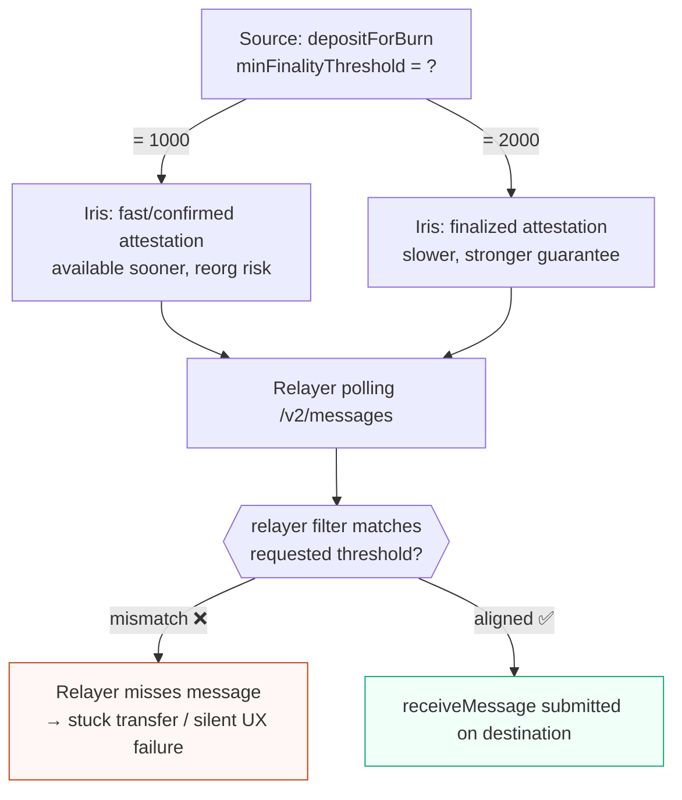
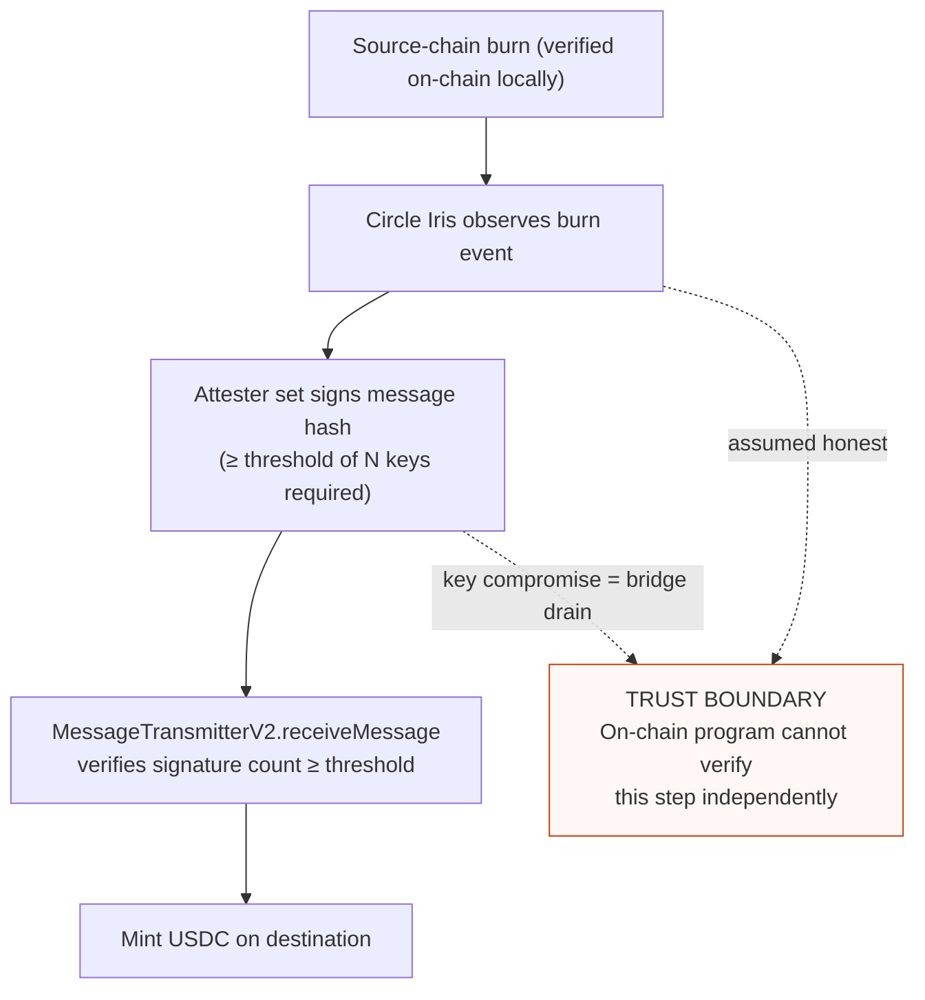
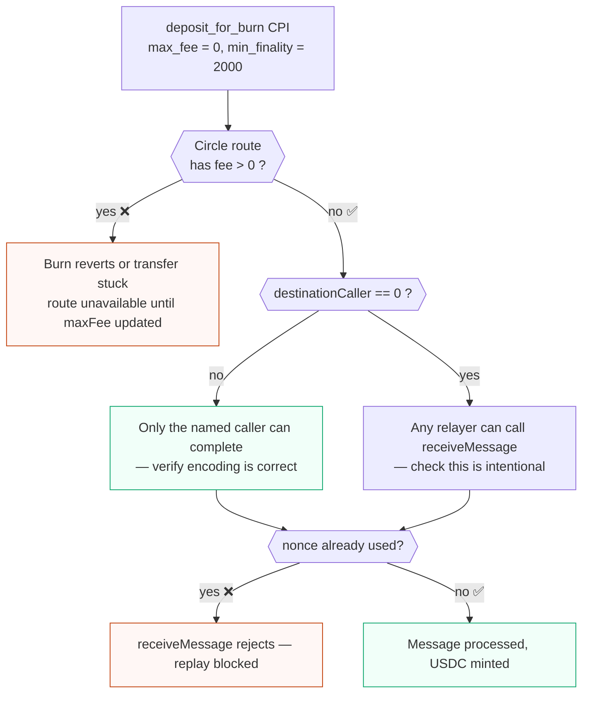

# CCTP V2 primer for Solana auditors

Circle Cross-Chain Transfer Protocol is not a generic bridge where the Solana program proves another chain's state. The source chain burns USDC and emits a Circle message, Circle's Iris attestation service signs that message after the requested finality level, and the destination chain's `MessageTransmitterV2` accepts the message plus attestation before minting or releasing USDC through the token messenger/minter path.

For a Solana auditor, the important boundary is therefore split between:

- on-chain account and instruction validation in the local CCTP programs;
- Circle domain, nonce, finality, fee, denylist, and recipient encoding rules;
- off-chain attester behavior and operational assumptions.


<span class="figcap">End-to-end CCTP V2 flow. Every arrow crossing the dashed trust boundary depends on Circle's attester set — the on-chain program only validates the signed message, not the source-chain state directly.</span>

## V1 to V2 deltas

V2 introduces new program or contract addresses and should be treated as a separate integration target from V1. Do not reuse V1 account ordering, instruction layouts, attestation endpoints, or operational assumptions without checking the V2 docs and IDL.

Key audit deltas:

- `destinationCaller` is now part of the burn flow. A zero 32-byte value means any caller may submit the destination `receiveMessage`; a nonzero value restricts who can complete the destination message.
- `maxFee` is part of the burn parameters. It caps the fee Circle may take for the route. `0` means the integrator expects a no-fee route.
- `minFinalityThreshold` requests the minimum finality level the attestation must satisfy.
- V2 attestations are fetched through the `/v2/messages` API, not the V1 endpoint.
- V2 supports fast transfer concepts and hooks that do not exist in the same way in V1.
- There is no V2 equivalent of V1 `replaceDepositForBurn`; auditors should not assume a failed recipient or caller choice can be corrected by a V1-style replacement flow.


<span class="figcap">V1 and V2 are separate integration targets — reusing V1 assumptions in a V2 integration is a common audit finding.</span>

## Solana program split

CCTP V2 on Solana separates message transmission from token burn/mint accounting:

- `TokenMessengerMinterV2` handles token messenger/minter instructions such as `deposit_for_burn`.
- `MessageTransmitterV2` handles message emission, attestation consumption, nonce tracking, and receive-side message processing.

This split matters in CPI review. Pin the exact program IDs, then validate that every account consumed by each program belongs to the expected half of the protocol. A fake token messenger, fake message transmitter, wrong event authority, or wrong denylist PDA is a bridge account-substitution bug, not just an ordinary bad account list.


<span class="figcap">Each CPI hop must pin the program ID. Swapping any program with a look-alike is the bridge account-substitution attack.</span>

```rust
// ❌ BAD: CPI target program IDs taken from caller-supplied accounts.
pub token_messenger: UncheckedAccount<'info>,
pub message_transmitter: UncheckedAccount<'info>,
// An attacker passes look-alike programs; the CPI succeeds but mints nothing
// or routes funds to the attacker.

// ✅ GOOD: pin both program IDs to the known CCTP V2 addresses. // illustrative
#[account(address = token_messenger_minter_v2::ID)]
pub token_messenger: Program<'info, TokenMessengerMinterV2>,
#[account(address = message_transmitter_v2::ID)]
pub message_transmitter: Program<'info, MessageTransmitterV2>,
```

## Persistent `MessageSent` accounts

CCTP V1 integrations often treated the emitted message as ephemeral event data. On Solana V2, `MessageSent` is represented by a persistent account created for the burn/message flow and owned by `MessageTransmitterV2`. Integrators may need to create this account before the CPI and reclaim it after Circle's processing window.

Audit checks:

- The `MessageSent` account must be owned and written by the expected message transmitter program.
- The account must correspond to the specific burn/message being attested.
- Reclaim logic must not let arbitrary users drain rent from unrelated message accounts.
- The event or message account must not become the sole security check for whether a burn happened; destination settlement still depends on the attested message.



```rust
// ❌ BAD: MessageSent account ownership not validated before reading message body.
/// CHECK: not checked — attacker can supply a spoofed account
pub message_sent: UncheckedAccount<'info>,
// Reading message_sent.data to settle a transfer trusts caller-supplied bytes.

// ✅ GOOD: enforce owner == MessageTransmitterV2 before trusting any field. // illustrative
#[account(owner = message_transmitter_v2::ID)]
pub message_sent: Account<'info, MessageSent>,
// Also verify message_sent.nonce matches the specific burn being settled,
// and that the attested message hash covers this account's data.
```

## Domain and address encoding

Circle domains are not EVM chain IDs and not Solana cluster IDs. They are Circle-defined domain identifiers. An auditor should keep a route table that explicitly maps source domain, destination domain, source program, destination program, and token mint for the route under review.

CCTP message address fields are 32 bytes. EVM addresses are 20 bytes and must be embedded consistently in a 32-byte field, typically left-padded with zeros. Solana public keys are already 32 bytes. Reviewers should look for:

- right-padding or raw 20-byte writes into a 32-byte field;
- comparing an EVM chain ID to a Circle domain;
- treating a Solana `Pubkey` as equivalent to an EVM address;
- allowed-domain lists that include the right chain but the wrong Circle domain;
- recipient or caller encoding that differs between local tests and production clients.



```rust
// ❌ BAD: copies only 20 bytes — trailing 12 bytes are zeroed by accident,
//         which is right-padding rather than left-padding.
let mut recipient_field = [0u8; 32];
recipient_field[..20].copy_from_slice(&evm_address); // right-padded ❌

// ✅ GOOD: left-pad so the 20-byte address occupies the LAST 20 bytes.
let mut recipient_field = [0u8; 32];
recipient_field[12..].copy_from_slice(&evm_address); // left-padded ✅

// ❌ BAD: confuses EVM chain ID with Circle domain ID.
let destination_domain: u32 = 1; // "Ethereum mainnet chain ID" — WRONG
// Circle domain for Ethereum mainnet is a different constant entirely.

// ✅ GOOD: use Circle's documented domain constants, not chain IDs. // illustrative
use cctp_domains::ETHEREUM_MAINNET; // Circle-defined domain constant
let destination_domain: u32 = ETHEREUM_MAINNET;
```

## Finality threshold semantics

CCTP V2 uses finality thresholds to distinguish faster and stronger attestation assumptions. The important constants for most integrations are:

- `1000`: fast/confirmed style finality, with faster availability but more reorg/insurance assumptions.
- `2000`: finalized/standard finality, slower but stronger.

Using `minFinalityThreshold = 2000` is a conservative default, but it is still an integration choice. Auditors should verify that the front end, relayer, backend polling, and destination settlement code all expect the same threshold. A relayer polling only for fast messages while the source requested finalized messages can create stuck transfers or misleading UX.



```rust
// ❌ BAD: source requests finalized (2000) but relayer polls only fast (1000)
//         messages — the attestation is never picked up; transfer is stuck.
// On-chain (source side):
let min_finality_threshold: u32 = 2000; // finalized requested
// Off-chain relayer (bug):
// GET /v2/messages?minFinalityThreshold=1000  // only picks up fast messages

// ✅ GOOD: relayer filter matches what the source program emits.
// On-chain:
let min_finality_threshold: u32 = 2000;
// Off-chain relayer:
// GET /v2/messages?minFinalityThreshold=2000  // aligned ✅
// Or: poll for both thresholds and let the on-chain program enforce the bound.
```

## Attester trust model

CCTP security includes Circle's attester set and Iris service. The local Solana program can validate message format, nonce reuse, source domain, destination domain, caller, recipient, and signature acceptance by `MessageTransmitterV2`, but it cannot independently prove the source-chain burn without trusting Circle's attestation system.

Practical review points:

- Treat attester keys and message transmitter ownership/admin powers as privileged infrastructure.
- Check upgrade/admin controls for both messenger and transmitter programs.
- Model attestation service downtime and delayed messages as operational failure modes.
- Do not describe CCTP as trustless bridging in audit notes; state the Circle attester assumption explicitly.


<span class="figcap">The on-chain program validates signatures and nonces, but the root trust is in Circle's attester key set. Any audit note describing CCTP as trustless bridging is incorrect.</span>

```rust
// ✅ Signature threshold check — illustrative of what MessageTransmitterV2 enforces.
// Auditors should verify the on-chain program reads attester_manager config
// and requires signatures >= threshold, NOT a hardcoded 1-of-N.
//
// ❌ BAD pattern to watch for in integrator wrappers:
pub fn relay_message(ctx: Context<RelayMessage>, message: Vec<u8>, attestation: Vec<u8>) -> Result<()> {
    // Skips the CPI to MessageTransmitterV2 entirely and just mints directly
    // based on a decoded message body — NO signature verification!
    let body = MessageBody::decode(&message)?;
    mint_usdc(ctx.accounts.mint_recipient, body.amount)?; // ❌ no attestation check
    Ok(())
}

// ✅ GOOD: always go through MessageTransmitterV2.receiveMessage via CPI;
//          never short-circuit attestation verification in integrator code.
pub fn relay_message(ctx: Context<RelayMessage>, message: Vec<u8>, attestation: Vec<u8>) -> Result<()> {
    let cpi_ctx = CpiContext::new(
        ctx.accounts.message_transmitter.to_account_info(),
        ReceiveMessage {
            // ... all required accounts including used_nonces, attester_manager ...
        },
    );
    message_transmitter_v2::cpi::receive_message(cpi_ctx, message, attestation)?; // ✅
    Ok(())
}
```

## Audit-relevant invariants

For a router or integrator that hardcodes `min_finality_threshold = 2000` and `max_fee = 0`, the intended invariant is:

> The route only emits finalized/standard messages and only when Circle charges no fee for that route.

The failure mode if Circle later enables fees on that route is not silent value loss. The burn should fail or remain unprocessable because the requested maximum fee is lower than the required fee. That can strand the user at the source-side UX layer as a failed transfer path, break automated routing, or make a previously healthy instruction permanently unusable until the integrator updates `maxFee`. Auditors should flag this as an availability and configuration-risk invariant:

- If the integrator wants no-fee-only transfers, assert and document that policy.
- If fees may be enabled, expose `maxFee` as a bounded parameter and test fee-enabled routes.
- Ensure off-chain estimators and relayers surface "fee exceeds maxFee" distinctly from generic CCTP failure.

Other CCTP V2 invariants worth writing tests for:

- source and destination domains are Circle domains, not chain IDs;
- every CPI target program ID is pinned;
- the denylist PDA and event authority are derived from the expected CCTP programs;
- EVM recipients and destination callers use correct 20-to-32-byte padding;
- duplicate nonces and replayed messages are rejected by the destination transmitter;
- zero `destinationCaller` is only used when any destination submitter is acceptable.



```rust
// ❌ BAD: hardcoded zero destinationCaller when the protocol requires a
//         specific relayer — any actor can front-run and complete the message.
let destination_caller = [0u8; 32]; // any caller ❌ — unintentional open relay

// ✅ GOOD: encode the expected destination caller explicitly; use zero only
//          when open relay is deliberate and documented.
let mut destination_caller = [0u8; 32];
destination_caller[12..].copy_from_slice(expected_evm_relayer.as_bytes()); // left-padded ✅
// For a Solana destination caller:
let destination_caller: [u8; 32] = expected_solana_relayer.to_bytes();

// ❌ BAD: maxFee hardcoded as a magic number with no config path.
const MAX_FEE: u64 = 0; // silently breaks if Circle enables fees on this route

// ✅ GOOD: expose maxFee as a bounded config parameter; document the invariant.
#[account(mut, has_one = admin)]
pub config: Account<'info, RouterConfig>,
// config.max_fee is set by admin; default 0 is documented + monitored.
```

## References

- Circle CCTP technical guide: https://developers.circle.com/cctp/references/technical-guide
- Circle CCTP Solana programs: https://developers.circle.com/cctp/references/solana-programs
- Circle V1 to V2 migration guide: https://developers.circle.com/cctp/migration-from-v1-to-v2
- ChainSecurity CCTP V2 audit: https://reports.chainsecurity.com/Circle/ChainSecurity_Circle_CCTPV2_Audit.pdf
- OtterSec EVM CCTP V2 audit: https://6778953.fs1.hubspotusercontent-na1.net/hubfs/6778953/PDFs/public_evm_cctp_audit_final%20%282%29.pdf
- OpenZeppelin Sponsored CCTP Deposits from Solana audit: https://www.openzeppelin.com/news/sponsored-cctp-deposits-from-solana-audit
