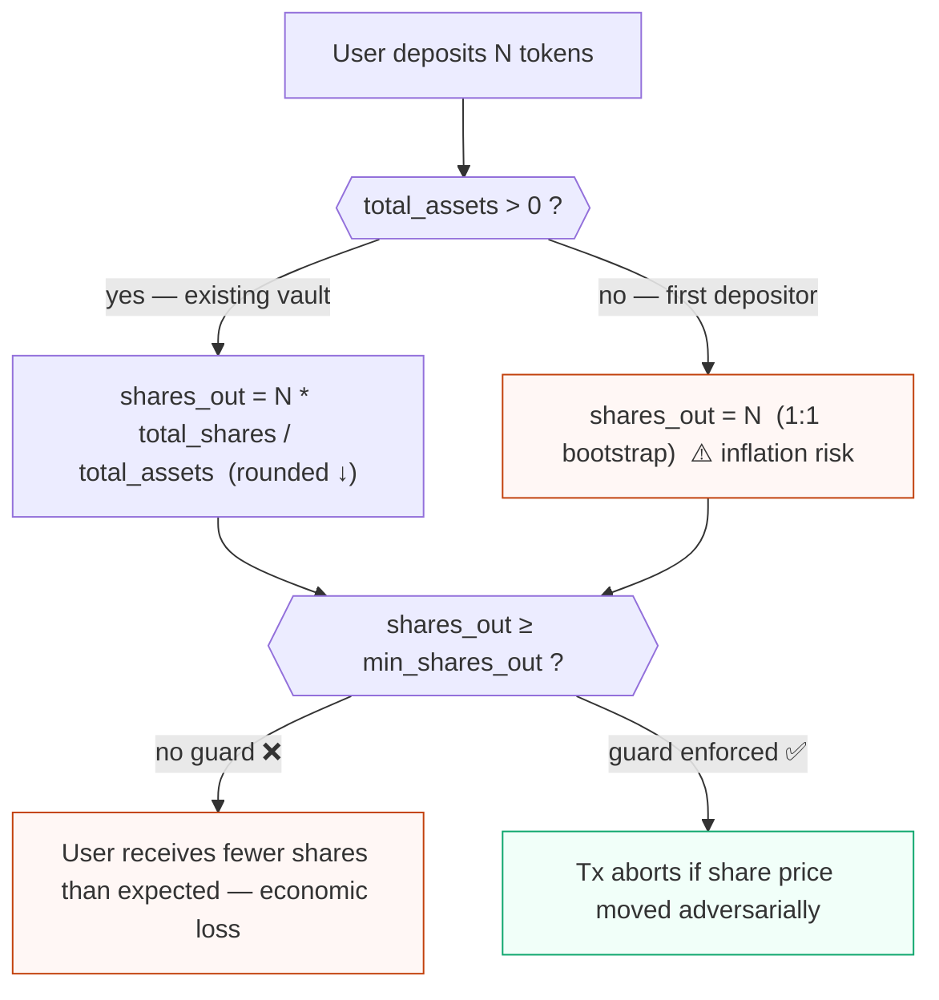
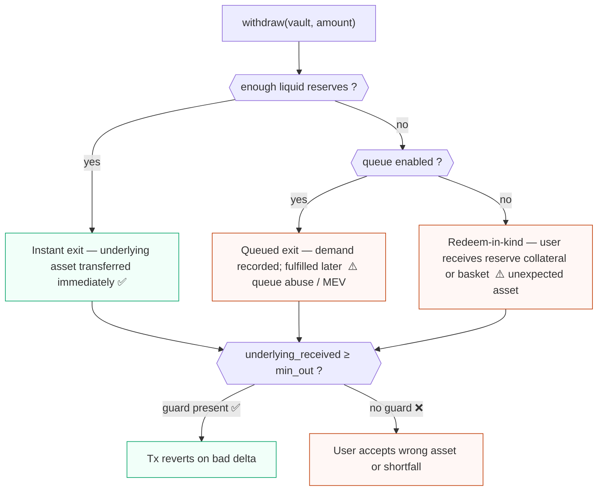
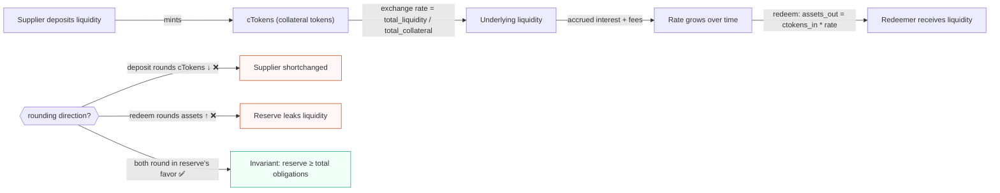
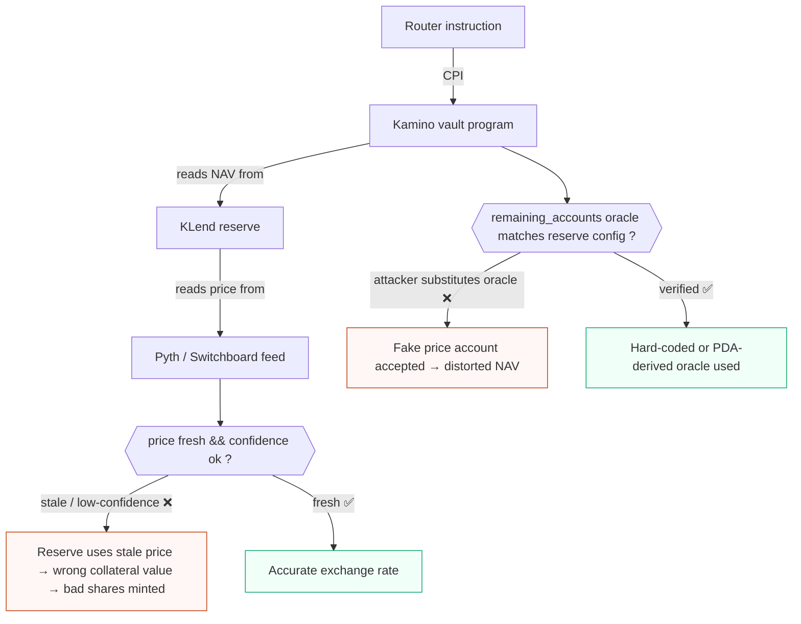
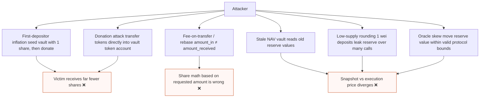
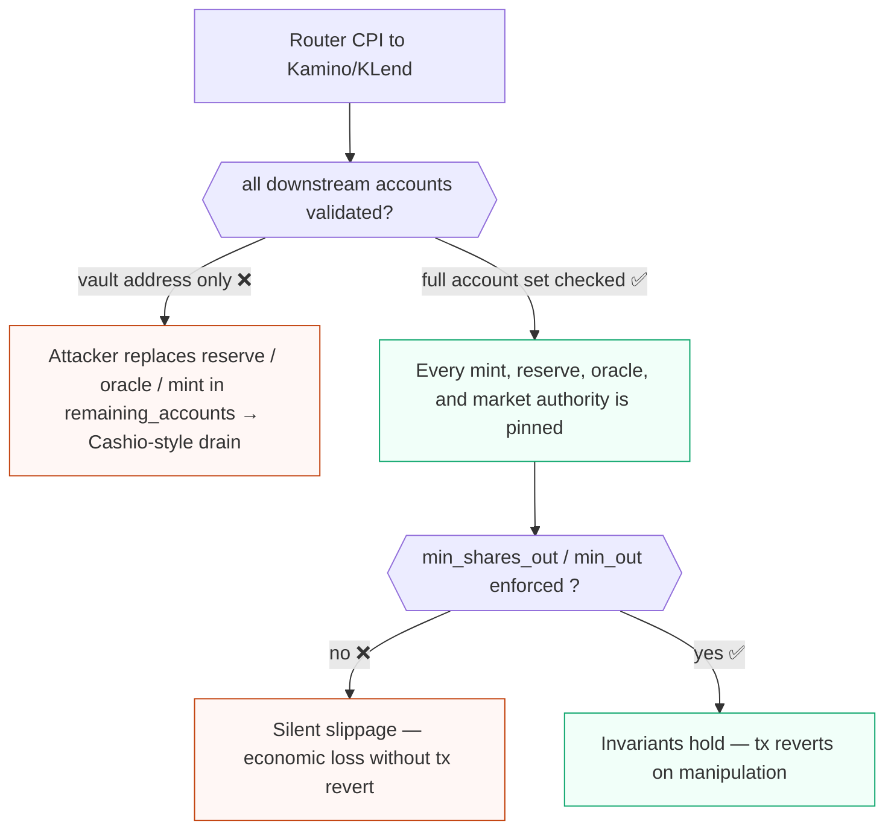

# Kamino kvault and KLend primer

Kamino vaults and KLend reserves add a second protocol's accounting and oracle assumptions behind the local program under review. A router can validate its own accounts and still expose users to economic loss if it forwards attacker-chosen Kamino/KLend accounts, accepts an adversarial share price, or assumes a withdraw slippage check protects a deposit path.

## Kamino kvault share semantics

Kamino lending vault shares are claims on net asset value (NAV). A deposit does not mint a fixed receipt amount for a fixed asset amount. It mints shares at the current vault share price:

```text
shares_out ~= deposit_assets * total_shares / total_assets
```


<span class="figcap">Vault share minting. The first-depositor path and any missing <code>min_shares_out</code> guard are the two primary audit targets.</span>

Withdrawals burn shares and return assets according to the later share price. That means the auditor should reason about:

- total assets, including deployed reserve positions and pending liquidity;
- total shares and low-supply edge cases;
- fee accrual and performance/management fee effects;
- stale or delayed NAV updates;
- rounding direction on deposit and withdraw.

A valid Kamino vault account is not enough. The integrator must prove the vault, share mint, underlying mint, reserve dependencies, token accounts, and CPI account order all describe the same economic position.

```rust
// ❌ BAD: no min_shares_out — attacker inflates share price between user's
//         simulation and execution; user receives far fewer shares.
pub fn deposit(ctx: Context<Deposit>, amount: u64) -> Result<()> {
    kamino_cpi::deposit(ctx.accounts.into_kamino_ctx(), amount)?;
    // shares minted are never checked
    Ok(())
}

// ✅ GOOD: enforce a caller-supplied minimum so price manipulation reverts.
pub fn deposit(ctx: Context<Deposit>, amount: u64, min_shares_out: u64) -> Result<()> {
    let shares_before = ctx.accounts.user_share_ata.amount;
    kamino_cpi::deposit(ctx.accounts.into_kamino_ctx(), amount)?;
    ctx.accounts.user_share_ata.reload()?;
    let shares_received = ctx.accounts.user_share_ata.amount
        .checked_sub(shares_before)
        .ok_or(MyError::MathOverflow)?;
    require!(shares_received >= min_shares_out, MyError::SlippageExceeded);
    Ok(())
}
```

## Exit paths

Kamino vault withdrawals can be shaped by reserve liquidity and vault configuration. Review the exact instruction and account list in scope, then classify which exit path it exercises:

- instant exit, where enough liquidity is available and the user receives the underlying asset immediately;
- queued exit, where withdrawal demand is recorded and fulfilled later;
- redeem-in-kind or reserve-position exits, where the user may receive reserve collateral or a basket of assets instead of a simple underlying-token transfer.


<span class="figcap">Exit path decision tree. A <code>min_out</code> guard only protects the final token delta of whichever path was chosen — it does not verify which path was selected.</span>

For routers, this classification matters because a `min_out` check on the final token delta only protects the last asset transfer. It does not prove the selected path was expected, that queued state cannot be abused, or that the `remaining_accounts` slice names the intended reserve dependencies.

## KLend cToken exchange-rate accounting

KLend reserves use collateral-token accounting similar to cToken-style lending markets. Supplying liquidity mints collateral tokens; redeeming collateral burns them for reserve liquidity at an exchange rate determined by reserve liquidity, borrow state, fees, and collateral supply.

Rounding direction is security-critical:

- deposits that round collateral shares down can harm suppliers;
- redeems that round assets up can leak reserve liquidity;
- low total collateral supply can amplify one-unit rounding errors;
- interest accrual or stale reserve refreshes can make a preview differ from execution.


<span class="figcap">cToken exchange-rate accounting. Every rounding decision must be audited for direction: deposit rounds <em>down</em> for the user (reducing supplier shares) and redeem rounds <em>up</em> for the reserve (over-reporting assets out) are both loss vectors.</span>

```rust
// ❌ BAD: redeem rounds assets_out UP — reserve leaks fractional lamports each call.
// illustrative; not exact KLend field names
let assets_out = (ctokens_in as u128)
    .checked_mul(exchange_rate_numerator as u128).unwrap()
    .checked_div(exchange_rate_denominator as u128).unwrap() as u64;
// integer division truncates, which rounds DOWN for the user — okay for supplier
// BUT if the formula is inverted or denominator/numerator swapped, rounding favors user.

// ✅ GOOD: use saturating/checked math and document rounding direction explicitly.
// Always round in the protocol's favor on redemptions (truncate assets_out).
let assets_out = (ctokens_in as u128)
    .checked_mul(reserve.liquidity.available_amount as u128)
    .ok_or(MyError::MathOverflow)?
    .checked_div(reserve.collateral.mint_total_supply as u128)
    .ok_or(MyError::MathOverflow)? as u64; // truncation = rounds DOWN = safe for reserve
```

Certora publicly documented a Kamino Lending precision-loss issue around redeem exchange-rate math. Treat that as a precedent: when reviewing KLend integrations, build small-number rounding tables and test the first-depositor, tiny-supply, and donation/skew cases.

## Oracle transitivity

A router may never read a price account directly, but it inherits oracle risk through Kamino and KLend. Vault NAV, reserve health, borrow limits, liquidation behavior, and exchange rates depend on Kamino's oracle stack, including Pyth, Switchboard, and protocol-specific configuration.

Audit questions:

- Which oracle accounts does the downstream instruction consume?
- Are oracle accounts supplied through `remaining_accounts`, hard-coded account ordering, or a reserve config?
- Does the downstream program enforce feed identity, freshness, confidence/deviation, status, and exponent normalization?
- Can stale reserve refresh or stale NAV state affect the shares minted or assets redeemed?
- Does the local router validate only a top-level vault/reserve while forwarding a malicious oracle or dependency account?


<span class="figcap">Oracle transitivity through the router → Kamino → KLend → price-feed chain. A router that validates only the vault address inherits every oracle risk in the downstream chain.</span>

## Share-price manipulation primitives

These primitives are useful exercises for any vault or lending integration:

- First-depositor inflation: an attacker seeds a vault with tiny shares, changes asset balance or NAV, then lets a victim deposit at a distorted price.
- Donation attack: assets are transferred directly into a vault/reserve token account, increasing assets per share without minting corresponding shares.
- Fee-on-transfer or rebasing mints: the amount sent differs from the amount received, so share math based on requested amount is wrong.
- Stale NAV: vault accounting uses old reserve values while execution uses current token balances or vice versa.
- Low-supply rounding: tiny deposits/redeems round to zero shares or leak assets over repeated calls.
- Oracle skew: a reserve or strategy value is moved within valid protocol state using flash liquidity or a thin market.


<span class="figcap">Share-price manipulation attack tree. Auditors should draft a PoC for each primitive against the vault/reserve under review.</span>

## Audit-relevant invariants

A depositing integrator without a `min_shares_out` guard is exposed to share-price manipulation. The missing guard means the user can deposit assets and receive fewer vault shares or collateral tokens than their off-chain quote expected. This is not fully mitigated by checking the vault address or the underlying mint, because the loss occurs through the current exchange rate.

Required deposit-side invariant:

```text
shares_or_ctokens_received >= user_or_integrator_min_shares_out
```

For withdrawals, a `min_out` guard is useful but narrower:

```text
underlying_received >= user_min_out
```

That only protects the final asset delta. It does not prove:

- the upstream shares were redeemed at a fair exchange rate;
- the reserve/vault account set was the intended one;
- a queued or redeem-in-kind path was not selected unexpectedly;
- oracle, NAV, or reserve refresh state was fresh and economically sane.

For CPI routers that forward Kamino/KLend accounts, add a separate account-set invariant:

```text
every downstream account consumed by Kamino/KLend is either locally validated
or derived from an approved vault/reserve/market configuration
```

Cashio-style fake-account attacks are directly relevant here. A valid-looking approval PDA or vault state is insufficient if the CPI account order lets an attacker replace a mint, reserve, oracle, market authority, collateral token account, or dependency account that the downstream program actually trusts.


<span class="figcap">Layered invariant checks for a CPI router. Account-set validation and slippage guards are independent layers — both are required.</span>

```rust
// ❌ BAD: router only checks the top-level vault address; remaining_accounts
//         are forwarded verbatim to Kamino CPI — attacker substitutes reserve/oracle.
pub fn route_deposit(ctx: Context<RouteDeposit>, amount: u64) -> Result<()> {
    require_keys_eq!(ctx.accounts.vault.key(), EXPECTED_VAULT, MyError::WrongVault);
    // remaining_accounts passed blindly — any oracle/reserve can be injected
    kamino_cpi::deposit_with_remaining(
        ctx.accounts.into_kamino_ctx(),
        ctx.remaining_accounts,
        amount,
    )?;
    Ok(())
}

// ✅ GOOD: validate the full account set AND enforce min_shares_out.
pub fn route_deposit(
    ctx: Context<RouteDeposit>,
    amount: u64,
    min_shares_out: u64,
) -> Result<()> {
    // 1. Pin every account Kamino will consume against an on-chain config PDA.
    let cfg = &ctx.accounts.approved_config; // PDA derived from known vault
    require_keys_eq!(ctx.accounts.vault.key(),   cfg.vault,   MyError::WrongVault);
    require_keys_eq!(ctx.accounts.reserve.key(), cfg.reserve, MyError::WrongReserve);
    require_keys_eq!(ctx.accounts.oracle.key(),  cfg.oracle,  MyError::WrongOracle);
    require_keys_eq!(ctx.accounts.share_mint.key(), cfg.share_mint, MyError::WrongMint);

    // 2. Execute CPI and measure shares actually received.
    let shares_before = ctx.accounts.user_share_ata.amount;
    kamino_cpi::deposit(ctx.accounts.into_kamino_ctx(), amount)?;
    ctx.accounts.user_share_ata.reload()?;
    let received = ctx.accounts.user_share_ata.amount
        .checked_sub(shares_before)
        .ok_or(MyError::MathOverflow)?;

    // 3. Slippage guard — reverts if share price was manipulated.
    require!(received >= min_shares_out, MyError::SlippageExceeded);
    Ok(())
}
```

## References

- Kamino lending vaults: https://kamino.com/docs/products/lending-vaults
- Kamino lending vault mechanics: https://kamino.com/docs/products/lending-vaults/how-it-works
- Kamino liquidity and withdrawals: https://kamino.com/docs/curators/vaults/concepts/liquidity-and-withdrawals
- Kamino developer withdraw guide: https://kamino.com/docs/build/developers/earn/operations/withdraw
- KLend deposit instruction guide: https://kamino.com/docs/build/kamino-lend-deposit/get-instructions-to-deposit-into-a-klend-reserve
- Kamino Lend litepaper: https://kamino.com/docs/kamino-lend-litepaper
- Kamino security hub: https://kamino.com/docs/security
- KLend source: https://github.com/Kamino-Finance/klend
- Certora Kamino Lending security report: https://www.certora.com/reports/kamino-lending-security-report
- Certora Kamino Lending blog: https://www.certora.com/blog/securing-kamino-lending
- Sec3 Cashio root-cause writeup: https://www.sec3.dev/blog/cashioapp-attack-whats-the-vulnerability-and-how-x-ray-detects-it
