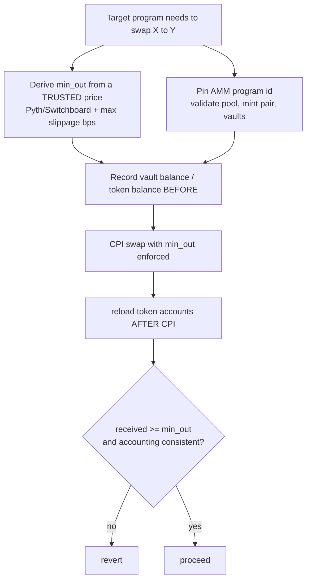

# AMMs (Raydium, Orca, Jupiter) for Solana auditors

Most Solana protocols you audit will, at some point, touch an automated market maker. A vault rebalances through a swap, a lending market liquidates collateral by selling it, a router quotes a price, a yield strategy harvests rewards and swaps them back to the base asset. The moment your target program CPIs into an AMM — or reads a number out of one — that AMM is inside your trust boundary. This note is a comparative overview of the three AMM shapes you will meet most: constant-product pools (Raydium AMM v4), concentrated-liquidity pools (Orca Whirlpools, Raydium CLMM), and aggregators/routers (Jupiter). It is deliberately not a line-by-line of any single program; the goal is to give an EVM/Solidity auditor the right mental models and the Solana-specific checks for *consuming* an AMM safely.

The single most important framing: on Solana the pool, its vaults, and its mints are all accounts passed into the transaction by the caller. None of them are fixed addresses baked into your program. Everything an EVM auditor takes for granted about "calling the canonical Uniswap pair at a known address" must be re-established by explicit account validation here.

## Purpose and trust model

An AMM prices and executes swaps against on-chain liquidity rather than an order book. The three shapes differ in how liquidity is represented and therefore in their security surface:

- **Constant-product (CP) — Raydium AMM v4.** Liquidity is spread uniformly along the `x * y = k` curve. Two token vaults hold the reserves; the spot price is just `reserve_b / reserve_a` (adjusted for decimals and fees). Simple, deep at all prices, and — crucially for auditors — its spot price is trivially cheap to move at the margin if a pool is thin.
- **Concentrated liquidity (CL) — Orca Whirlpools, Raydium CLMM.** Liquidity providers place capital into discrete price *ticks*, concentrating it where they expect trading. Pricing uses a `sqrt_price` and tick math (Uniswap v3 style). More capital-efficient, but the math (tick crossing, fixed-point `sqrt_price`, rounding direction) is far richer and is itself a bug surface.
- **Aggregator / router — Jupiter.** Jupiter does not hold liquidity. It computes a route — often split across several AMMs and hops — and executes it, frequently by CPIing into the underlying AMM programs. For an auditor, Jupiter adds a *route-construction and quote-freshness* layer on top of the AMMs it calls.

The trust model for a *consumer* (your target program) is, stated conservatively:

- The AMM program is third-party, upgradeable infrastructure. Whoever holds its upgrade authority can change its behavior. Record this as an assumption, not a given.
- The AMM gives you an execution venue and a price *quote*; it does not give you a *trustworthy oracle*. An AMM spot price reflects the current pool balance, which an attacker with capital (or a flash sequence within one transaction) can move. Using it as a valuation source is the Mango/Crema class of bug — see `program-pyth-oracle.md` and the `oracle-validation` / `oracle-mev` patterns.
- Slippage protection is *your* responsibility. The AMM will happily execute a swap at a terrible price if you ask it to with no floor.

## EVM analog

| Solana | EVM analog | Notes |
| --- | --- | --- |
| Raydium AMM v4 (constant product) | Uniswap v2 pair | `x * y = k`; spot price = reserve ratio; cheap to move at the margin. |
| Orca Whirlpools / Raydium CLMM | Uniswap v3 | Concentrated liquidity, ticks, `sqrt_price`, fee tiers, NFT-like positions. |
| Jupiter | 1inch / 0x aggregator | Routes/splits across venues; you trust its route construction and the freshness of its quote. |
| Pool account passed into the tx | The pair address is fixed in your contract | The headline difference: on Solana you must *validate* the pool, mints, and vaults; you cannot rely on a hardcoded address being unswappable. |
| `amountOutMin` / `amountInMax` | `amountOutMin` in `swapExactTokensForTokens` | Same idea; the danger is deriving the floor from the pool's *own* spot price. |
| LP position | v2 LP token / v3 position NFT | CL positions are per-tick-range, like v3. |

The intuition that mostly transfers: AMM math, slippage, sandwiching, and "spot price is not an oracle." The intuition that does *not* transfer: address immutability. In Solidity an attacker cannot make your router call a fake Uniswap pair; on Solana they can pass any account, so pool/mint/vault identity must be checked every time.

## Program IDs and versions

> **Accuracy stance (per repo README).** This is a ramp-up guide, not a registry of canonical addresses. AMM program IDs are version- and cluster-sensitive, and several of these protocols run multiple programs simultaneously (e.g. Raydium's CP AMM and its CLMM are *different* programs with *different* IDs and account models). Always read the program ID from the in-scope deployment, the project's config accounts, the IDL, and `Cargo.lock` — never copy an address from a `/latest/` doc page or from this file into a finding. If you cannot confirm an exact ID, describe the program qualitatively rather than fabricate one.

What to actually pin down during inventory, *per AMM the target touches*:

- The exact program that **owns** the pool account and the token vaults the target reads or swaps against. Raydium AMM v4, Raydium CLMM, and Orca Whirlpools are distinct programs; do not assume one layout applies to another.
- Whether the target CPIs into the AMM directly, or routes through **Jupiter** (which then CPIs into one or more AMMs). The set of accounts that appear in the transaction differs sharply between these two cases.
- The SDK/crate and version the target depends on for quoting or account decoding, pinned from `Cargo.lock`. Account layouts (tick arrays, `sqrt_price` representation, fee fields) are version-specific.
- The AMM program's own upgrade authority and program-data account, recorded as a dependency the way you would record any upgrade authority (`upgrade-admin` pattern).

Qualitatively: Raydium, Orca, and Jupiter each publish their current mainnet program IDs in their docs (linked below). Treat those as a starting point to verify against the deployment, not as ground truth to hardcode.

## Key accounts and PDAs

Exact seeds and layouts are program- and version-specific; verify against the IDL. Conceptually:

Constant-product pool (Raydium AMM v4-style):

- **Pool / AMM state account** — stores the two token mints, the two vault addresses, fee parameters, and (in some designs) references to an associated market. This is the account whose identity you must pin.
- **Token vaults (base and quote)** — the SPL token accounts holding the actual reserves. Spot price is derived from their balances. These must be the vaults *belonging to the pinned pool*, not arbitrary token accounts of the right mints.
- **LP mint** — represents pool share.
- **Authority PDA** — the pool's signing authority for moving vault funds.

Concentrated-liquidity pool (Whirlpools / CLMM-style):

- **Whirlpool / pool state account** — holds the two mints, the two vaults, `sqrt_price`, current tick, `tick_spacing`, fee tier, and liquidity. Identity-critical.
- **Tick arrays** — accounts holding initialized ticks over a contiguous range. A swap crossing many ticks must be supplied the correct tick array accounts; passing the wrong or insufficient tick arrays affects how far/at what price the swap executes.
- **Position accounts** — per-LP, per-tick-range positions (often paired with a position NFT/mint), analogous to a Uniswap v3 position.
- **Vaults and an authority PDA** — as above.

Aggregator (Jupiter-style):

- There is no single "pool." A Jupiter swap instruction carries the **route**: the set of underlying pool/vault/tick-array accounts for every hop, plus per-AMM program IDs, often packed through `remaining_accounts`. From an auditor's seat this is the dangerous part — see `remaining-accounts-cpi-trust.md` and the `remaining-accounts-trust` pattern. The accounts are caller-supplied and must be validated against the *intended* route, not trusted by position.

## Instructions that matter

You are usually auditing the **consumer**, so the relevant instruction is whatever handler in the target performs or quotes the swap. The AMM-side surface that appears in the transaction:

- **Swap (exact-in / exact-out).** CP and CL pools both expose a swap that takes an input amount (or desired output) and a **minimum-out / maximum-in** limit. The limit argument is the slippage guard; whether it is set, and what it is derived from, is the crux of most consumer findings.
- **Deposit / withdraw liquidity (add/remove).** For CP, mint/burn LP against both reserves. For CL, open/close a position over a tick range and add/remove liquidity. Rounding direction on these paths can favor or harm LPs.
- **Quote (often off-chain or a read-only helper).** Aggregators compute a route+quote off-chain (or in a separate read), then submit a swap that *must* still carry an on-chain min-out. A quote computed at time T and executed at T+Δ is stale; the min-out is what bounds the staleness risk.
- **Route execution (Jupiter).** A single instruction that drives multiple underlying-AMM CPIs. Carries the route plan and the accounts for each hop.

## Security-relevant surface

This is the crux for an auditor whose target *uses* an AMM. For each item the question is "what does the AMM guarantee, and what must my target independently enforce?"

- **Slippage / min-amount-out enforcement.** Every swap the target performs must pass a real `min_out` (or `max_in`). A swap with `min_out = 0`, or a `min_out` left to a default, is an open invitation to sandwiching and to the pool being drained at a bad price. This is the `oracle-mev` pattern's slippage limb. Confirm the limit is present, non-trivial, and *enforced by the CPI* (not merely computed and discarded).
- **Deriving `min_out` from the pool's own spot price.** A subtle and common bug: the target reads the pool's current spot price, applies a slippage tolerance, and uses that as `min_out`. But if an attacker has already moved the pool within the same transaction (or the bundle), the "spot price" is *their* price, and the slippage guard protects nothing. The floor must come from an **independent trusted source** (a validated Pyth/Switchboard feed, a TWAP, a configured bound) — not from the venue you are about to trade against.
- **Using AMM spot price as an oracle.** Reading `reserve_b / reserve_a` (CP) or `sqrt_price` (CL) and treating it as the asset's value for collateral, minting, or reward math is the **Mango/Crema** class. CP spot is the cheapest to manipulate; CL spot can also be moved, and a single thin tick range can produce a wildly off price. Crema Finance was drained via forged tick data feeding price/fee math — a genuine pricing-manipulation case. (Raydium's 2022 incident, by contrast, was a compromised pool-admin key, i.e. key management, *not* spot-price manipulation; it is listed below as a separate class, not an oracle bug.) The takeaway: an AMM's internal numbers are not a trustworthy oracle. See the Crema and Raydium incident links below and `program-pyth-oracle.md`.
- **Pool / mint / vault account substitution.** Because the pool, its mints, and its vaults are caller-supplied, an attacker can pass a *different* pool (same mints, manipulated reserves), or a pool for the *wrong mint pair*, or vaults that are not the pinned pool's vaults. Validate: the pool account is owned by the expected AMM program; the pool's two mints are exactly the expected pair (in the expected order); the vaults are the vaults *recorded inside the pool state*, not arbitrary token accounts. This is `relationship-checks` + `arbitrary-cpi` applied to AMMs.
- **Token-2022 transfer-fee accounting in pools.** If either side of a pool is a Token-2022 mint with a transfer-fee extension, the amount the vault *receives* is less than the amount *sent*, and the amount a swapper receives is net of fee. A consumer that assumes `amount_in == amount_received_by_vault`, or that ignores the fee when computing `min_out`, will mis-account. Reload balances after the CPI and measure the *actual delta* rather than trusting the requested amount. See `token2022` and `anchor-token-interface`.
- **Sandwich / MEV on swaps.** Solana has no Ethereum-style public mempool, but orderflow is not guaranteed private (leaders, RPCs, Jito bundles, private orderflow). Treat any ordering-sensitive swap as MEV-exposed unless the deployment documents protection. The durable mitigation is a tight, independently-derived `min_out`, not an assumption of privacy (`oracle-mev`).
- **Stale route / quote in aggregator flows.** A Jupiter route+quote is computed against pool state at quote time and submitted later. Between the two, prices move and pools can be manipulated. The on-chain `min_out` is what bounds this; a route that carries a generous or zero floor re-introduces the slippage hole at the aggregator layer. Also confirm the route's accounts cannot be silently swapped for a worse venue (`remaining-accounts-trust`).
- **Tick / liquidity math edge cases in CL pools (rounding direction).** Concentrated-liquidity math is the richest surface: `sqrt_price` fixed-point arithmetic, tick crossing, liquidity-net accumulation, and fee growth. Rounding must consistently favor the protocol/pool, never the swapper extracting value. Off-by-one tick handling, wrong rounding direction on `sqrt_price` conversion, or insufficient/incorrect tick-array accounts can mis-price a swap or leak liquidity. If your target *re-implements* any of this math (e.g. to pre-quote), it inherits the full `math` pattern surface; if it merely calls the AMM, focus on min-out and account identity.
- **Upgrade authority of the AMM program.** Record it. A target that swaps through a pool transitively trusts whoever can upgrade that AMM.

## What to check when the target program CPIs into it

The common case: your target is not the AMM, but it CPIs into one (directly, or via Jupiter) to execute a swap. A focused checklist for that CPI path:

- **Pin the AMM program ID.** Constrain the CPI target to the expected AMM program (`Program`/`Interface` type or `require_keys_eq!`), per the in-scope deployment. Never `invoke` a caller-supplied program account as "the AMM" without checking it (`arbitrary-cpi`). If routing through Jupiter, pin Jupiter's program ID and treat the per-hop programs it calls as part of the validated route.
- **Validate the pool, its mint pair, and its vaults are the expected ones.** The pool account is owned by the pinned AMM program; its two mints are exactly the expected pair; the vaults are the ones recorded inside the pool state. Reject a same-type pool for a different mint pair or with attacker-chosen reserves (`relationship-checks`, `cpi-substitution`).
- **Pass a real `min_out` derived from a trusted price — NOT the pool's own spot.** Compute the floor from a validated oracle (see `program-pyth-oracle.md`), a TWAP, or a configured bound, apply an explicit max-slippage in bps, and require that floor on the CPI. A `min_out` read from the venue you are about to trade against is not a guard.
- **Reload balances after the swap CPI.** Anchor's `Account<T>` fields are stale after a CPI mutates them. Re-`reload()` (or re-unpack native accounts), measure the *actual* received delta, and assert it against `min_out` and your accounting — do not trust the requested amount or pre-CPI cached fields. This is essential for Token-2022 transfer-fee correctness (`stale-cpi-reload`, `token2022`).
- **Validate forwarded route accounts (aggregator case).** If the target forwards `remaining_accounts` into a Jupiter/AMM CPI, parse them into named roles and validate length, owner/program IDs, writable/signer policy, and disjointness from the validated context accounts before the CPI (`remaining-accounts-trust`, see `remaining-accounts-cpi-trust.md`).
- **Check duplicate/aliased accounts** where the swap path assumes distinct source/destination/vault accounts (`duplicate-mut`).
- **Record the AMM program ID, version, and its upgrade authority** as a dependency in your report.

See also `data/patterns.json` → `oracle-mev`, `oracle-validation`, `cpi-substitution`, `remaining-accounts-trust`, `token2022`, and `math` for the generalized versions of these checks, and `audit-workflow.md` §6 for the economic/MEV review step.

## Audit checklist

- [ ] Is every swap CPI's target program **pinned** to the expected AMM (or Jupiter) program ID for the in-scope cluster?
- [ ] Is the pool account owned by that program, and are its **two mints the expected pair** in the expected order?
- [ ] Are the swap **vaults the ones recorded inside the pool state**, not arbitrary token accounts of the right mints?
- [ ] Does every swap carry a **non-trivial `min_out` / `max_in`** that the CPI actually enforces?
- [ ] Is `min_out` derived from an **independent trusted price** (oracle/TWAP/config), never the pool's own spot?
- [ ] Are any **AMM internal numbers** (CP reserve ratio, CL `sqrt_price`) being used as a valuation oracle? If so, is that economically safe given the asset's liquidity (Mango/Crema precedent)?
- [ ] Are **balances reloaded after the CPI** and the actual received delta asserted, rather than trusting the requested amount?
- [ ] If either side is **Token-2022**, are transfer fees/hooks accounted for in `min_out` and post-CPI accounting?
- [ ] For **aggregator/Jupiter** flows: is the quote's staleness bounded by the on-chain `min_out`, and are forwarded route accounts validated (not trusted by position)?
- [ ] For **CL math** re-implemented in the target: is rounding direction consistent and protocol-favoring, and are tick-array accounts correct?
- [ ] Is the swap path safe against **sandwich/MEV** without relying on orderflow privacy?
- [ ] Are the AMM program ID(s), version(s), and upgrade authority recorded as trust assumptions?

## References

- Raydium developer docs: https://docs.raydium.io/
- Orca / Whirlpools developer docs: https://dev.orca.so/
- Jupiter developer docs: https://dev.jup.ag/
- Crema Finance tick/price-manipulation incident: https://rekt.news/crema-finance-rekt/
- Crema Finance hack analysis (Halborn): https://www.halborn.com/blog/post/explained-the-crema-finance-hack-july-2022
- Crema Finance exploit analysis (CertiK): https://www.certik.com/resources/blog/crema-finance-exploit
- Raydium protocol exploit analysis (CertiK): https://www.certik.com/skynet-report/raydium-protocol-exploit-incident-analysis
- Mango Markets price-manipulation incident (AMM/spot-price-as-oracle precedent): https://rekt.news/mango-markets-rekt/
- Spot-price-as-oracle and slippage checks: `docs/program-pyth-oracle.md`, `data/patterns.json` (`oracle-validation`, `oracle-mev`, `math`)
- Forwarded-account CPI trust: `docs/remaining-accounts-cpi-trust.md`, `data/patterns.json` (`remaining-accounts-trust`, `cpi-substitution`)
- Economic/MEV review step: `docs/audit-workflow.md` §6
