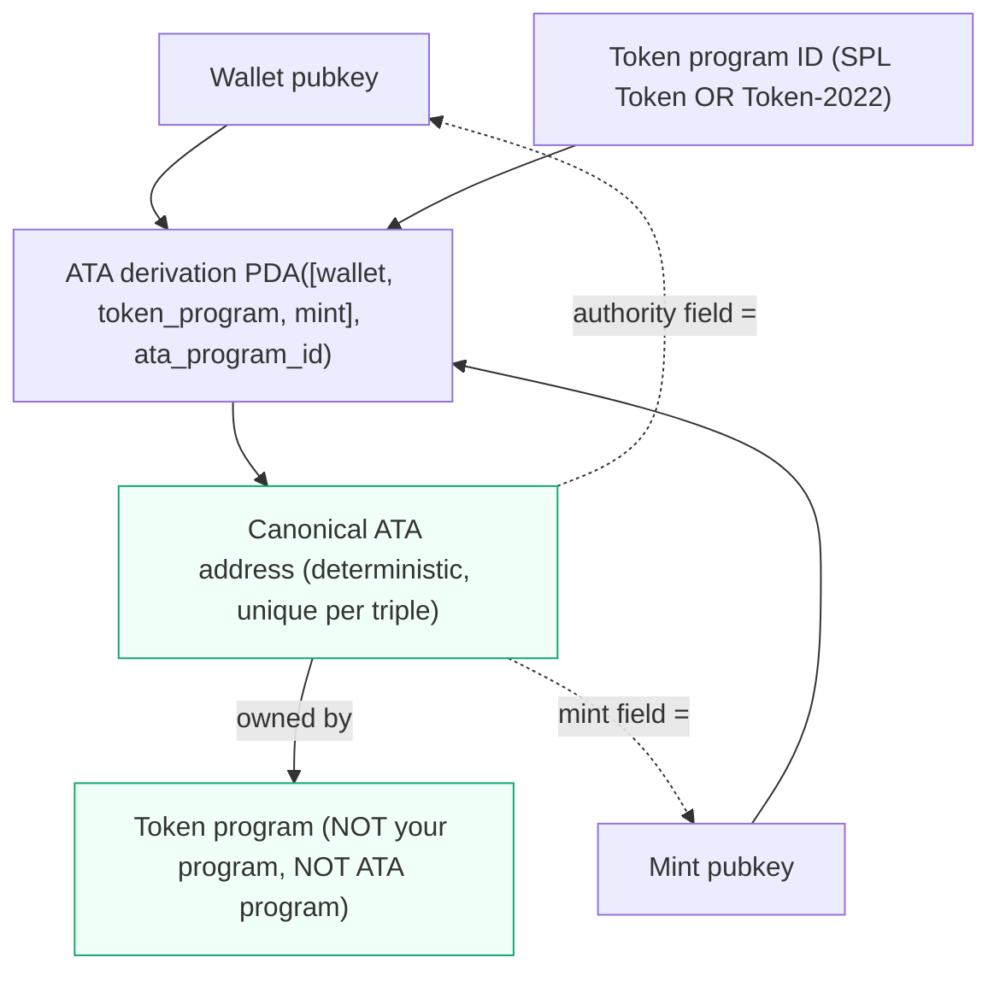
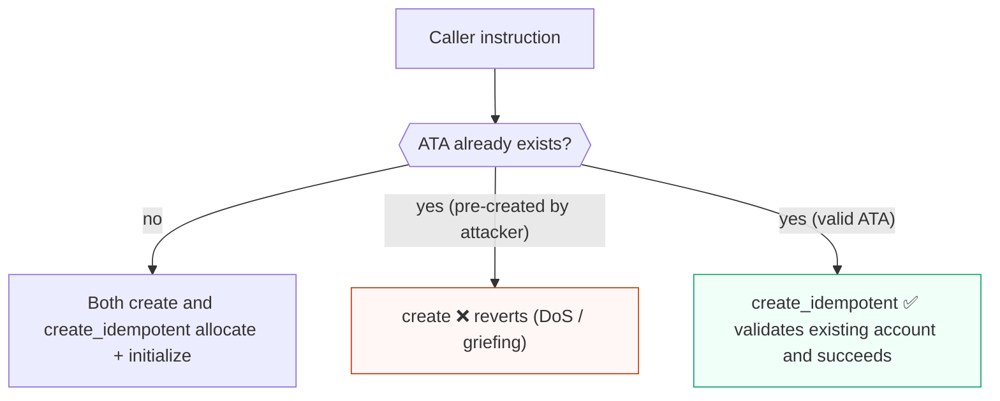
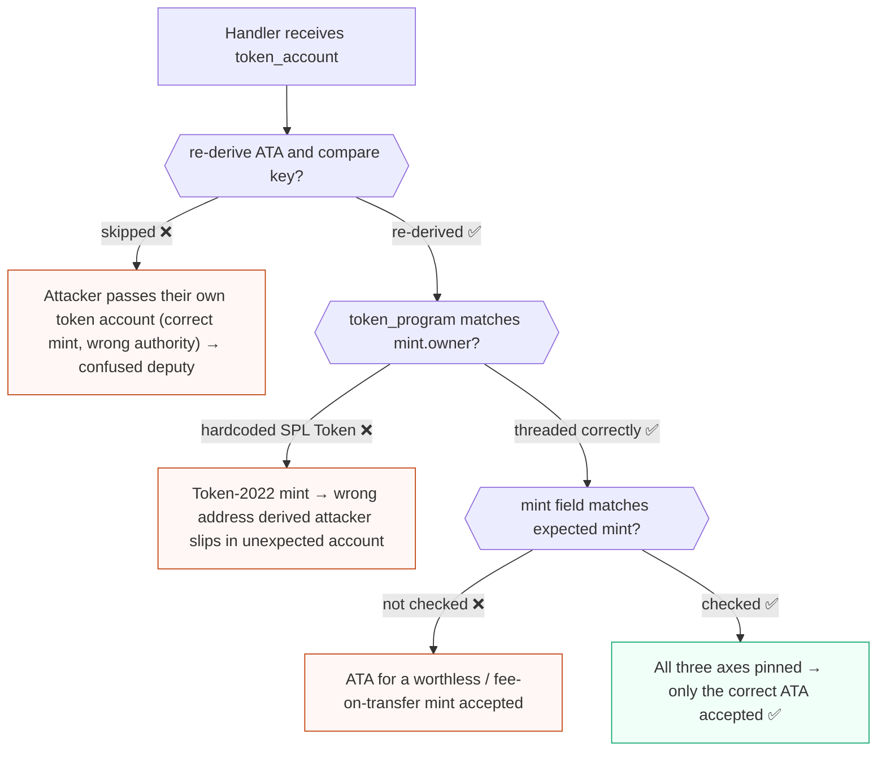
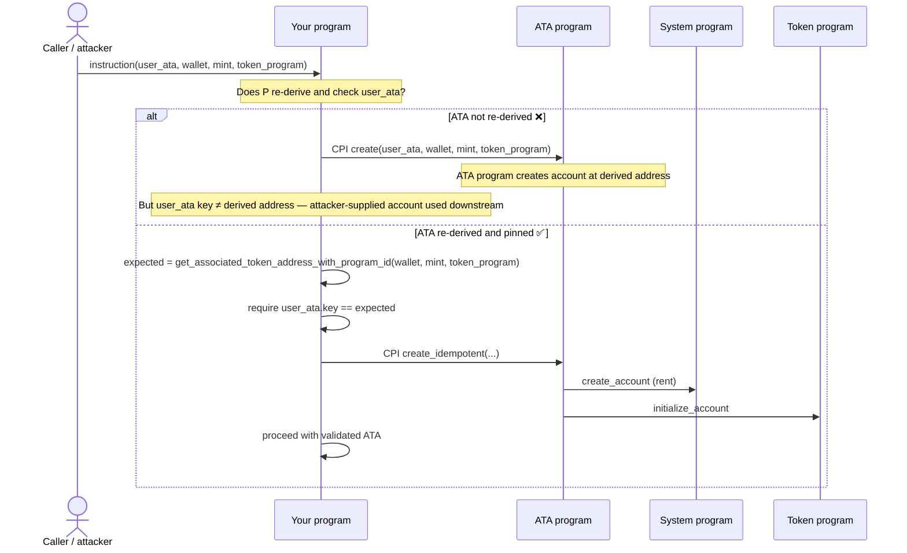

# Associated Token Account program for Solana auditors

The Associated Token Account (ATA) program creates and manages the canonical, deterministic token account for a `(wallet, token program, mint)` triple. Instead of every wallet tracking an arbitrary token account per mint, the ATA program defines one well-known address per wallet/mint so that senders can compute "where does this user hold this token" without asking the user. For an EVM/Solidity auditor, the ATA is the rough equivalent of a deterministic balance-holder address, but the security work is in *proving* that a passed-in token account really is that canonical address rather than an attacker-chosen substitute.

This doc is about the ATA *program*. For SPL Token account fields, authorities, and transfer semantics, see [spl-token-walkthrough.md](spl-token-walkthrough.md).

## Purpose and trust model

The ATA program is a thin, trusted helper over the System Program and a token program. It does two things: derive the canonical ATA address as a PDA, and create that account (owned by the token program, with the mint and wallet wired up). Its instructions are essentially a convenience wrapper that CPIs into the System Program (to create the account) and the token program (to initialize it).

What you can trust:

- The derivation is deterministic. The ATA is the PDA of `seeds = [wallet_pubkey, token_program_id, mint_pubkey]` under the ATA program ID.
- A correctly created ATA is owned by the relevant token program and has its `owner` (token-account authority) field set to the wallet and its `mint` set to the intended mint.

What is **not** automatically trusted:

- That a token account *passed into your instruction* is actually the ATA for the wallet/mint you care about. The ATA program does not retroactively validate accounts other code hands around. Any token account can be passed where an ATA is expected unless the consumer re-derives and compares.
- That the token program threaded into the seeds matches the mint's owning token program (classic SPL Token vs Token-2022).


<span class="figcap">All three inputs are part of the derivation. Swapping the token program (SPL Token vs Token-2022) yields a completely different address.</span>

## EVM analog

The ATA is like a `CREATE2`-style deterministic address, but for token balance holders rather than contracts. Given the wallet, the token program, and the mint, anyone can compute the ATA address off-chain or on-chain, exactly as `CREATE2` lets you precompute a contract address from `(deployer, salt, init_code_hash)`.

| ATA concept | EVM analog | Caveat |
| --- | --- | --- |
| Deterministic ATA address | `CREATE2` precomputed address | Derived from `[wallet, token_program, mint]`, not init code |
| `create` | Deploy-if-not-exists | Fails if the account already exists |
| `create_idempotent` | "deploy or no-op if present" | Succeeds whether or not the ATA already exists |
| `get_associated_token_address` | `computeCreate2Address` | Must thread the correct token program for Token-2022 |

The mental trap carried over from EVM: in Solidity a precomputed `CREATE2` address either holds your known code or it does not. On Solana, an attacker can have created the ATA first, or can hand you a *different* token account that is not the ATA at all. Determinism does not relieve you of validating the account you are actually given.

## Program IDs and versions

| Item | Value |
| --- | --- |
| Associated Token Account program ID | `ATokenGPvbdGVxr1b2hvZbsiqW5xWH25efTNsLJA8knL` |
| ATA seeds | `[wallet_pubkey, token_program_id, mint_pubkey]` (PDA under the ATA program) |
| Derivation helper | `get_associated_token_address` / `get_associated_token_address_with_program_id` |

> Accuracy stance: program IDs and versions are version- and cluster-sensitive. Verify the ATA program ID, the `spl-associated-token-account` crate version, and the token program(s) in scope against the in-scope deployed addresses and the project's `Cargo.lock`/`Cargo.toml` rather than relying on `/latest/` docs. Note in particular that the seeds include the *token program ID*, so the derived address differs for classic SPL Token vs Token-2022; use `get_associated_token_address_with_program_id` and pass the token program that actually owns the mint.

## Key accounts and PDAs

- **The ATA (the PDA).** The canonical token account, derived as `PDA([wallet, token_program, mint], ata_program_id)`. It is owned by the token program (not the ATA program) once created.
- **Wallet / owner.** The account that will be the token-account authority. It does not need to sign to *receive* into its ATA; anyone can create another user's ATA and fund the rent.
- **Mint.** The SPL Token (or Token-2022) mint. Its owning program is the token program that must appear in the seeds.
- **Token program.** Classic SPL Token or Token-2022. This is part of the derivation, so substituting it changes the derived address.
- **Payer.** A writable signer that funds the rent-exempt lamports for the new account (via the System Program CPI under the hood).

## Instructions that matter

```rust
// spl_associated_token_account instruction builders (verify exact signatures against the in-scope crate)
create(payer, wallet, mint, token_program)             // create the ATA; fails if it already exists
create_idempotent(payer, wallet, mint, token_program)  // create the ATA, or no-op if it already exists
recover_nested(...)                                     // recover funds from a nested ATA mistakenly created under another ATA
```

- **`create`.** Allocates and initializes the ATA at the derived address. It fails if the account already exists. Useful when the caller wants to be sure it created the account, but it is a denial-of-service / griefing surface because anyone can pre-create the account first.
- **`create_idempotent`.** Same effect, but succeeds whether or not the ATA already exists (it validates the existing account is the correct ATA for the wallet/mint rather than erroring). This is the safer default for integrators that just need the ATA to exist.
- **`recover_nested`.** Recovers tokens from a nested ATA (an ATA whose owner is itself an ATA), a foot-gun that can otherwise strand funds.


<span class="figcap">Any address can call <code>create</code> for any wallet/mint ATA first. Protocols that must ensure an ATA exists should default to <code>create_idempotent</code>.</span>

## Security-relevant surface

- **ATA derivation must be verified.** The most common ATA bug is trusting that a passed-in token account is "the ATA" without re-deriving. A handler that accepts a `token_account` and assumes it equals `ATA(wallet, mint)` lets an attacker substitute any token account they control. This is an [account relationship / substitution](core-solana-security.md) bug. Always recompute the expected ATA and require equality.
- **`create_idempotent` vs `create` (front-run / DoS).** Because the ATA address is deterministic and public, an attacker can call `create` for someone else's ATA first. A flow that uses plain `create` and treats "already exists" as a hard failure can be griefed into reverting. Prefer `create_idempotent` when the goal is "ensure it exists."
- **Wrong token program in the seeds (Token vs Token-2022).** The token program is part of the derivation. Deriving with classic SPL Token while the mint is owned by Token-2022 (or vice versa) yields a *different* address. Code that hardcodes the classic token program will compute the wrong ATA for Token-2022 mints, and an attacker may exploit the mismatch to slip in an unexpected account. Thread the token program that actually owns the mint, via `get_associated_token_address_with_program_id`.
- **Owner substitution.** The token-account authority (`owner` field inside the token account) must be the intended wallet. Re-deriving the ATA from the intended wallet pins this; accepting a token account whose authority is attacker-controlled while only checking the mint is a classic confused-deputy setup.
- **Mint substitution.** Similarly, the ATA must be for the expected mint. Checking only that an account is *some* token account, or only that the authority matches, lets an attacker pass an ATA for a different (worthless or fee-on-transfer) mint. Bind the mint in the derivation and validate the token account's `mint` field.


<span class="figcap">Three independent axes of substitution: wrong account entirely, wrong token program in derivation, wrong mint. Each must be checked.</span>

```rust
// ❌ BAD: accepts any token account — no re-derivation, no binding of mint/authority.
#[derive(Accounts)]
pub struct Withdraw<'info> {
    #[account(mut)]
    pub user_token_account: Account<'info, TokenAccount>,
    pub user: Signer<'info>,
    pub mint: Account<'info, Mint>,
    // Attacker can pass any TokenAccount they control for the same mint,
    // or even an ATA for a different mint if mint is unchecked.
}

// ✅ GOOD: Anchor associated_token constraints re-derive and enforce all three axes.
#[derive(Accounts)]
pub struct Withdraw<'info> {
    #[account(
        mut,
        associated_token::mint      = mint,
        associated_token::authority = user,
        associated_token::token_program = token_program, // required for Token-2022
    )]
    pub user_token_account: Account<'info, TokenAccount>,
    pub user: Signer<'info>,
    pub mint: Account<'info, Mint>,
    pub token_program: Interface<'info, TokenInterface>, // accepts SPL Token or Token-2022
    pub associated_token_program: Program<'info, AssociatedToken>,
}
```

## What to check when the target program CPIs into it

When the program under review calls the ATA program (directly, via `anchor_spl::associated_token`, or through `init`-style ATA creation):

- **Pin the ATA program ID.** Require the associated-token-account program account equals `ATokenGPvbdGVxr1b2hvZbsiqW5xWH25efTNsLJA8knL`. In Anchor, `Program<'info, AssociatedToken>` does this; for raw accounts use an explicit `require_keys_eq!`.
- **Recompute and require equality.** Derive the expected ATA with `get_associated_token_address_with_program_id(wallet, mint, token_program)` and require the supplied account's key equals it. Do not trust a caller-provided "ata" account. Anchor's `associated_token::mint`, `associated_token::authority`, and `associated_token::token_program` constraints encode this; confirm all three are present and bound to the intended values.
- **Confirm the token program matches the mint owner.** Validate that the token program threaded into the derivation is the program that actually owns the mint account (classic SPL Token vs Token-2022). A mismatch silently changes the derived address. If Token-2022 is in scope, account for extensions/transfer fees per [core-solana-security.md](core-solana-security.md) and [spl-token-walkthrough.md](spl-token-walkthrough.md).
- **Prefer idempotent creation in shared flows.** If the instruction must ensure an ATA exists, `create_idempotent` avoids the pre-creation DoS that plain `create` exposes. If plain `create` is required, ensure a pre-existing (attacker-created) ATA does not break the flow or cause fund loss.
- **Validate payer and authority roles.** The payer must be a writable signer you intend to charge; do not let the wallet/authority float to an attacker-chosen key when it determines the ATA identity.


<span class="figcap">The ATA program itself is correct; the risk is in the caller not re-deriving before trusting the supplied account downstream.</span>

```rust
// ❌ BAD: creates or initialises with the caller-supplied ata key, then uses it
//         without verifying it is the expected ATA.
pub fn ensure_ata(ctx: Context<EnsureAta>) -> Result<()> {
    // CPIs into ATA program — but if ctx.accounts.user_ata was substituted,
    // the downstream token operations act on the wrong account.
    associated_token::create(CpiContext::new(
        ctx.accounts.associated_token_program.to_account_info(),
        associated_token::Create {
            payer: ctx.accounts.payer.to_account_info(),
            associated_token: ctx.accounts.user_ata.to_account_info(), // unverified
            authority: ctx.accounts.wallet.to_account_info(),
            mint: ctx.accounts.mint.to_account_info(),
            system_program: ctx.accounts.system_program.to_account_info(),
            token_program: ctx.accounts.token_program.to_account_info(),
        },
    ))
}

// ✅ GOOD: Anchor `init_if_needed` + associated_token constraints re-derive
//          and enforce the address, owner, and mint in one declaration.
#[derive(Accounts)]
pub struct EnsureAta<'info> {
    #[account(
        init_if_needed,
        payer = payer,
        associated_token::mint      = mint,
        associated_token::authority = wallet,
        associated_token::token_program = token_program,
    )]
    pub user_ata: Account<'info, TokenAccount>,
    #[account(mut)] pub payer: Signer<'info>,
    pub wallet: SystemAccount<'info>,
    pub mint: Account<'info, Mint>,
    pub token_program: Interface<'info, TokenInterface>,
    pub associated_token_program: Program<'info, AssociatedToken>,
    pub system_program: Program<'info, System>,
}
```

```rust
// ❌ BAD: hardcodes the classic SPL Token program — wrong ATA for Token-2022 mints.
use spl_associated_token_account::get_associated_token_address; // implicit SPL Token
let expected_ata = get_associated_token_address(&wallet, &mint);
require_keys_eq!(user_ata.key(), expected_ata, MyError::WrongAta);
// If mint is owned by Token-2022, this derives the WRONG address.

// ✅ GOOD: thread the token program that actually owns the mint.
use spl_associated_token_account::get_associated_token_address_with_program_id;
let token_program_id = ctx.accounts.token_program.key();
// Verify the token program is the actual owner of the mint:
require_keys_eq!(*ctx.accounts.mint.to_account_info().owner, token_program_id, MyError::WrongTokenProgram);
let expected_ata = get_associated_token_address_with_program_id(
    &wallet,
    &ctx.accounts.mint.key(),
    &token_program_id, // illustrative — verify exact API against in-scope crate
);
require_keys_eq!(ctx.accounts.user_ata.key(), expected_ata, MyError::WrongAta);
```

## Audit checklist

- [ ] Is the ATA program ID pinned to `ATokenGPvbdGVxr1b2hvZbsiqW5xWH25efTNsLJA8knL` (`Program<'info, AssociatedToken>` or explicit key check)?
- [ ] Is every "ATA" account re-derived via `get_associated_token_address_with_program_id` and required to equal the supplied key?
- [ ] Are the mint, authority/wallet, and token program all bound in the derivation (Anchor `associated_token::*` constraints present)?
- [ ] Does the token program threaded into the seeds match the program that owns the mint (classic SPL Token vs Token-2022)?
- [ ] Could an attacker substitute a different token account, a different mint's ATA, or an account with a different authority?
- [ ] Is `create_idempotent` used where the intent is "ensure exists", to avoid pre-creation DoS? If `create` is used, is a pre-existing ATA handled safely?
- [ ] Is the rent payer a writable signer the protocol intends to charge?
- [ ] If Token-2022 is in scope, are extensions/transfer fees accounted for in downstream accounting (see SPL Token notes)?
- [ ] Are nested-ATA situations (ATA owned by an ATA) considered, with `recover_nested` understood?

## References

- https://spl.solana.com/associated-token-account
- https://www.anchor-lang.com/docs/tokens/basics/create-token-account
- https://github.com/solana-program/associated-token-account
