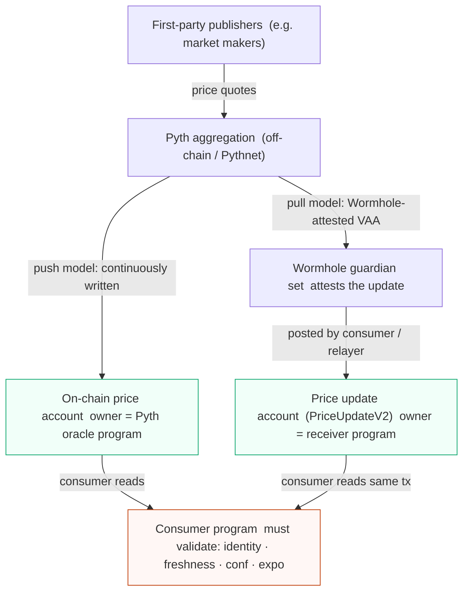
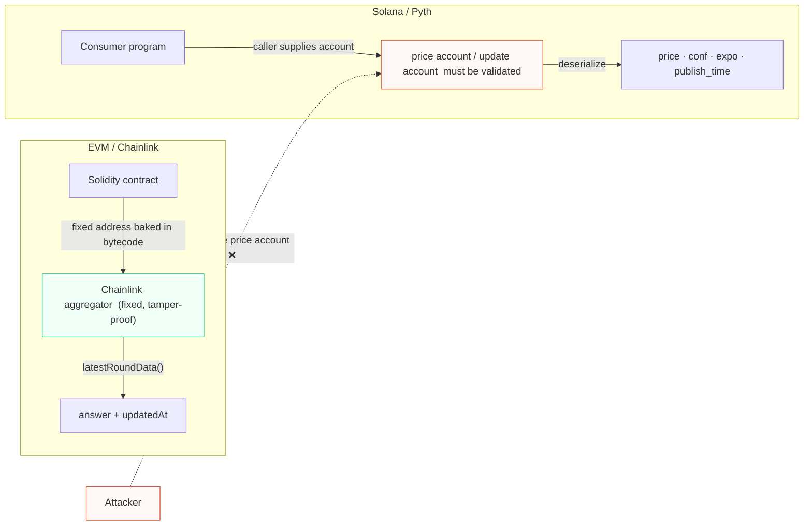
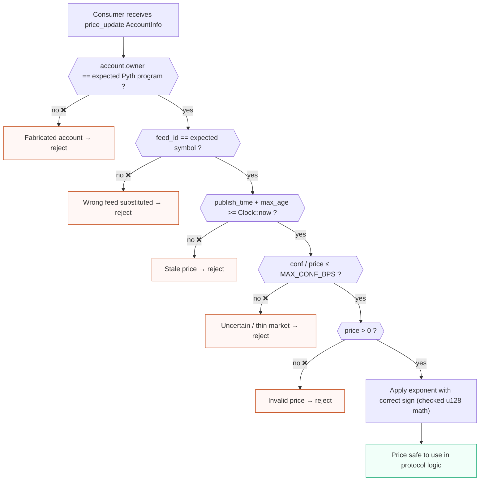

# Pyth oracle for Solana auditors

Pyth is one of the two oracle stacks you will most often see behind Solana lending, perps, and vault protocols (the other is Switchboard). For a Solidity auditor, the dangerous habit to unlearn is treating an oracle read as a trusted call to a fixed address. On Solana the price account is just another account passed into the transaction, and like every other account it can be substituted by the caller. The consuming program must validate the feed's identity, ownership, freshness, confidence, status, and exponent before it lets a price drive collateral value, borrow limits, or liquidation. The economic class of bug behind Mango Markets sits on top of all of this: even a correctly read, fresh, in-status price can be economically wrong if the underlying market is thin.

This doc covers both Pyth integration models you may encounter in scope:

- **Legacy on-chain price accounts** (push model): Pyth publishers maintain a price account on-chain that the consumer reads directly.
- **Pull Oracle / price update accounts** (Pyth "Pull" / `pyth-solana-receiver`): the consumer (or a relayer) posts a signed Wormhole-attested price update into a price update account in the same transaction, then reads it. This is now the recommended Pyth model and is what most current integrations use.

## Purpose and trust model

Pyth aggregates first-party publisher prices into an aggregate price plus a confidence interval. The trust model is: you trust the Pyth publisher set and aggregation, plus (for the pull model) the Wormhole guardian set that attests the update. The on-chain program you are auditing does **not** re-derive the price; it consumes whatever the price account contains, after (hopefully) validating identity and quality fields.


<span class="figcap">Trust flows from publishers through Pyth aggregation to an on-chain account. The consumer sits at the end and must validate every quality field — the runtime gives it no help.</span>

Two assumptions an EVM auditor must drop:

- The price account is not a fixed protocol address baked into bytecode. It is supplied per-transaction and must be pinned to config or derived deterministically. A wrong but well-formed Pyth account is an account-substitution bug, not just a misconfiguration.
- "Pyth returned a number" is not the same as "the number is safe to use." Pyth explicitly publishes a confidence interval and a status; ignoring them is a finding, not a style nit. Pyth's own guidance is that consumers should reject prices that are stale, have a non-trading status, or have a confidence interval too wide relative to the price.

The economic layer sits above identity/quality: a perfectly valid Pyth price for a low-liquidity asset can still be moved by an attacker with enough capital, exactly the Mango Markets pattern. Feed validation is necessary but not sufficient; risk parameters and liquidity assumptions are also in scope. See the audit workflow §6 and the `oracle-validation` / `oracle-mev` patterns in `data/patterns.json`.

## EVM analog

The closest analog is reading a Chainlink aggregator: `latestRoundData()` returning `(answer, updatedAt, ...)`, where a careful Solidity auditor checks `updatedAt` for staleness, checks the answer is positive, and is wary of L2 sequencer-uptime and feed-deprecation edge cases.

The Solana-specific twist:

- In Solidity the aggregator address is fixed in your contract and an attacker cannot swap it. On Solana the price account is passed in the transaction and **must be validated like any other account** (owner, address/feed id). Substitution is the headline difference.
- The pull model has no direct EVM equivalent: the consumer posts the price update itself within the transaction. Treat the posted update like a self-supplied input that must be verified (verification level, feed id, age) before you trust it, similar to verifying a signed message rather than reading trusted storage.


<span class="figcap">On EVM the feed address is immutable bytecode — substitution is impossible. On Solana every account is caller-supplied; without an identity + owner check an attacker can pass a fabricated price account.</span>

## Program IDs and versions

> **Accuracy stance (read this first).** This is a ramp-up guide, not a source of canonical addresses. Oracle program IDs are especially version- and cluster-sensitive. There is **no single canonical Pyth program id across clusters and integration models**: the legacy oracle program, the pull/receiver program, and any wrapper SDK can each have different ids, and these can differ between mainnet-beta, devnet, and forks. Always verify the program id and feed accounts against the in-scope deployment, IDL, `Cargo.lock`, and the project's own config accounts. Do not hardcode an address copied from a `/latest/` doc page or from this file into a finding.

What to actually pin down during inventory:

- The exact program that **owns** the price account(s) the target reads. For legacy accounts this is the Pyth oracle program; for the pull model it is the Pyth receiver / price update program. Get the precise pubkey from the deployed cluster, not from memory.
- The Pyth SDK crate and version the target depends on (e.g. `pyth-solana-receiver-sdk` / `pyth-sdk-solana`), pinned from `Cargo.lock`. The parsing API, the field names, and the available validation helpers differ across versions. Read the docs.rs page that matches the pinned version, not `/latest/`.
- Whether the integration is push (legacy account) or pull (price update account). This changes which accounts appear in the instruction and which checks apply.

## Key accounts and PDAs

Legacy push model:

- **Price account**: an account owned by the Pyth oracle program containing the aggregate price, confidence, exponent, status, and publish time/slot. The consumer reads this directly. Identity is established by the account address (pinned to config) and by the owning program.
- **Product account**: metadata about the symbol. Less security-critical for the price read itself but useful for cross-checking which symbol a price account describes.

Pull model (`pyth-solana-receiver`):

- **Price update account** (`PriceUpdateV2`-style): created/posted by the consumer or a relayer from a Wormhole-attested update. It carries the feed id, the verification level, the price/confidence/exponent, and the publish time. The consumer reads from this account in the same transaction.
- **Feed id**: a 32-byte identifier for the symbol (the same logical "feed" across chains). In the pull model you bind to the **feed id** stored inside the update, in addition to checking the account is owned by the receiver program. Do not assume the account address alone is enough; the same receiver program can produce many price update accounts.
- **Wormhole-related accounts**: used during posting/verification of the update. The verification level recorded on the update tells you how strongly the update was verified (e.g. fully verified vs partially verified). Treat anything below "full" verification as a finding unless the integration explicitly justifies it.

Because the price update account in the pull model can be created by anyone (a relayer posts it), the consuming program must not trust it merely because it is owned by the receiver program. It must check the feed id matches the expected symbol and that the update is recent enough.

```mermaid
flowchart TD
    subgraph PUSH["Legacy push model"]
      direction LR
      PPROG["Pyth oracle program&nbsp;&nbsp;(owner)"] -->|"writes"| PACC2["Price account&nbsp;&nbsp;address pinned in config&nbsp;&nbsp;price · conf · expo · status · publish_time"]
      PACC2 -->|"consumer reads"| PUSHCON["Consumer&nbsp;&nbsp;checks: owner · address · status · staleness · conf · expo"]
    end
    subgraph PULL["Pull model (pyth-solana-receiver)"]
      direction LR
      VAA["Wormhole-attested VAA&nbsp;&nbsp;(signed by guardian set)"] -->|"relayer / consumer posts"| RECV["Receiver program&nbsp;&nbsp;(owner)"]
      RECV -->|"writes"| PUPACC["Price update account&nbsp;&nbsp;(PriceUpdateV2)&nbsp;&nbsp;feed_id · verification_level&nbsp;&nbsp;price · conf · expo · publish_time"]
      PUPACC -->|"consumer reads same tx"| PULLCON["Consumer&nbsp;&nbsp;checks: owner · feed_id · verif level · staleness · conf · expo"]
    end
    classDef b fill:#fff7f5,stroke:#c2410c;
    classDef g fill:#f1fff9,stroke:#0fa76e;
    class PUSHCON g;
    class PULLCON g;
    class PUPACC b;
```


<span class="figcap">Both models land on the same consumer responsibility: validate identity, ownership, freshness, confidence, and exponent. The pull model adds feed-id binding and verification-level checks because the update account is posted by an untrusted party.</span>

## Instructions that matter

You are usually auditing the **consumer**, not Pyth itself, so the relevant "instruction" is whatever handler in the target reads the price. The Pyth-side surface that shows up in the transaction:

- **Post / update price (pull model)**: a `pyth-solana-receiver` instruction (often via the SDK) that verifies a Wormhole-attested update and writes a price update account. This may be a separate instruction earlier in the same transaction, or a CPI. Check who pays for and controls this account and that its lifecycle (post then optionally close to reclaim rent) cannot be abused.
- **Read price**: in the consumer, the deserialize-and-validate step. For the pull model the SDK typically exposes a "get price no older than" helper that takes a maximum age and the expected feed id; using that helper correctly is most of the battle. For legacy accounts, the consumer deserializes the price account and must apply the checks itself.

## Security-relevant surface

This is the crux. For every price the target consumes, confirm all of the following. Missing any one is a real finding, graded by how the price is used (collateral valuation and liquidation are typically high/critical).

- **Feed/account identity.** Is this the right price account / feed id for the asset being priced? It must be pinned to the protocol's config (an address stored in a validated config/reserve/market account) or derived deterministically, not accepted as an arbitrary `AccountInfo`. In the pull model, also bind the **feed id** inside the update, since one receiver program serves all feeds.
- **Owner / program.** Is the account owned by the expected Pyth program (legacy oracle program, or the pull/receiver program for the cluster in scope)? An attacker can create an account with spoofed price bytes that they own; an owner check is what stops a fabricated feed. This is the `missing-owner` pattern applied to oracles.
- **Verification level (pull model only).** Does the update's verification level meet the integration's requirement (prefer fully verified)? A partially verified update is a weaker trust assumption and should be explicitly justified.
- **Freshness / staleness.** Compare the update's `publish_time` (and/or slot) against the on-chain `Clock` and a configured maximum age. A price with no max-age check is the oracle equivalent of trusting an unbounded `updatedAt`. Beware sysvar spoofing: read `Clock` via `Clock::get()` or an address-checked `Sysvar<Clock>`, not an arbitrary account (`sysvar-spoof`). The pull SDK's "get price no older than `max_age`" helper enforces this when called with a sane bound; verify the bound is actually conservative for the asset.
- **Confidence interval (`conf`).** Pyth publishes a confidence (standard-deviation-like) band around the price. A wide band signals disagreement or thin/uncertain markets. The consumer should reject or down-weight prices where `conf` is large relative to `price` (e.g. enforce a maximum `conf/price` ratio), and decide a deliberate policy for using `price`, `price - conf`, or `price + conf` depending on direction (conservative lending uses the worse bound for the protocol). Ignoring confidence entirely is a finding.
- **Status (trading vs halted).** Legacy price accounts carry a status; only a "trading" status should be trusted for live valuation. A halted/unknown/auction status must not be used as a normal price. In the pull model, the equivalent guarantees come from freshness + verification + confidence; confirm the integration does not consume an update for a feed that is effectively offline.
- **Decimals / exponent normalization.** Pyth prices carry an `exponent` (typically negative, e.g. `-8`), so the real value is `price * 10^expo`. The consumer must normalize using the exponent and reconcile it with the token's own decimals. A hardcoded scale, a sign mistake on the exponent, or assuming a fixed exponent across feeds is a classic precision/`math` bug that can massively mis-value collateral. Use `u128`/checked math (`math` pattern).
- **Positive / sane price.** Reject non-positive prices and obviously out-of-range values; combine with confidence and (where available) a sanity band or circuit breaker.
- **Manipulation cost / liquidity.** Even a fresh, in-status, tight-confidence price can be pushed for a low-liquidity asset. This is the Mango Markets class: valid protocol state reflecting an economically manipulated price. Confidence helps (a manipulated thin market often widens `conf`), but the durable mitigations are risk parameters, conservative LTVs, caps, and TWAP/circuit-breaker designs. Flag any integration that values collateral off a thin feed without economic guardrails.

```rust
// ❌ BAD: reads price with none of the required checks.
// price_update is an unchecked AccountInfo — the caller chose it.
pub fn price_collateral_bad(ctx: Context<PriceCollateralBad>) -> Result<()> {
    // No owner check, no feed-id binding, no staleness, no confidence check,
    // no status check, and exponent is ignored (assumes fixed scale).
    let data = ctx.accounts.price_update.try_borrow_data()?;
    // ... raw deserialization of price bytes ...
    // price used directly as USD value — massively wrong on any of the above.
    Ok(())
}

// ✅ GOOD: pull-model read with all required checks (illustrative; exact API
// is version-specific — verify against pinned pyth-solana-receiver-sdk).
pub fn price_collateral_good(ctx: Context<PriceCollateralGood>) -> Result<()> {
    let clock = Clock::get()?; // safe sysvar read — not from an arbitrary account
    let feed_id = get_feed_id_from_hex(EXPECTED_SOL_USD_FEED_ID)?; // pin symbol

    // get_price_no_older_than: checks owner = receiver program, feed_id matches,
    // publish_time within max_age. Returns error if any check fails.
    let price = ctx.accounts.price_update
        .get_price_no_older_than(&clock, MAX_PRICE_AGE_SECS, &feed_id)?;

    // ① positive price
    require!(price.price > 0, ErrorCode::BadOraclePrice);

    // ② confidence: reject if band too wide (e.g. conf > 2 % of price)
    require!(
        (price.conf as u128).checked_mul(10_000).unwrap()
            <= (price.price as u128).checked_mul(MAX_CONF_BPS as u128).unwrap(),
        ErrorCode::OracleConfidenceTooWide
    );

    // ③ exponent normalization — expo is typically negative (e.g. -8)
    //    real_price = price * 10^expo  →  handle sign explicitly with u128 math
    let normalized = apply_exponent(price.price, price.expo)?; // checked arithmetic
    Ok(())
}
```

## What to check when the target reads the feed

A focused checklist for the consuming program's read path:

- The price account / price update account is bound to config or derived, not a free `AccountInfo` the caller chose. Confirm there is an `address = ...` constraint or an explicit `require_keys_eq!` against a validated stored pubkey, and (pull) a feed-id check.
- The account's owner is the expected Pyth program for the cluster in scope.
- Freshness is enforced against `Clock` with a configured max age; `Clock` is read safely (not a spoofable account).
- Confidence is checked (max `conf/price` ratio or equivalent) and the price-vs-confidence direction policy is deliberate and conservative for the protocol.
- Status is checked (legacy) / the pull update is fully verified and recent (pull).
- Exponent is applied with the correct sign and reconciled with token decimals using checked/`u128` math.
- After any CPI that could change the relevant clock-dependent state or re-post an update, the read uses fresh data (`stale-cpi-reload`).
- The economic use of the price has guardrails appropriate to the asset's liquidity (caps, LTV, slippage, TWAP), not just a raw spot read.


<span class="figcap">Every gate is a distinct auditor check. Skipping any one gate is a finding on its own. For legacy push accounts add a status == Trading gate between staleness and confidence.</span>

```rust
// Illustrative pull-model read (pseudocode; exact API is version-specific —
// check the pinned pyth-solana-receiver-sdk docs.rs, not /latest/).
// price_update: Account<'info, PriceUpdateV2> owned by the receiver program.

let clock = Clock::get()?; // do not read clock from an arbitrary account
let max_age_secs: u64 = config.max_price_age_secs; // conservative, per-asset
let feed_id = get_feed_id_from_hex(EXPECTED_FEED_ID_HEX)?; // bind the symbol

// Helper enforces: owned by receiver, feed id matches, not older than max_age.
let price = price_update.get_price_no_older_than(&clock, max_age_secs, &feed_id)?;

// Still your responsibility:
require!(price.price > 0, ErrorCode::BadOraclePrice);
// confidence policy: reject if band too wide relative to price
require!(
    (price.conf as u128) * (MAX_CONF_BPS as u128)
        <= (price.price as u128) * 10_000u128,
    ErrorCode::OracleConfidenceTooWide
);
// exponent normalization with checked math; reconcile with token decimals
// (price.expo is typically negative; handle sign explicitly)
```

```rust
// Illustrative legacy-account read (pseudocode):
require_keys_eq!(price_acc.owner, &PYTH_LEGACY_PROGRAM_ID); // owner check
require_keys_eq!(price_acc.key(), config.expected_price_feed); // identity
let feed = load_price_account(&price_acc)?;            // version-specific parse
require!(feed.status == PriceStatus::Trading, ErrorCode::OracleNotTrading);
require!(
    clock.unix_timestamp - feed.publish_time <= config.max_price_age_secs as i64,
    ErrorCode::StaleOracle
);
// then: positive price, confidence/price ratio, exponent normalization (u128).
```

## Audit checklist

- [ ] Is the price account / price update account pinned to validated config (or deterministically derived), never an arbitrary caller-chosen `AccountInfo`?
- [ ] Is the account owner checked against the correct Pyth program for the in-scope cluster?
- [ ] (Pull) Is the feed id inside the update bound to the expected symbol, and is the verification level acceptable (prefer fully verified)?
- [ ] Is staleness enforced against `Clock` with a conservative, per-asset max age, and is `Clock` read safely?
- [ ] Is confidence (`conf`) checked against a max ratio, with a deliberate price-vs-band direction policy?
- [ ] Is status (legacy) trading-only, or (pull) is "effectively offline" handled?
- [ ] Is the exponent applied with correct sign and reconciled with token decimals using `u128`/checked math?
- [ ] Are non-positive / out-of-range prices rejected?
- [ ] After CPIs, is the price read from fresh data rather than stale cached fields?
- [ ] Does the economic use of the price have liquidity-aware guardrails (caps, LTV, TWAP, circuit breakers), given the Mango Markets precedent?
- [ ] Are the Pyth program id, SDK crate, and version confirmed against the deployment and `Cargo.lock`, not copied from `/latest/`?

## References

- Pyth: use real-time data on Solana: https://docs.pyth.network/price-feeds/use-real-time-data/solana
- Pyth price feeds docs: https://docs.pyth.network/price-feeds
- Mango Markets oracle/price-manipulation incident: https://rekt.news/mango-markets-rekt/
- CoinDesk Mango Markets analysis: https://www.coindesk.com/markets/2022/10/12/how-market-manipulation-led-to-a-100m-exploit-on-solana-defi-exchange-mango
- Oracle/economic/MEV review step: see `docs/audit-workflow.md` §6
- Oracle validation pattern and analogues: see `data/patterns.json` (`oracle-validation`, `oracle-mev`, `math`, `sysvar-spoof`)
