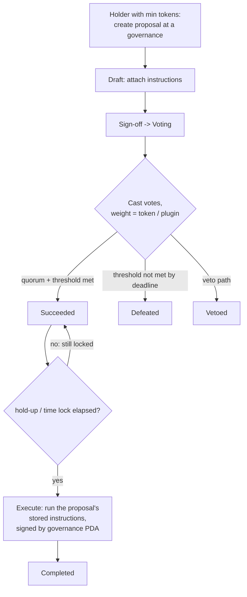

# SPL Governance / Realms for Solana auditors

SPL Governance (the program behind Realms) is the DAO-style alternative to a multisig for controlling a Solana protocol. Where a Squads multisig gates privileged actions behind an `m`-of-`n` member set, SPL Governance gates them behind *token-weighted voting*: holders deposit governance tokens, vote on proposals, and an approved proposal can execute an instruction it carries — frequently the very instruction that upgrades a program, changes a fee, or rotates an authority. When a protocol you are auditing names "the DAO" or "governance" as its admin or upgrade authority, SPL Governance is part of your trust boundary, and the question is the same as for any Solana authority: does the on-chain reality match the claim?

This note maps SPL Governance / Realms onto the Compound Governor + Timelock model an EVM auditor already has, then flags the Solana-specific surface. It is a companion to `program-squads-multisig.md` — the two are alternative governance backends, and the "verify the admin pubkey *is* the governance PDA" discipline is shared between them.

## Purpose and trust model

A **realm** is a DAO instance. It is associated with a **community mint** (the main governance token) and optionally a **council mint** (a smaller, often-trusted set). Token holders deposit into the realm to obtain voting power recorded in a **token-owner record**. Governed resources (a program, a treasury, a mint, an arbitrary account) each have a **governance account** that defines the voting rules (thresholds, quorum, voting time, time lock) and owns a **governance authority PDA** that actually signs privileged actions. A **proposal** under a governance carries one or more **instructions**; if the proposal passes and clears any hold-up (time lock), those exact instructions execute, signed by the governance PDA.

The trust assumptions, stated conservatively:

- Security reduces to **who holds voting power and what the thresholds are**. Whoever controls enough community (or council) voting weight to meet the approval threshold and quorum can pass and execute proposals. A council mint concentrated in a few hands is effectively a small multisig wearing DAO clothing.
- The SPL Governance program is third-party, upgradeable infrastructure. Whoever holds its upgrade authority can in principle change governance behavior. State it as an assumption.
- **Voter-weight plugins** (e.g. VSR vote-escrow) can replace the naive "1 token = 1 vote" with custom weight. The plugin is then *additional trusted code* that determines voting power; its correctness and its own admin are in scope.
- A **time lock** (hold-up time) delays execution after a proposal succeeds, giving monitors a reaction window. A hold-up of zero means a passing proposal can execute immediately.

Do not describe a Realms-governed protocol as "decentralized" without reading the actual mints, their distribution, the thresholds/quorum, the time lock, and any voter-weight plugin on-chain.

## EVM analog

For an auditor coming from Compound Governor / Governor Bravo + Timelock, the mapping is close:

| Compound Governor + Timelock | SPL Governance / Realms | Notes |
| --- | --- | --- |
| Governor contract | Realm + Governance accounts | Realm is the DAO; each Governance account holds the rules for a governed resource. |
| `COMP` voting token / `getPriorVotes` | Community mint + token-owner record (deposited weight) | Voting power is token-weighted; weight is recorded on deposit. |
| (no first-class equivalent) | Council mint | A second, usually smaller, voting class — often the real control. |
| `propose(targets, calldatas, ...)` | Create proposal + attach instruction(s) | The executable instruction(s) are stored *in the proposal*. |
| Vote: For / Against / Abstain | Vote (Yes / No), with veto in some configs | Vote-tipping/early-finalize behavior is config-dependent. |
| Quorum + proposal threshold | Quorum (vote threshold) + min tokens to create | Both must be checked for correctness. |
| Timelock `delay` / `eta` | Governance time lock (hold-up time) | Delay between success and execution. |
| `execute()` runs queued calldata | Execute transaction runs the proposal's instruction(s), signed by the governance PDA | The executed instruction must be the one voted on. |
| Custom voting strategy / vote delegation | Voter-weight plugin (e.g. VSR) | Plugins compute weight; they are extra trusted code. |
| Timelock *is* the admin of the protocol | The **governance authority PDA** is the admin/upgrade authority | The key Solana check: verify the protocol's admin == this PDA. |

The intuition that transfers: proposal lifecycle, quorum/threshold, timelock-gated execution, "execute exactly what was voted on." The intuition that needs adjusting: the admin of the protocol is a **PDA derived from the governance account**, not a contract address — and like every Solana account, the linkage between "the protocol's stored admin" and "the governance PDA" must be verified, not assumed.

## Program IDs and versions

> **Accuracy stance (per repo README).** This is a ramp-up guide, not a registry of canonical addresses. The SPL Governance program ID is version- and cluster-sensitive, and multiple instances/forks of the program can be deployed simultaneously (different DAOs may run different governance program builds). Always read the program ID from the in-scope realm and governance accounts, the IDL, and `Cargo.lock` — never copy an address from a doc page or this file into a finding. If you cannot confirm an exact ID, describe the program qualitatively.

What to actually pin down during inventory:

- The exact SPL Governance program that **owns** the realm, governance, proposal, and token-owner-record accounts in scope. Confirm it from the deployed accounts, not from memory.
- Whether a **voter-weight plugin** (e.g. VSR / vote-escrow, NFT voter, gateway) is configured on the realm/governance. If so, that plugin program is a separate audit dependency with its own ID, version, and admin.
- The governance program's own upgrade authority and program-data account, recorded as a trust assumption (`upgrade-admin`).
- The account layouts (versioned: SPL Governance has evolved its account structures) for the pinned program version. Field offsets, discriminators, and vote-tipping/veto semantics differ across versions; read the version that matches the deployment.

## Key accounts and PDAs

Exact seeds and layouts are version-specific; verify against the IDL/source. Conceptually:

- **Realm** — the DAO root. References the community mint and (optionally) the council mint, plus configuration (e.g. min tokens to create governance, voter-weight plugin addresses).
- **Governance account** — one per governed resource (a program, treasury, mint, or generic account). Holds the voting config: approval threshold, quorum, voting time, **hold-up (time lock)**, vote-tipping rules, and which council/community votes apply. Owns the **governance authority PDA**.
- **Governance authority PDA** — the address that actually signs privileged CPIs when a proposal executes. **This is the pubkey a governed protocol should record as its admin/upgrade authority.** Like the Squads vault PDA, it is *derived from* the governance account, not equal to it.
- **Token-owner record** — per-holder, per-realm record of deposited governance tokens (community or council) and thus voting weight, plus outstanding-proposal and vote bookkeeping. The analog of `getPriorVotes` accounting.
- **Proposal account** — the proposal state machine: state (Draft → Voting → Succeeded/Defeated → Executing → Completed, plus Cancelled/Vetoed paths), vote tallies, and references to the proposal's instructions.
- **Proposal instruction (transaction) account(s)** — the actual instruction(s) to execute on success, stored on-chain. Execution integrity hinges on these being the ones that were voted on.
- **Vote record** — per-voter, per-proposal record preventing double-voting and recording the voter's weight and choice.
- **Voter-weight record (plugin)** — when a plugin is used, the weight the consuming governance reads is taken from a plugin-produced record rather than directly from the token-owner record's raw balance.

Note the split between the *proposal* (what is being decided) and the *proposal instruction* accounts (what executes). Re-execution and integrity bugs live in that relationship, plus the proposal's state transitions.

## Instructions that matter

Names are illustrative; confirm against the IDL/source for the pinned version.

- **Create realm** — sets the community mint, optional council mint, voter-weight plugin addresses, and base config. The riskiest setup instruction: a council mint with concentrated supply, or an unexpected plugin, undermines everything downstream.
- **Deposit / withdraw governing tokens** — moves tokens into/out of the realm, updating the token-owner record's deposited weight. Withdrawal rules during active votes matter for weight integrity.
- **Create governance** — creates a governance account for a resource with its thresholds, quorum, voting time, and **time lock**. These parameters are the security knobs.
- **Create proposal / insert (attach) instruction / sign-off** — opens a proposal and attaches the executable instruction(s), then moves it from Draft into Voting.
- **Cast vote / relinquish vote** — records a vote weighted by the voter's (possibly plugin-computed) weight. Vote-tipping config may finalize early once a threshold is mathematically decided.
- **Finalize vote** — resolves Voting → Succeeded/Defeated against quorum and threshold.
- **Execute transaction** — runs the proposal's stored instruction(s) once Succeeded and the hold-up has elapsed, signed by the **governance authority PDA**. This is where arbitrary privileged CPIs (upgrade, set-fee, rotate-authority) actually fire.
- **Veto / cancel** — where configured, a veto (often council) can block a proposal; cancellation withdraws it. These are alternative control paths to review.

## Security-relevant surface

For each item the question is "what does SPL Governance guarantee, and what must the audited protocol (or the integration) independently verify?"

- **Who really controls the governance authority PDA.** Mirror the Squads discipline: the protocol's stored admin/upgrade authority must be the **governance authority PDA**, correctly derived from the governance account with the canonical bump — not the realm, not the governance account itself, and not a council member's key. A protocol that records the wrong pubkey is not actually DAO-governed in the way its docs claim. **Cross-link: `program-squads-multisig.md`** ("verify the admin pubkey IS the governance PDA"); the check is identical in spirit. See `core-solana-security.md` items 6–7 (PDA bump canonicalization, PDA sharing).
- **Proposal execution integrity.** The instruction(s) executed must be exactly the instruction(s) that were attached and voted on — same program, accounts, and data. A path where execution reads instruction data or account metas from a source other than the approved proposal-instruction account is a confused-deputy hole: voters approve one thing, a different thing executes. This is the analog of verifying the Timelock executes the queued calldata hash, and maps to `governance-timelock` ("the exact proposed instruction bound to approval").
- **Quorum / threshold / vote-tipping correctness.** Confirm the approval threshold and quorum are computed against the right supply (community vs council, and the *deposited/eligible* supply, not raw mint supply if they differ), and that **vote-tipping** (early finalization) cannot declare success before the threshold is genuinely met or before enough of the electorate could react. A threshold set too low, a quorum of zero, or a tipping rule that finalizes on a thin tally is a finding.
- **Voter-weight plugin trust.** If a plugin (e.g. VSR vote-escrow) computes weight, that plugin is trusted code: verify its program ID is the expected one, that the governance actually reads weight from the plugin's record (not a bypassable raw balance), and review the plugin's own admin/upgrade authority and weight math (lock multipliers, decay). A malicious or buggy plugin can mint voting power. This is `governance-timelock` extended into a third-party dependency.
- **Council-mint centralization.** A council mint is a second voting class that frequently holds outsized or overriding power (and veto). Read its supply and distribution. A "DAO" whose council mint is a single wallet is a single-key admin; report it as such rather than as decentralized governance.
- **Time-lock bypass.** If a hold-up time is configured, execution must enforce that it has elapsed since the proposal succeeded — not bypassable via an alternate execute path, a council fast-track, or a misconfigured per-governance value. A hold-up of zero defeats any monitor-reaction threat model; state the actual value.
- **Re-execution and proposal state.** A succeeded proposal's instructions must execute at most once; the state machine must mark them executed and reject re-execution. Verify state transitions (Voting → Succeeded → Executing → Completed) are enforced and that a cancelled/defeated/vetoed proposal cannot be executed. This is the replay/`eta`-consumed analog (`close-revival` for the account-lifecycle angle).
- **Vote-weight integrity around deposits/withdrawals.** Confirm a holder cannot withdraw governing tokens while a vote they cast is still counted (double-use of weight), nor inflate weight by re-depositing across proposals in a way the records do not track.
- **Upgrade authority of the SPL Governance program (and any plugin).** Record both. A protocol governed by a realm transitively trusts whoever can upgrade the governance program and any voter-weight plugin.

## What to check when the target program CPIs into it / is governed by it

The common case: the protocol you are auditing is *not* SPL Governance, but it names a realm/governance as its admin or upgrade authority. The protocol almost never CPIs *into* governance; rather, governance CPIs *into* the protocol's privileged instructions as the governance PDA. Your job is to verify the governance claim is real and sound.

- **Confirm the claimed admin/upgrade authority resolves to the realm's governance authority PDA.** Read the protocol's stored admin field (and its ProgramData upgrade authority). Independently derive the governance authority PDA from the in-scope governance account (canonical bump) and confirm they match. A protocol storing the realm, the governance account, or a council key as admin is not governed the way it claims. (Same discipline as `program-squads-multisig.md`'s vault-PDA check.)
- **Verify sane thresholds and quorum.** Fetch the governance account and decode it against the pinned IDL. Confirm the approval threshold and quorum are non-trivial and computed against the correct mint/supply, and check vote-tipping rules. A "DAO" governance with a 1% threshold or zero quorum is a finding.
- **Confirm a time lock is present if the risk model assumes a reaction window.** If the threat model relies on monitors catching a malicious upgrade before it lands, a hold-up of zero defeats it. State the actual value.
- **Verify the voter-weight source is trusted.** If a plugin computes weight, pin its program ID and version, confirm the governance reads from it, and record the plugin's own admin/upgrade authority. If no plugin, confirm weight derives from deposited governing tokens as expected.
- **Read the council mint's supply and distribution** and any veto powers. Report concentration honestly; do not call a few-wallet council "decentralized."
- **Trace the full upgrade-authority chain.** If the claim is "the program is governed by a DAO," verify the program's ProgramData upgrade authority *is* the governance PDA, not a leftover deploy key, and that the governance's parameters cannot be changed by a lower-privileged path.
- **Pin the SPL Governance program ID and version** (and any plugin) and record them as dependencies, each with its own upgrade authority.

See also `data/patterns.json` → `governance-timelock` and `upgrade-admin` for the generalized versions of these checks, and `program-squads-multisig.md` for the multisig alternative (the PDA-admin verification discipline is shared).

## Audit checklist

- [ ] Is the protocol's admin/upgrade authority the **governance authority PDA** (correctly derived, canonical bump) — not the realm, the governance account, or a council key?
- [ ] Does the upgrade-authority chain actually terminate at that PDA, with no leftover deploy key?
- [ ] Is the SPL Governance **program ID and version** confirmed against the on-chain deployment and IDL?
- [ ] Is the governance program's own upgrade authority recorded as a trust assumption (and any plugin's)?
- [ ] Do the **executed instructions exactly match** the proposal's attached, voted-on instructions (program, accounts, data)?
- [ ] Are **threshold and quorum** non-trivial and computed against the correct mint/eligible supply?
- [ ] Is **vote-tipping** unable to finalize success before the threshold is genuinely met?
- [ ] If a **voter-weight plugin** (e.g. VSR) is used, is its program ID pinned, its record actually consulted, and its admin/math reviewed?
- [ ] What is the **council mint** supply/distribution and veto power? Is it effectively a small multisig?
- [ ] Is a **time lock (hold-up)** present and enforced from proposal success, with no fast-track bypass? What is its value?
- [ ] Is a succeeded proposal **executable at most once**, with cancelled/defeated/vetoed proposals rejected?
- [ ] Can a voter **withdraw governing tokens** while a cast vote still counts (double-use of weight)?

## References

- Realms documentation: https://docs.realms.today/
- SPL Governance program source: https://github.com/solana-labs/solana-program-library/tree/master/governance
- Generalized governance/timelock and upgrade-authority checks: `data/patterns.json` (`governance-timelock`, `upgrade-admin`) and `docs/core-solana-security.md`.
- Multisig alternative and the shared "verify the admin pubkey IS the governance/vault PDA" discipline: `docs/program-squads-multisig.md`.
- PDA derivation and sharing hazards: `docs/core-solana-security.md` (items 6–7).
- Where governance sits in the review flow: `docs/audit-workflow.md`.
