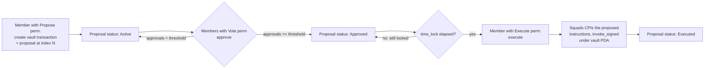

# Squads multisig for Solana auditors

Squads is the most widely deployed "smart contract wallet" on Solana: an on-chain multisig program that holds assets and gates privileged actions behind a member set plus an approval threshold. When a protocol you are auditing names a Squads multisig as its admin, upgrade authority, treasury, or fee recipient, the multisig is part of your trust boundary even though it is a separate, third-party program. This note maps Squads onto the Gnosis Safe mental model an EVM auditor already has, then flags the Solana-specific surface that does not transfer cleanly.

## Purpose and trust model

A Squads multisig replaces a single hot keypair authority with an `m`-of-`n` member set. Instead of one private key signing a privileged instruction, members propose a transaction, vote on it, and execute it once the configured threshold of approvals is reached. The assets and authorities the multisig controls are not held by the multisig config account itself; they are held by a **vault PDA** derived from that config. Privileged instructions are executed by the Squads program issuing a CPI signed (`invoke_signed`) under that vault PDA.

The trust assumptions, stated conservatively:

- Security reduces to the member set and threshold: any colluding subset of size `threshold` can execute arbitrary instructions as the vault. There is no further on-chain check that a proposed instruction is "reasonable."
- The Squads program itself is upgradeable infrastructure. Whoever holds the Squads program's upgrade authority can, in principle, change multisig behavior. This is outside the audited protocol's control and should be stated as an assumption, not waved away.
- A `time_lock` (if configured) delays execution after approval, giving an off-chain monitor a window to react. A `time_lock` of zero means approval and execution can land in the same block.
- Spending-limit features (where configured) allow specific members to move bounded amounts without a full proposal. These are an explicit relaxation of the `m`-of-`n` rule and must be reviewed as their own authority path.

Do not describe a Squads-governed protocol as "decentralized" or "trustless" without first reading the actual member set, threshold, and time lock on-chain.

## EVM analog

For an auditor coming from Gnosis Safe, the mapping is close but not exact.

| Gnosis Safe | Squads | Notes |
| --- | --- | --- |
| Safe owners | Multisig members | Each member is a pubkey with a permission mask. |
| `threshold` | `threshold` | `m`-of-`n` approvals required to execute. |
| `execTransaction` (collect signatures, then execute) | propose → approve/vote → execute (vault transaction / proposal) | Squads splits the lifecycle into separate on-chain instructions and accounts rather than one call with bundled signatures. |
| Safe modules / guards | Squads roles, permission masks (Propose / Vote / Execute), spending limits | Permissions are per-member capability bits, not separate module contracts. |
| The Safe contract address holds assets | A **vault PDA** derived from the multisig account holds assets | This is the key difference — see below. |
| Owner changes via `addOwnerWithThreshold` etc. | Config transactions (add/remove member, change threshold, change time lock) | Config changes are themselves multisig-gated proposals. |
| Nonce-ordered execution | Per-multisig transaction index plus per-proposal state | Stale-proposal and re-execution semantics differ; see Security-relevant surface. |

The single most important difference: **the address that "is" the wallet and holds funds is not the multisig account.** It is a vault PDA derived from the multisig account (plus a vault index). The multisig config account stores members, threshold, and bookkeeping; the vault PDA is the signer the program produces via `invoke_signed` when executing approved instructions. An EVM auditor used to "the Safe address == the asset holder" must instead verify the *vault PDA* is the admin/owner/authority the target protocol actually trusts. The multisig config pubkey and the vault PDA are different addresses.

## Program IDs and versions

> **Accuracy stance (per repo README):** This guide does not assert a single canonical program id as authoritative. Squads has multiple program versions and the deployed id is version- and cluster-sensitive. Always read the program id from the deployment in scope and confirm it against the official Squads docs/IDL before relying on any layout described here.

- **Squads v3 and Squads v4 (sometimes "multisig v4" / SquadsX) use different program IDs and different account models.** Do not assume a v3 layout, instruction set, or account ordering applies to a v4 deployment, or vice versa. Treat them as separate audit targets the same way you would CCTP v1 vs v2.
- A commonly cited Squads **v4** program id is `SQDS4ep65T869zMMBKyuUq6aD6EgTu8psMjkvj52pCf` (or similar). **Flag, do not trust:** verify the exact id against the on-chain deployment and the official IDL. If you cannot confirm it, describe the program qualitatively rather than hardcoding an id into findings.
- The account model below is described qualitatively for v4. The exact field offsets, discriminators, and seed strings must come from the IDL of the pinned program version, not from this document.
- The Squads program is itself upgradeable. Record its program id, its ProgramData account, and its upgrade authority as part of your inventory — the same way you would record any dependency's upgrade authority.

## Key accounts and PDAs

The exact seeds and layouts are IDL- and version-specific; verify them. Conceptually, a v4-style deployment involves:

- **Multisig (config) account** — stores the member set (each with a permission mask), `threshold`, `time_lock`, a `config_authority` (or a flag indicating the multisig governs itself), a monotonically increasing `transaction_index`, and a `stale_transaction_index` watermark. This is the account everything else is derived from.
- **Vault PDA** — derived from the multisig account key and a vault index (e.g. seeds resembling `[b"multisig", multisig.key(), b"vault", vault_index]`). This PDA is the asset holder and the signer used for executed CPIs. A single multisig can have multiple vaults.
- **Transaction account** — a proposed transaction, typically a "vault transaction" (a set of instructions to be executed under a vault PDA) or a "config transaction" (changes to members/threshold/time lock). Stores the proposed instructions, the target vault index, and the `transaction_index` it was created at.
- **Proposal account** — tracks voting state for a given transaction index: status (active/approved/rejected/executed/cancelled), the set of approvers, rejecters, and cancellers. Approval counting happens against this account.
- **Spending-limit account** (if used) — authorizes specific members to move a bounded amount of a given mint per period without a full proposal.

Note the split between the *transaction* account (what is proposed) and the *proposal* account (who voted). Re-execution and staleness bugs live in the relationship between these, the multisig's `transaction_index`/`stale_transaction_index`, and the member set at execution time.

## Instructions that matter

Names are illustrative of the v4 model; confirm exact names and args against the IDL.

- **Create multisig** — sets initial members and permission masks, `threshold`, `time_lock`, and `config_authority`. The riskiest single instruction: a wrong threshold, a stray member, or an unintended external `config_authority` undermines everything downstream.
- **Create vault transaction** — records a set of instructions to be executed under a vault PDA at a specific `transaction_index`.
- **Create proposal** — opens voting for a transaction index.
- **Approve / Reject / Cancel proposal** — members with the relevant permission vote. Approval counting must require the signer to be a current member with Vote permission and must not double-count.
- **Execute (vault transaction / config transaction)** — runs the approved instructions once `threshold` approvals exist and any `time_lock` has elapsed. Vault transactions execute arbitrary CPIs signed by the vault PDA; config transactions mutate the member set / threshold / time lock.
- **Add member / Remove member / Change threshold / Set time lock** — performed via config transactions (or directly by an external `config_authority`, if one is set). These change the security parameters of the multisig itself.
- **Add spending limit / Use spending limit** — creates and consumes a bounded, member-scoped spending path that bypasses the full proposal flow.

## Security-relevant surface

This is where an EVM auditor's Safe intuition needs Solana-specific adjustment. For each item, the question is "what does the Squads program guarantee, and what must my target program independently verify?"

- **Threshold correctness and unique-approver counting.** The execute path must require at least `threshold` *distinct, currently-valid* approvers. Watch for: an approver counted twice, an approval from a member who was removed after voting, or a threshold stored separately from the live member count (threshold greater than `n` is a permanent lockout; threshold of 1 or 0 is effectively a single-key wallet). Map this to Safe's "signatures must be from current owners, sorted, no duplicates" check.
- **Proposal staleness and re-execution.** A proposal approved under one member set should not remain executable after a config change that should have invalidated it. Squads tracks a `stale_transaction_index`: config changes bump it so that proposals created before the change are stale. Verify that (a) config changes actually advance the staleness watermark, (b) execution rejects stale proposals, and (c) an executed proposal cannot be executed a second time (status transitions to Executed and is checked). This is the analog of nonce/replay protection in a Safe.
- **Proposal integrity vs execution integrity.** The instructions executed must be exactly the instructions that were proposed and approved — same target program, same accounts, same data. A bug where the executor reads instruction data or account metas from a source other than the approved transaction account is a confused-deputy hole: members approve one thing and a different thing executes. This maps to verifying the `data`/`to`/`value` in `execTransaction` matches what was signed.
- **Vault PDA derivation.** Confirm the vault PDA is derived from the intended multisig and vault index with the canonical bump, and that execution signs only for that PDA. A derivation that under-scopes seeds (or accepts a caller-supplied bump) risks one multisig signing for another's vault. See `core-solana-security.md` items 6 and 7 (PDA bump canonicalization, PDA sharing).
- **Time-lock bypass.** If a `time_lock` is configured, execution must enforce that the lock has elapsed since approval — not since proposal creation, and not bypassable via an alternate execute path or a spending limit. A `time_lock` that resets or is read from an attacker-influenced clock source is a bypass.
- **Member-set changes invalidating prior approvals.** Adding or removing members, or changing the threshold, must not leave a pending proposal executable on terms the current member set never agreed to. This is the staleness invariant from the angle of "who is allowed to vote right now."
- **Config-change gating.** The instructions that change members/threshold/time lock are the crown jewels. Verify they require the same (or stronger) authority as a normal execution and cannot be reached by a lower-privileged path. If an external `config_authority` is set, that single account can rewrite the member set — confirm whether that is intended, and what it is.
- **Spending limits.** Where configured, these let a member move bounded funds without the full threshold. Review the per-period reset logic, the mint/amount bounds, which member(s) hold the limit, and whether the limit can be created or raised without a full proposal.
- **Rent and closing stale proposals.** Old transaction/proposal accounts hold rent. Closing them refunds lamports; verify the refund recipient is intended and that closing a proposal cannot be used to revive or re-execute it (see `core-solana-security.md` item 13, close/revival).
- **Upgrade authority of the Squads program itself.** Record it. A protocol that trusts a Squads vault as admin transitively trusts whoever can upgrade the Squads program.

## What to check when the target program CPIs into it / is governed by it

The common case: the protocol you are auditing is *not* Squads, but it names a Squads multisig as its admin, upgrade authority, treasury, or fee authority. The protocol almost never CPIs *into* Squads; rather, Squads CPIs *into* the protocol's privileged instructions as the vault PDA. Your job is to verify the governance claim is real.

- **Verify the admin pubkey is the vault PDA, not the config account or a member key.** Read the protocol's stored admin/authority field. Independently derive the multisig's vault PDA (multisig key + vault index + canonical bump) and confirm they match. A protocol that stores the multisig *config* account, or one member's key, as its admin is not actually governed by the multisig in the way the docs claim.
- **Read the live member set and threshold.** Fetch the multisig account and decode it against the pinned IDL. Confirm `n` and `threshold` are sane (threshold > 1 for a real multisig; threshold ≤ live member count; no unexpected members; permission masks as expected). A "5-of-7 multisig" that is actually 1-of-7 on-chain is a finding.
- **Confirm a `time_lock` exists if the protocol's risk model assumes a reaction window.** If the threat model relies on monitors catching a malicious upgrade before it lands, `time_lock = 0` defeats it. State the actual value.
- **Trace the full upgrade-authority chain.** If the claim is "the program is governed by a multisig," verify the program's ProgramData upgrade authority *is* the vault PDA, not a leftover deploy key. Then verify the multisig's own `config_authority` is the multisig itself (self-governed) and not an external single key. The chain is only as strong as its weakest link, which is frequently a stray upgrade key or an external config authority.
- **Check for spending limits or other bypass paths** that let a subset move funds or change config below the stated threshold.
- **Pin the Squads program id and version** used by this deployment and record it as a dependency in your report, with its own upgrade authority noted.

See also `data/patterns.json` → `governance-timelock` and `upgrade-admin` for the generalized versions of these checks.

## Audit checklist

- Is the protocol's admin/authority the multisig's **vault PDA** (correctly derived, canonical bump) — not the config account, not a member key?
- Does the upgrade-authority chain actually terminate at that vault PDA, with no leftover deploy key?
- Is the Squads **program id and version (v3 vs v4)** confirmed against the on-chain deployment and official IDL?
- Is the Squads program's own upgrade authority recorded as a trust assumption?
- Live on-chain: are `n`, `threshold`, member permission masks, and `time_lock` what the protocol docs claim? Threshold > 1, ≤ live member count, > 0?
- Does execution require `threshold` **distinct, currently-valid** approvers (no double-count, no stale approvals from removed members)?
- Are proposals marked Executed and prevented from re-execution?
- Do config changes advance the staleness watermark and invalidate proposals created beforehand?
- Do the executed instructions exactly match the proposed/approved instructions (program, accounts, data)?
- Is `config_authority` the multisig itself, or an unexpected external single key?
- Are spending limits present? If so, what are the member/mint/amount/period bounds, and can they be created or raised below threshold?
- Can closing stale transaction/proposal accounts misroute rent or enable revival/re-execution?
- Is `time_lock` enforced from approval time, with no alternate bypass path?

## References

- Squads documentation: https://docs.squads.so/
- Consult the Squads **v4** program docs and IDL for the exact account layouts, seed strings, instruction names, and the deployed program id; confirm the on-chain program id and version (v3 vs v4) before relying on any layout in this note.
- Generalized governance/multisig/timelock checks: `data/patterns.json` (`governance-timelock`, `upgrade-admin`) and `docs/core-solana-security.md`.
- PDA derivation and sharing hazards: `docs/core-solana-security.md` (items 6–7).
- SPL Governance / Realms (the DAO-style alternative governance path): https://docs.realms.today/
