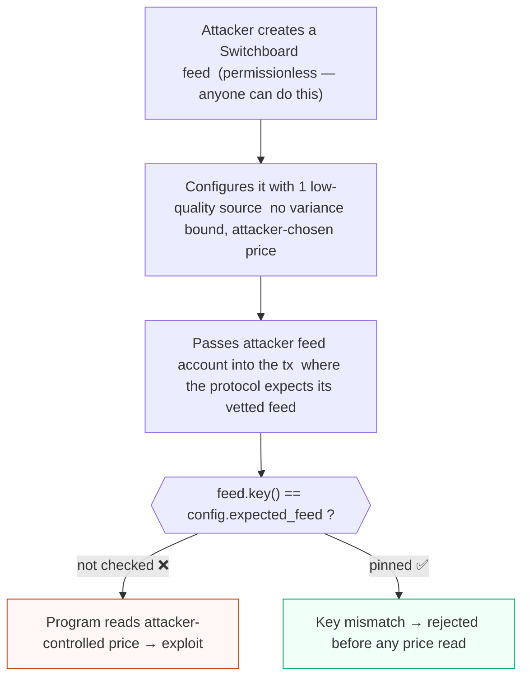
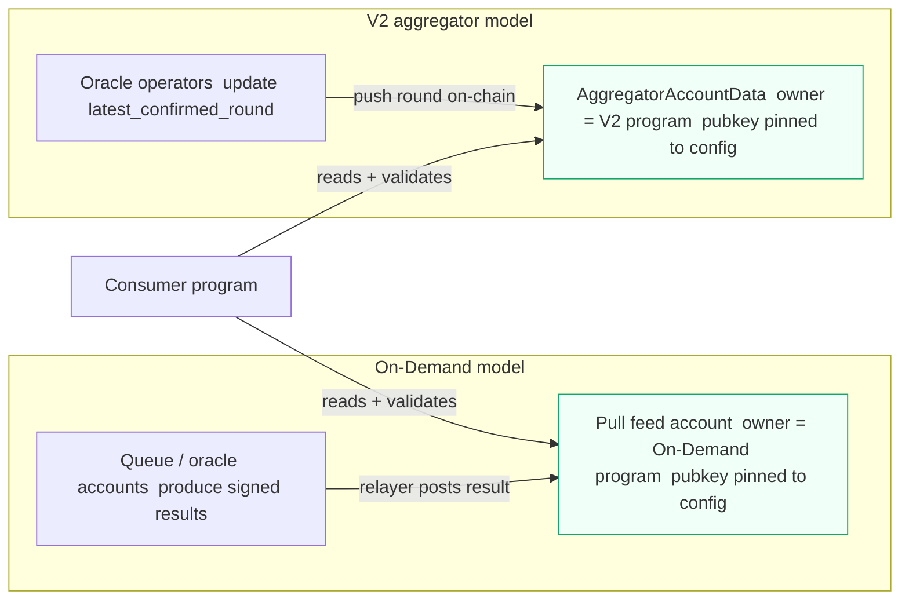
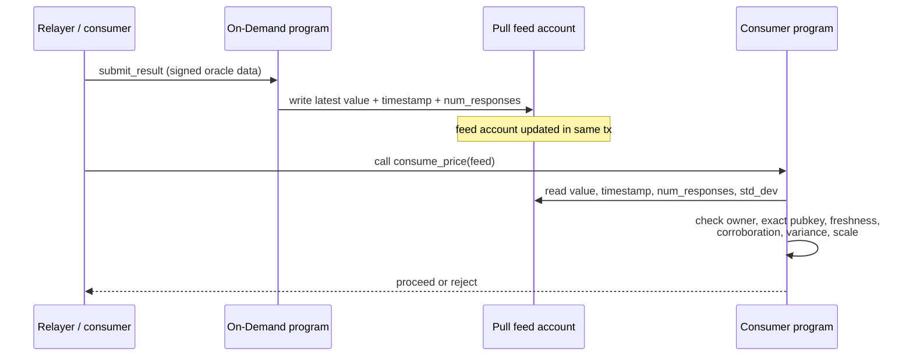
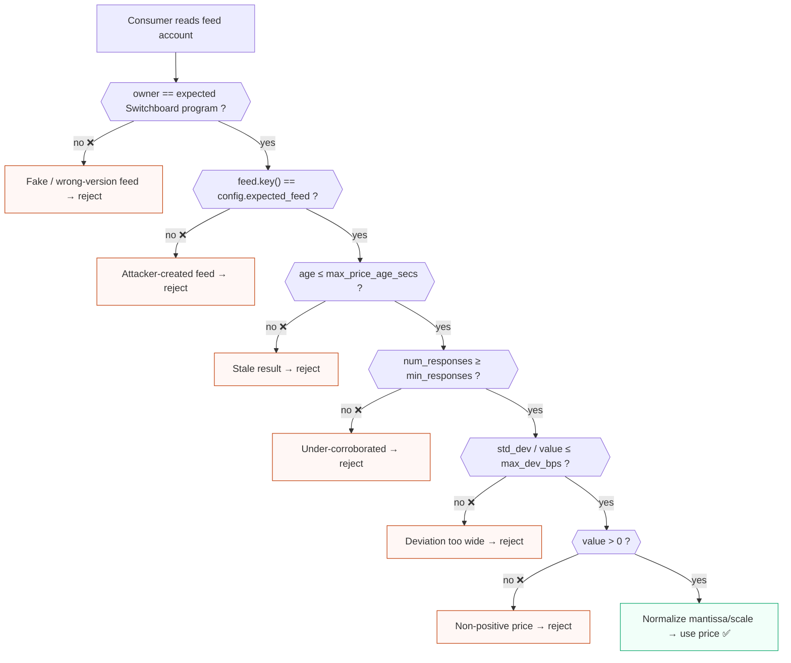

# Switchboard oracle for Solana auditors

Switchboard is the other oracle stack you will commonly see behind Solana lending, perps, and vault protocols (the first is Pyth). For a Solidity auditor, the same habit must be unlearned as with any Solana oracle: a feed read is not a trusted call to a fixed address. The Switchboard feed account is passed into the transaction and, like every other account, can be substituted by the caller. The consuming program must validate the feed's identity, ownership, freshness, and result-quality fields before a price drives collateral value, borrow limits, or liquidation.

Switchboard has a property that makes identity validation even more important than with Pyth: **feeds are permissionless to create.** Anyone can stand up a Switchboard feed that aggregates whatever data sources they choose. "It is a Switchboard feed" tells you almost nothing; you must verify the **specific feed pubkey** the protocol intends to use. A well-formed but attacker-created Switchboard feed is the headline account-substitution risk here.

This doc covers both models you may encounter in scope:

- **On-Demand feeds** (current Switchboard model): the consumer (or a relayer) pulls a fresh signed result and posts/updates the feed account in the same transaction, then reads it. Conceptually similar to Pyth's pull model.
- **V2 aggregator accounts** (older Switchboard V2): an aggregator account holds the latest result/round that the consumer reads directly.

## Purpose and trust model

A Switchboard feed aggregates results from a set of oracles/operators according to the feed's configuration (jobs, sources, minimum responses, variance/deviation bounds). The trust model is: you trust the operator set and the feed's own configuration. Critically, **the feed creator chooses that configuration.** A feed can be configured with a single low-quality source, no meaningful variance bound, or a manipulable job. So validating Switchboard reduces to two questions:

1. Is this the **exact feed pubkey** the protocol vetted, owned by the expected Switchboard program?
2. Is the latest result fresh, sufficiently corroborated (min responses / variance), and economically sane for the asset's liquidity?

An EVM auditor must drop two assumptions:

- The feed address is not fixed in bytecode and unswappable. It is supplied per-transaction and must be pinned to validated config (`relationship-checks` / `oracle-validation`).
- "Switchboard returned a value" is not "the value is trustworthy." Because creation is permissionless, the configuration behind a feed is part of your trust assumption and should be reviewed, not assumed.

As with Pyth, the economic layer sits on top: a valid, fresh Switchboard result for a thin asset can still be moved by a well-capitalized attacker, the Mango Markets pattern (`oracle-mev`).


<span class="figcap">Permissionless creation means owner-check alone is not enough. The exact feed pubkey must be pinned to vetted config.</span>

## EVM analog

The closest analog is a Chainlink aggregator read where a careful auditor checks `updatedAt` for staleness and the answer for sanity. The Solana-specific twists:

- The feed account is passed in the transaction and **must be validated like any other account** (owner + exact pubkey). Substitution is the headline difference.
- Permissionless creation has no clean Chainlink analog: it is more like accepting "any contract that implements `AggregatorV3Interface`" without checking which one. The interface shape is not the trust boundary; the specific instance and its configuration are.
- On-Demand has no direct EVM equivalent: the consumer pulls and posts the result in-transaction, so treat the posted result as a self-supplied input to verify (owner, identity, freshness, corroboration), not as trusted storage.

## Program IDs and versions

> **Accuracy stance (read this first).** This is a ramp-up guide, not a source of canonical addresses. Oracle program IDs are especially version- and cluster-sensitive. There is **no single canonical Switchboard program id across clusters and versions**: the On-Demand program and the older V2 aggregator program have different ids, and these can differ between mainnet-beta, devnet, and forks. Always verify the program id and the specific feed pubkey against the in-scope deployment, IDL, `Cargo.lock`, and the project's own config accounts. Do not hardcode an address copied from a `/latest/` doc page or from this file into a finding.

What to pin down during inventory:

- The exact Switchboard program that **owns** the feed/aggregator account the target reads (On-Demand vs V2 differ). Get the precise pubkey from the deployed cluster.
- The Switchboard SDK crate and version the target depends on (e.g. `switchboard-on-demand` / `switchboard-v2`), pinned from `Cargo.lock`. Parsing APIs, account structs, and validation helpers differ across versions; read the matching docs.rs page, not `/latest/`.
- Whether the integration uses On-Demand (pull/post a result) or a V2 aggregator (read latest round). This changes the accounts in the instruction and the checks that apply.
- The **specific feed pubkey(s)** the protocol intends to use, and where they are stored (config/reserve/market account). This is the most important single item for Switchboard given permissionless creation.

## Key accounts and PDAs

On-Demand model:

- **Pull feed account**: holds the latest aggregated result, the timestamp/slot of that result, and corroboration metadata (number of oracle responses, variance/deviation). Created per feed; identity is the exact pubkey, pinned to config. Owned by the On-Demand program.
- **Queue / oracle accounts**: the operator set / queue that produces results. Relevant when reviewing how a result is produced and how strong the corroboration is.
- **Update mechanism**: the consumer or a relayer submits a signed update that writes the latest result into the feed account in the same transaction. Treat the posted result like a self-supplied input to validate.

V2 model:

- **Aggregator account** (`AggregatorAccountData`-style): holds the latest confirmed round (result value, round timestamp/slot), plus configuration such as minimum oracle responses and variance threshold. The consumer reads `latest_confirmed_round` and must check it is recent and adequately corroborated.

In both models, because anyone can create a feed/aggregator, the consuming program must bind the **exact feed pubkey** (not merely "owned by Switchboard") and should be aware that the feed's configuration (sources, min responses, variance) is attacker-chosen unless the protocol vetted that specific feed.


<span class="figcap">Both models: identity (exact pubkey), owner, freshness, and corroboration checks live in the consumer program.</span>

## Instructions that matter

You are usually auditing the **consumer**. The Switchboard-side surface in the transaction:

- **Update / pull result (On-Demand)**: an instruction (via the SDK) that verifies a signed oracle result and writes the feed account. May be a separate earlier instruction or a CPI. Check who controls and pays for the update and that its lifecycle cannot be abused.
- **Read result**: in the consumer, deserialize-and-validate. On-Demand SDKs expose helpers to read the current value with a staleness bound; V2 reads `latest_confirmed_round` and applies checks manually. Either way the consumer owns the identity, freshness, corroboration, and economic checks.


<span class="figcap">On-Demand: the result is posted and read in the same transaction. Treat the posted result as a self-supplied input; all validation lives in the consumer.</span>

## Security-relevant surface

This is the crux. For every value the target consumes from Switchboard, confirm all of the following. Missing any is a finding, graded by how the value is used (collateral valuation and liquidation are typically high/critical).

- **Feed/account identity (the big one).** Is this the **exact feed pubkey** the protocol vetted? Because Switchboard feeds are permissionless to create, checking only "owned by the Switchboard program" is insufficient: an attacker can create a fully valid Switchboard feed reporting a price they control. The pubkey must be pinned to validated config (an address stored in a checked config/reserve/market account) or deterministically derived. Accepting an arbitrary `AccountInfo` here is critical (`oracle-validation`, `relationship-checks`).
- **Owner / program.** Is the feed/aggregator owned by the expected Switchboard program for the in-scope cluster (On-Demand vs V2)? Necessary but not sufficient on its own (see identity above). This is the `missing-owner` pattern.
- **Freshness / staleness.** Compare the latest result's timestamp/slot (On-Demand result time, or V2 `latest_confirmed_round.round_open_timestamp/slot`) against the on-chain `Clock` and a configured maximum age. A read with no max-age check is the oracle equivalent of trusting an unbounded `updatedAt`. Read `Clock` via `Clock::get()` or an address-checked `Sysvar<Clock>`, never an arbitrary account (`sysvar-spoof`).
- **Min responses / corroboration.** Switchboard feeds aggregate multiple oracle responses. Check the number of successful responses meets a sane minimum (V2 `min_oracle_results` and the actual responses in the round). A result backed by one operator is far weaker than a quorum. For a vetted feed this is partly a configuration review item; for any feed it should be enforced/checked at read time where the data is available.
- **Variance / standard deviation.** Switchboard results carry a deviation/variance measure (the V2 aggregator config has a variance threshold; results carry std-deviation-like data). This is Switchboard's analog to Pyth's confidence interval: a wide spread among operators signals disagreement or a thin/manipulable market. Reject or down-weight results whose deviation is large relative to the value. Ignoring it entirely is a finding.
- **Status / staleness as "effectively offline."** Switchboard does not expose a Pyth-style trading/halted enum, so "is this feed alive and healthy" is enforced through freshness + min responses + variance. Confirm the integration cannot consume a stale or under-corroborated result as if it were a live price.
- **Decimals / scale normalization.** Switchboard results are commonly represented as a scaled decimal (e.g. an `SwitchboardDecimal` with `mantissa` and `scale`, or a fixed-point representation depending on SDK/version). The consumer must normalize the value to the protocol's fixed-point convention and reconcile with the token's decimals. A scale/sign mistake is a classic precision/`math` bug that can massively mis-value collateral; use `u128`/checked math.
- **Positive / sane value.** Reject non-positive and obviously out-of-range values; combine with variance and (where available) a sanity band or circuit breaker.
- **Manipulation cost / liquidity.** A fresh, well-corroborated Switchboard result for a low-liquidity asset can still be pushed, the Mango Markets class: valid protocol state reflecting an economically manipulated price. Variance checks help (manipulation often widens operator spread), but the durable mitigations are conservative risk parameters, caps, and TWAP/circuit-breaker designs. Flag any integration that values collateral off a thin feed without economic guardrails.


<span class="figcap">Every arrow to a reject node is a missing-check finding. Skipping any layer is exploitable — severity scales with how the price drives collateral or liquidation.</span>

```rust
// ❌ BAD: reads the feed value with no identity, staleness, corroboration,
//         or variance checks — attacker can substitute any Switchboard feed
//         or pass a stale/manipulated result.
pub fn update_collateral_value(ctx: Context<UpdateCollateral>) -> Result<()> {
    let feed = &ctx.accounts.price_feed; // arbitrary AccountInfo, unchecked
    // No owner check, no pubkey pin, no freshness, no min responses, no deviation
    let data = feed.try_borrow_data()?;
    let price: i64 = i64::from_le_bytes(data[0..8].try_into().unwrap());
    ctx.accounts.position.collateral_value = price as u64; // no sign/scale check
    Ok(())
}

// ✅ GOOD: full validation chain before the value drives any state.
pub fn update_collateral_value(ctx: Context<UpdateCollateral>) -> Result<()> {
    let feed = &ctx.accounts.price_feed;

    // 1. Owner: must be the expected Switchboard program (On-Demand or V2).
    require_keys_eq!(
        *feed.owner, SWITCHBOARD_ONDEMAND_PROGRAM_ID, // version-matched constant
        ErrorCode::WrongOracleProgram
    );
    // 2. Identity: exact pubkey pinned to validated config — permissionless
    //    creation makes this the critical check.
    require_keys_eq!(
        feed.key(), ctx.accounts.config.expected_price_feed,
        ErrorCode::WrongFeed
    );

    let result = load_pull_feed(feed)?; // version-specific SDK helper (illustrative)
    let clock = Clock::get()?;

    // 3. Freshness.
    require!(
        clock.unix_timestamp.saturating_sub(result.result_ts)
            <= ctx.accounts.config.max_price_age_secs as i64,
        ErrorCode::StaleOracle
    );
    // 4. Corroboration.
    require!(
        result.num_responses >= ctx.accounts.config.min_responses,
        ErrorCode::TooFewOracles
    );
    // 5. Variance / deviation (Switchboard's analog to Pyth confidence).
    require!(
        (result.std_dev as u128).saturating_mul(10_000u128)
            <= (result.value as u128).saturating_mul(
                ctx.accounts.config.max_dev_bps as u128
            ),
        ErrorCode::OracleDeviationTooWide
    );
    // 6. Sanity.
    require!(result.value > 0, ErrorCode::BadOraclePrice);

    // 7. Normalize mantissa/scale to protocol fixed-point using u128/checked math.
    let normalized = normalize_switchboard_decimal(result.value, result.scale)?;
    ctx.accounts.position.collateral_value = normalized;
    Ok(())
}
```

## What to check when the target reads the feed

A focused checklist for the consuming program's read path:

- The feed/aggregator account is bound to config by **exact pubkey** (not just "is a Switchboard feed"), via an `address = ...` constraint or explicit `require_keys_eq!` against validated stored state.
- The account's owner is the expected Switchboard program for the cluster in scope.
- Freshness is enforced against `Clock` with a configured max age; `Clock` is read safely.
- Minimum responses / corroboration is checked or guaranteed by a vetted feed config, and variance/deviation is bounded relative to the value.
- The result value is normalized from its scaled representation into the protocol's fixed-point convention with correct sign/scale and reconciled with token decimals, using `u128`/checked math.
- Non-positive / out-of-range values are rejected.
- After any CPI that could change clock-dependent state or re-post a result, the read uses fresh data (`stale-cpi-reload`).
- The economic use of the price has liquidity-aware guardrails (caps, LTV, slippage, TWAP), not just a raw read.

```rust
// Illustrative On-Demand read (pseudocode; exact API is version-specific —
// check the pinned switchboard-on-demand docs.rs, not /latest/).
require_keys_eq!(feed.owner, &SWITCHBOARD_ONDEMAND_PROGRAM_ID); // owner check
require_keys_eq!(feed.key(), config.expected_feed);             // EXACT pubkey

let clock = Clock::get()?; // do not read clock from an arbitrary account
let result = load_pull_feed(&feed)?;          // version-specific parse

// freshness
require!(
    clock.unix_timestamp - result.result_ts <= config.max_price_age_secs as i64,
    ErrorCode::StaleOracle
);
// corroboration + variance (analogous to Pyth confidence)
require!(result.num_responses >= config.min_responses, ErrorCode::TooFewOracles);
require!(
    (result.std_dev as u128) * (MAX_DEV_BPS as u128)
        <= (result.value as u128) * 10_000u128,
    ErrorCode::OracleDeviationTooWide
);
require!(result.value > 0, ErrorCode::BadOraclePrice);
// then normalize mantissa/scale into protocol fixed-point with u128/checked math.
```

```rust
// Illustrative V2 aggregator read (pseudocode):
require_keys_eq!(agg.owner, &SWITCHBOARD_V2_PROGRAM_ID);
require_keys_eq!(agg.key(), config.expected_feed);  // exact, vetted feed
let round = aggregator.get_latest_confirmed_round()?;
require!(round.num_success >= aggregator.min_oracle_results, ErrorCode::TooFewOracles);
require!(
    clock.unix_timestamp - round.round_open_timestamp <= config.max_price_age_secs as i64,
    ErrorCode::StaleOracle
);
// bound variance vs value; reject non-positive; normalize SwitchboardDecimal scale.
```

The Anchor account-constraint approach for pinning the feed pubkey:

```rust
// ❌ BAD: feed account is accepted as any AccountInfo with no pubkey pin or
//         owner verification — attacker-created feed passes freely.
#[derive(Accounts)]
pub struct ConsumeFeed<'info> {
    pub market: Account<'info, Market>,
    /// CHECK: "we trust the caller" — no pin, no owner check
    pub aggregator: UncheckedAccount<'info>,
    pub clock: Sysvar<'info, Clock>,
}

// ✅ GOOD: Anchor pins the exact pubkey stored in `market.price_feed` and
//          checks the V2 program owns the account before deserialization.
#[derive(Accounts)]
pub struct ConsumeFeed<'info> {
    pub market: Account<'info, Market>,

    // `address = market.price_feed` — fails if caller supplies any other key.
    // `owner = SWITCHBOARD_V2_PROGRAM_ID` — fails if not the real V2 program.
    // (illustrative; exact type wrapper is SDK-version-specific)
    #[account(
        address = market.price_feed @ ErrorCode::WrongFeed,
        owner = SWITCHBOARD_V2_PROGRAM_ID @ ErrorCode::WrongOracleProgram,
    )]
    pub aggregator: AccountLoader<'info, AggregatorAccountData>,

    // Read Clock from its canonical sysvar address — never from a caller account.
    pub clock: Sysvar<'info, Clock>,
}
// Then in the handler: load aggregator, check num_success, timestamp, deviation,
// reject non-positive, normalize SwitchboardDecimal with u128/checked math.
```

## Audit checklist

- [ ] Is the feed/aggregator pinned by **exact pubkey** to validated config, not accepted as "any Switchboard feed"? (Permissionless creation makes this critical.)
- [ ] Is the account owner checked against the correct Switchboard program for the in-scope cluster (On-Demand vs V2)?
- [ ] Was the specific feed's configuration (sources/jobs, min responses, variance threshold) reviewed, since the creator chose it?
- [ ] Is staleness enforced against `Clock` with a conservative, per-asset max age, and is `Clock` read safely?
- [ ] Is minimum corroboration (number of oracle responses) checked or guaranteed by the vetted feed?
- [ ] Is variance/deviation bounded relative to the value (Switchboard's analog to confidence)?
- [ ] Is the scaled result normalized with correct sign/scale and reconciled with token decimals using `u128`/checked math?
- [ ] Are non-positive / out-of-range values rejected?
- [ ] After CPIs, is the value read from fresh data rather than stale cached fields?
- [ ] Does the economic use of the price have liquidity-aware guardrails (caps, LTV, TWAP, circuit breakers), given the Mango Markets precedent?
- [ ] Are the Switchboard program id, SDK crate, and version confirmed against the deployment and `Cargo.lock`, not copied from `/latest/`?

## References

- Switchboard docs: https://docs.switchboard.xyz/
- Mango Markets oracle/price-manipulation incident: https://rekt.news/mango-markets-rekt/
- CoinDesk Mango Markets analysis: https://www.coindesk.com/markets/2022/10/12/how-market-manipulation-led-to-a-100m-exploit-on-solana-defi-exchange-mango
- Oracle/economic/MEV review step: see `docs/audit-workflow.md` §6
- Oracle validation pattern and analogues: see `data/patterns.json` (`oracle-validation`, `oracle-mev`, `relationship-checks`, `math`, `sysvar-spoof`)
