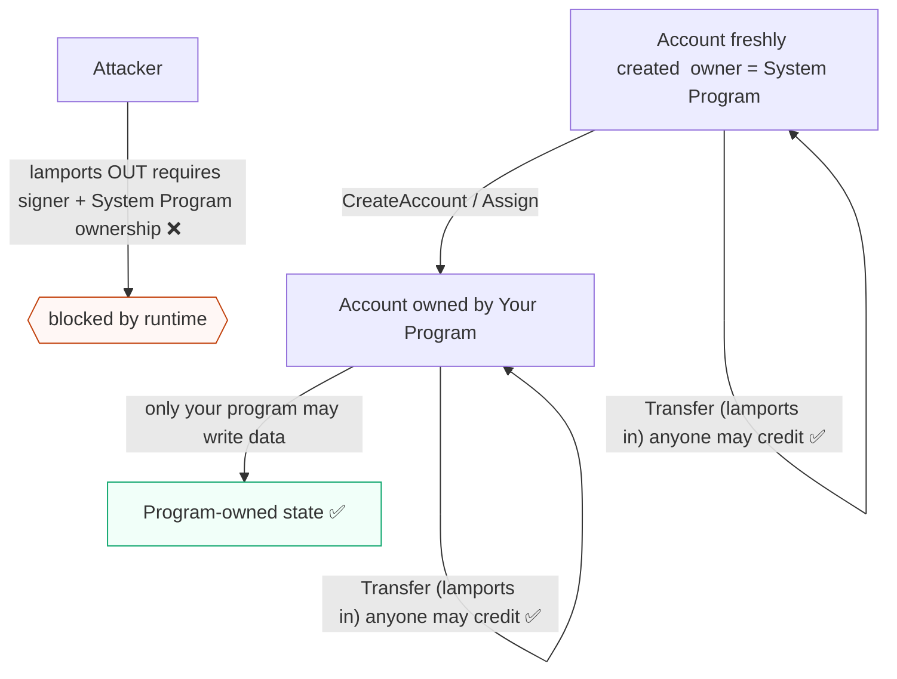
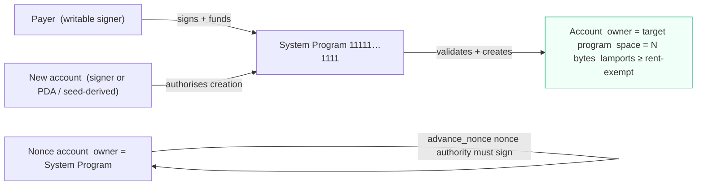
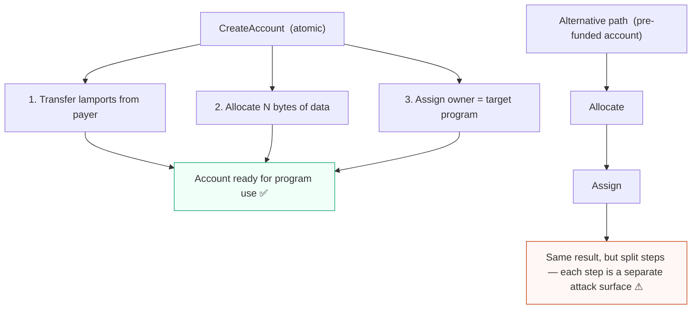
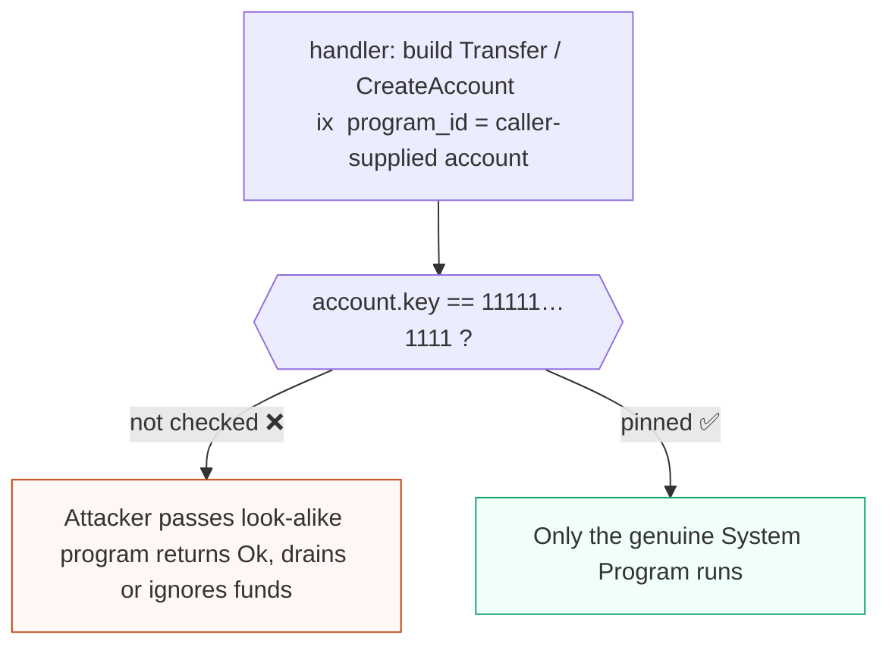
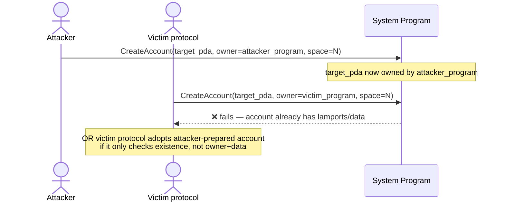
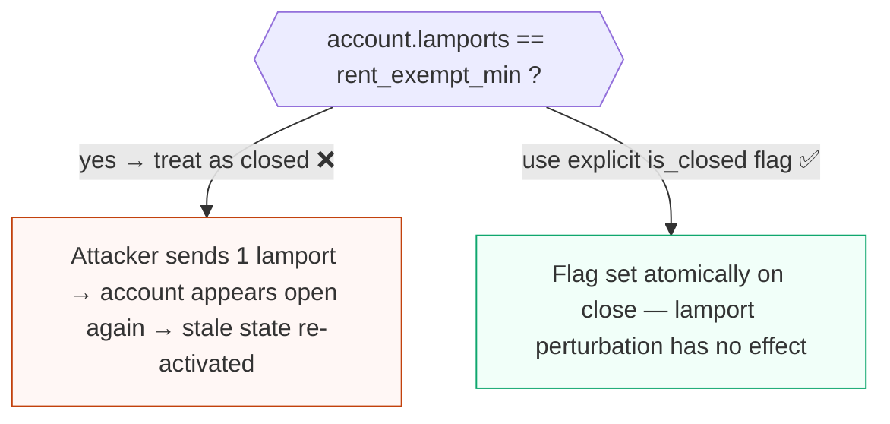
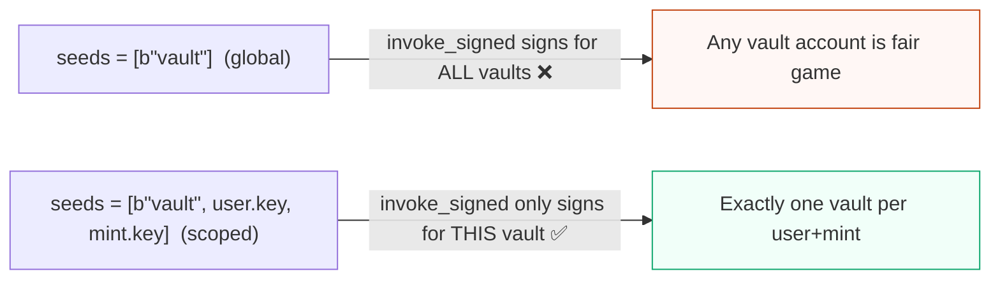

# System Program for Solana auditors

The System Program is the runtime-blessed program that creates accounts, funds them with lamports, assigns their owning program, sizes their data, and moves native SOL between accounts it owns. On Solana, almost everything else is downstream of it: a token account, a PDA state account, or a vault all begin life as a System Program `CreateAccount` (often via CPI) before another program takes ownership. For an EVM/Solidity auditor, the key adjustment is that account creation and SOL transfer are explicit instructions against a specific program, not implicit side effects of `CREATE`/`CREATE2` or a `value`-bearing call.

## Purpose and trust model

The System Program is part of the validator's set of native programs. It is not upgradeable by a normal authority and its instruction set is fixed by the runtime. You can treat its logic as trusted; what is *not* automatically trusted is that a given instruction or CPI actually targets it and uses the accounts you expect.

Its trust model rests on a few runtime rules that EVM auditors should internalize:

- **It owns "un-owned" accounts and native SOL.** A freshly created account, or any account whose `owner` is still the System Program, can be acted on by the System Program: it can transfer that account's lamports, assign it to a new owner, or allocate its data. Once another program owns an account, the System Program can no longer move that account's data or (with a signer) reassign it under normal rules.
- **Assigning ownership is a one-way handoff.** `CreateAccount`/`Assign` set the account's `owner` field. After assignment, only the new owner program may modify the account's data or shrink/realloc it under normal runtime rules. This is the `owner` = data-write-authority model described in [core-solana-security.md](core-solana-security.md); it is not asset ownership.
- **Lamport credits are permissive; debits are constrained.** Anyone can transfer lamports *into* a writable account. Reducing an account's lamports requires that the account is owned appropriately and, for System-owned accounts, that the funding key signs. This asymmetry is the source of several lamport-accounting and "balance == exactly rent" bugs.
- **Rent-exemption is a balance floor, not a recurring fee.** Created accounts must hold at least the rent-exempt minimum for their data size or creation fails. In current Solana practice rent is an account-lifecycle concern (create/realloc/close), not an Ethereum-style per-block storage charge. See the rent-exemption discussion in [core-solana-security.md](core-solana-security.md).


<span class="figcap">Ownership is a one-way handoff. Lamport credits are open to anyone; debits are constrained. Once your program owns an account the System Program cannot reassign or write its data.</span>

## EVM analog

There is no clean EVM equivalent. In Solidity:

- account/contract creation is implicit in `CREATE`/`CREATE2`, and a contract's storage is an implicit per-contract mapping;
- sending ETH is `payable`/`call{value:}` and does not "create" a storage region;
- you never explicitly "assign an owner program" to an address.

On Solana all of that is explicit and separable: you allocate bytes (`Allocate`/`CreateAccount`), you fund lamports (`Transfer`/`CreateAccount`), and you assign an owner (`Assign`/`CreateAccount`). The closest individual analogies:

| Solana System Program concept | Rough EVM analog | Caveat |
| --- | --- | --- |
| `CreateAccount` | `CREATE` plus implicit funding | On Solana it is an explicit CPI with caller-supplied accounts |
| `CreateAccountWithSeed` | `CREATE2` deterministic address | Seed address is derived from a base key + seed + owner, not init code |
| `Transfer` | `call{value:}` / sending ETH | Only moves native SOL, never SPL tokens |
| `Assign` | (no analog) | Hands data-write authority to another program |
| Nonce account | (no real analog) | A durable, on-chain replacement for recent-blockhash, not an EOA nonce |

Treat "account creation is free/implicit" intuition from EVM as a liability here. On Solana the creation step is a place where front-running, pre-creation, and ownership/space mismatches live.

## Program IDs and versions

| Item | Value |
| --- | --- |
| System Program ID | `11111111111111111111111111111111` |
| Instruction reference | `solana_program::system_instruction` |

> Accuracy stance: program IDs and versions are version- and cluster-sensitive. The System Program ID above is stable across clusters, but you should still verify program IDs and crate versions against the in-scope deployed addresses and the project's `Cargo.lock`/`Cargo.toml` rather than relying on `/latest/` docs. For the System Program specifically, confirm the `solana-program` crate version in scope, because instruction layouts and helper signatures (for example nonce instructions and `create_account_with_seed`) are version-sensitive.

## Key accounts and PDAs

The System Program has no protocol PDAs of its own, but several account roles recur and each is a validation surface:

- **The new account.** The account being created. It must be a signer for plain `CreateAccount` (it signs to authorize being created at its own address) unless it is a PDA created via `invoke_signed`, or a seed-derived address via `CreateAccountWithSeed`.
- **The funding account (payer).** A System-owned account, must sign, must be writable, and pays both the rent-exempt lamports and the creation. In EVM terms this is the `msg.value` source, but it is an explicit, signing account.
- **Seed-derived addresses.** `CreateAccountWithSeed` derives an address from `base + seed_string + owner`. This is deterministic like `CREATE2`; the `base` key must sign. It is distinct from a PDA, which is derived by `find_program_address` and "signed" only via `invoke_signed`.
- **Nonce accounts.** System-owned accounts holding durable-nonce state (the stored blockhash and the nonce authority). They enable durable-nonce transactions whose lifetime is not tied to a recent blockhash.


<span class="figcap">Every account role is an explicit signer/writable requirement — nothing is implicit. The nonce account's authority is a separate key from the payer and must be validated on every nonce instruction.</span>

## Instructions that matter

```rust
// solana_program::system_instruction (signatures are version-sensitive; verify in scope)
create_account(from, to, lamports, space, owner)
create_account_with_seed(from, to, base, seed, lamports, space, owner)
assign(pubkey, owner)
allocate(pubkey, space)
transfer(from, to, lamports)
// nonce:
create_nonce_account(...)   advance_nonce_account(...)   withdraw_nonce_account(...)   authorize_nonce_account(...)
```

- **CreateAccount.** Atomically funds the new account with `lamports`, allocates `space` bytes, and sets `owner`. The new account and the payer both sign. This is the canonical "make a new state/token account" path.
- **CreateAccountWithSeed.** Same as above but the new address is deterministically derived from a base key, a seed string, and the target owner. Useful for predictable addresses without PDA signing. The `base` key signs.
- **Assign.** Changes an existing System-owned account's `owner` to a new program. The account must sign. After assignment the System Program can no longer write that account's data.
- **Allocate.** Sets the data length of a System-owned account (which must sign). Often combined with `Assign` as an alternative to `CreateAccount` when an account already exists/was pre-funded.
- **Transfer.** Moves native SOL from a System-owned `from` (signer, writable) to any writable `to`. Does not touch SPL tokens.
- **Nonce instructions.** `create_nonce_account` sets up durable-nonce state; `advance_nonce_account` consumes/rotates the stored nonce (requires the nonce authority to sign); `withdraw_nonce_account` reclaims lamports subject to rent rules; `authorize_nonce_account` changes the nonce authority.


<span class="figcap">`CreateAccount` bundles three operations atomically. The split-step alternative (Allocate + Assign on a pre-funded account) is common in PDA creation via CPI but exposes each step to race conditions and pre-creation attacks.</span>

## Security-relevant surface

The System Program itself is trusted, so the bugs live in *how a target program drives it*. Map these onto the core patterns:

- **Arbitrary-CPI target if the program ID is not pinned.** A handler that builds a `CreateAccount`/`Transfer` instruction with a caller-supplied "system program" account and never checks it is `11111111111111111111111111111111` can be pointed at a malicious program. This is the [arbitrary CPI](core-solana-security.md) class.
- **Account-already-initialized / reinitialization.** `CreateAccount` fails if the target already holds lamports or data, but multi-step flows (`Allocate` + `Assign`, or `init_if_needed`) can be coaxed into reusing an existing account. Validate that a "new" account is genuinely zeroed/uninitialized before trusting it. See reinitialization in [core-solana-security.md](core-solana-security.md).
- **Create-account front-running / init races.** Because addresses for `CreateAccountWithSeed` and PDAs are deterministic and public, an attacker can pre-create or pre-fund the target address in an earlier transaction (or earlier instruction in the same atomic transaction). A handler that assumes "this address does not exist yet, therefore it is mine to initialize" can be tricked into adopting an attacker-prepared account. Validate eventual `owner`, `space`, and zeroed data rather than mere existence.
- **Transfer to/from PDAs.** A PDA that is still System-owned can be the `from` of a `Transfer` only via `invoke_signed` with correct seeds; if a program lets the seeds or the PDA identity float, it can sign over the wrong account. Conversely, anyone can `Transfer` lamports *into* a program-owned PDA, so logic that branches on an exact lamport balance (for example "balance == rent-exempt minimum means closed") is unsafe.
- **Lamport accounting.** Native SOL is not an SPL token. Direct lamport mutation, rent floors, and the credit/debit asymmetry above produce the [native SOL lamport accounting](core-solana-security.md) bug class. Recheck balances after any System CPI rather than trusting pre-CPI values.
- **System-program-owned vs program-owned confusion.** A program must not assume an account it sees is owned by itself just because it created it earlier; ownership only transfers on `Assign`/`CreateAccount` with the target `owner` set. Equally, an account still owned by the System Program is not yet protected program state.

### Arbitrary-CPI — unpinned System Program ID



```rust
// ❌ BAD: invokes whatever the caller passed as "system_program".
pub fn create_state(ctx: Context<CreateState>, space: u64) -> Result<()> {
    let ix = system_instruction::create_account(
        ctx.accounts.payer.key,
        ctx.accounts.new_account.key,
        Rent::get()?.minimum_balance(space as usize),
        space,
        ctx.program_id,
    );
    invoke(&ix, &[
        ctx.accounts.payer.to_account_info(),
        ctx.accounts.new_account.to_account_info(),
        ctx.accounts.system_program.to_account_info(), // unvalidated!
    ])?;
    Ok(())
}

// ✅ GOOD: Anchor's Program<'info, System> pins the ID automatically.
#[derive(Accounts)]
pub struct CreateState<'info> {
    #[account(mut)] pub payer: Signer<'info>,
    /// CHECK: will be initialized by CPI below
    #[account(mut)] pub new_account: AccountInfo<'info>,
    pub system_program: Program<'info, System>, // enforces 11111…1111
}
// Native alternative: require_keys_eq!(system_program.key(), system_program::ID);
```

### Front-running / init races on deterministic addresses


<span class="figcap">PDA and seed-derived addresses are public and deterministic. An attacker can race to pre-create or pre-fund the address before the victim transaction, causing initialization to fail or adopt attacker-controlled state.</span>

```rust
// ❌ BAD: treats "account has no data" as proof it is safe to initialize.
pub fn init_pool(ctx: Context<InitPool>) -> Result<()> {
    let pool = &mut ctx.accounts.pool;
    // If an attacker already wrote bytes here, we might overwrite only some fields
    // or adopt pre-seeded state when using init_if_needed.
    pool.admin = ctx.accounts.admin.key();
    Ok(())
}

// ✅ GOOD: use Anchor's `init` (calls CreateAccount via CPI) — fails if the
// account already exists, and validates owner + space + rent all at once.
#[derive(Accounts)]
pub struct InitPool<'info> {
    #[account(
        init,                        // fails if already initialized ✅
        payer = admin,
        space = 8 + Pool::LEN,
        seeds = [b"pool", admin.key().as_ref()],
        bump,
    )]
    pub pool: Account<'info, Pool>,
    #[account(mut)] pub admin: Signer<'info>,
    pub system_program: Program<'info, System>,
}
// After init, verify pool.owner == your program if using raw CPI.
```

### Lamport-balance branching — the "anyone can top up" trap



```rust
// ❌ BAD: branching on exact lamport balance to detect a "closed" account.
//   Anyone can System::transfer 1 lamport in → balance rises above threshold
//   → the closed-account path is skipped → revived with stale data.
if vault.to_account_info().lamports() == RENT_EXEMPT_MIN {
    return err!(MyError::VaultClosed);
}

// ✅ GOOD: store an explicit flag in account data; close it atomically.
#[account]
pub struct Vault {
    pub authority: Pubkey,
    pub is_closed: bool,   // set to true when closing, checked on every use
    // ...
}

pub fn use_vault(ctx: Context<UseVault>) -> Result<()> {
    require!(!ctx.accounts.vault.is_closed, MyError::VaultClosed);
    // ...
    Ok(())
}
```

## What to check when the target program CPIs into it

When the program under review calls the System Program (directly or via Anchor's `system_program::{create_account, transfer, allocate, assign}` or the `init`/`init_if_needed` machinery):

- **Pin the program ID.** Require the system program account equals `11111111111111111111111111111111`. In Anchor, `Program<'info, System>` does this; for raw `AccountInfo`, use `require_keys_eq!(system_program.key(), system_program::ID)`.
- **Validate the created account's eventual owner, space, and rent.** After creation the account should be owned by the intended program (often the program under review or a token program), sized to the expected `space`, and rent-exempt. Anchor's `init` enforces payer, space, owner, and rent together; manual flows must reproduce each check.
- **Watch for someone pre-creating the account.** Do not treat "address is empty" as proof of first creation. If using `CreateAccountWithSeed` or PDA-targeted creation, confirm the resulting account's owner/data match expectations and that an attacker could not have pre-funded or pre-assigned it. Be explicit about same-transaction composition: an earlier instruction could have created or funded the address.
- **Constrain the payer and recipient.** The funding account must be a writable signer you actually intend to charge; a `Transfer` recipient must be the intended account, not a caller-substituted one. Reject `from == to` aliasing where it would distort accounting.
- **Re-check balances after the CPI.** For lamport movements, validate post-transfer invariants and rent floors on freshly read balances; do not branch on exact-balance equality given that anyone can transfer SOL in.
- **For PDA signing, validate seeds.** When the program signs a System CPI for a PDA via `invoke_signed`, ensure the seeds are canonical and scoped so the PDA cannot be made to sign over an unintended account.

```rust
// ❌ BAD: manual CreateAccount CPI — several missing checks.
pub fn manual_create(ctx: Context<ManualCreate>, space: u64) -> Result<()> {
    let lamports = Rent::get()?.minimum_balance(space as usize);
    let ix = system_instruction::create_account(
        ctx.accounts.payer.key,
        ctx.accounts.account.key,
        lamports,
        space,
        ctx.program_id,
    );
    invoke(&ix, &[
        ctx.accounts.payer.to_account_info(),
        ctx.accounts.account.to_account_info(),
        // ❌ system_program not validated — could be a look-alike
        ctx.accounts.system_program.to_account_info(),
    ])?;
    // ❌ No check that account.owner == program_id after CPI
    // ❌ No check that payer != account (aliasing)
    Ok(())
}

// ✅ GOOD: let Anchor's `init` handle owner, space, rent, and ID pinning.
#[derive(Accounts)]
pub struct GoodCreate<'info> {
    #[account(
        init,
        payer = payer,
        space = 8 + MyState::LEN,           // rent-exempt by construction
        seeds = [b"state", payer.key().as_ref()],
        bump,
    )]
    pub state: Account<'info, MyState>,      // owner enforced == program_id ✅
    #[account(mut, constraint = payer.key() != state.key() @ MyError::SelfFund)]
    pub payer: Signer<'info>,                // payer ≠ new account ✅
    pub system_program: Program<'info, System>, // ID pinned ✅
}

// ✅ GOOD: re-read lamports after a manual Transfer CPI, do not cache pre-CPI value.
pub fn withdraw(ctx: Context<Withdraw>, amount: u64) -> Result<()> {
    let pre_balance = ctx.accounts.vault.to_account_info().lamports();
    system_program::transfer(
        CpiContext::new(
            ctx.accounts.system_program.to_account_info(),
            system_program::Transfer {
                from: ctx.accounts.vault.to_account_info(),
                to: ctx.accounts.recipient.to_account_info(),
            },
        ),
        amount,
    )?;
    // ✅ Re-read after CPI; do NOT use pre_balance - amount (stale).
    let post_balance = ctx.accounts.vault.to_account_info().lamports();
    require!(post_balance >= RENT_EXEMPT_MIN, MyError::BelowRentMin);
    Ok(())
}
```

### PDA-signed System CPI — seed scoping



```rust
// ❌ BAD: PDA with global seeds — one signer for every vault.
let signer_seeds: &[&[&[u8]]] = &[&[b"vault", &[bump]]];
invoke_signed(&transfer_ix, &accounts, signer_seeds)?;

// ✅ GOOD: scope seeds to the specific user + mint this vault is for.
let signer_seeds: &[&[&[u8]]] = &[&[
    b"vault",
    user.key.as_ref(),
    mint.key.as_ref(),
    &[vault.bump],
]];
invoke_signed(&transfer_ix, &accounts, signer_seeds)?;
// The PDA derived from these seeds can only move that specific user's vault.
```

## Audit checklist

- [ ] Is every System Program CPI target pinned to `11111111111111111111111111111111` (`Program<'info, System>` or explicit key check)?
- [ ] For each created account: are eventual `owner`, `space`, and rent-exempt balance validated, not just existence?
- [ ] Could the target address have been pre-created, pre-funded, or pre-assigned by an attacker (cross-transaction or same-transaction)?
- [ ] Is the funding/payer account a writable signer the protocol actually intends to charge?
- [ ] Are `Transfer` source/destination the intended accounts, with `from != to` where required?
- [ ] Does any logic branch on an exact lamport balance that anyone could perturb with a `Transfer`?
- [ ] For PDA-signed System CPIs, are the seeds canonical and resource-scoped?
- [ ] Is `Assign`/`Allocate` used in a way that could reinitialize or repurpose an existing account?
- [ ] If nonce accounts are used, is the nonce authority validated on `advance`/`withdraw`/`authorize`?
- [ ] After any System CPI that moves lamports, are post-conditions checked on freshly read balances?

## References

- https://solana.com/docs/core/accounts
- https://docs.rs/solana-program/latest/solana_program/system_instruction/index.html
- https://solana.com/docs/core/fees
