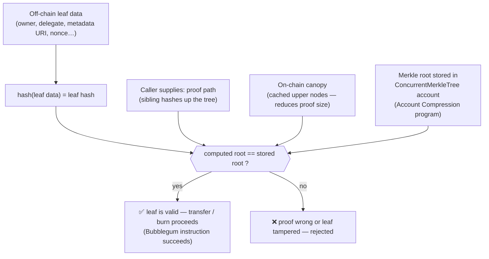
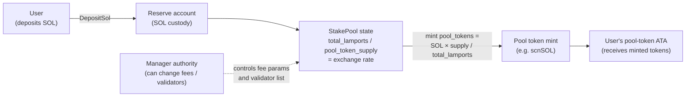
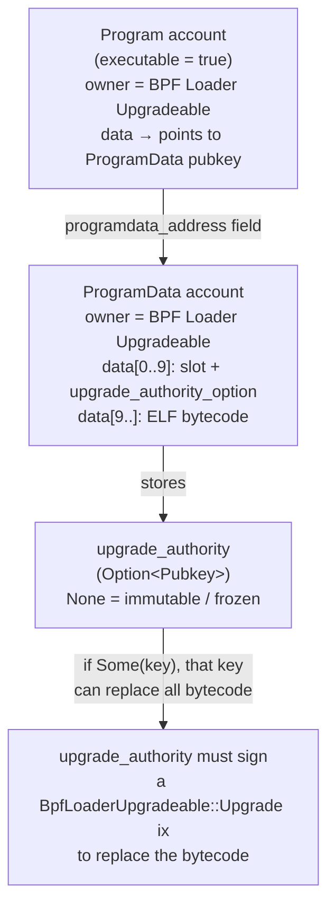

# Programs to recognize on Solana

This page is a recognition map, not a deep dive. As a Solana auditor you will repeatedly see the same handful of third-party and SPL programs named as dependencies, authorities, or CPI targets; you need to know each one exists, roughly what it does, its rough EVM analog, and the one audit-relevant thing to remember. Where this repo already has a full deep dive, the entry is deliberately short and links to it — follow the link rather than relying on the paragraph here.

> Accuracy stance (per repo README): program IDs and account layouts are version- and cluster-sensitive. This page keeps program-id mentions minimal on purpose. Always confirm the deployed program id, version, and IDL against the in-scope deployment rather than trusting any id you find in docs.

## Tokens & NFTs

### Metaplex Token Metadata
Attaches a metadata account (name, symbol, URI, royalties/creators) to a mint, keyed by a PDA derived from the mint. The metadata carries an **update authority** — the account allowed to change the token's name, URI, royalties, and other fields. EVM analog: ERC-721/ERC-1155 metadata plus a privileged updater. The one thing to remember: when reviewing anything that displays or trusts token metadata, the update authority is the "who can rewrite this token's identity" surface — treat it like any other admin key and trace who holds it.

```rust
// Verifying a Token Metadata PDA and collection membership (illustrative).

// ❌ BAD: trust a metadata account supplied by the caller without re-deriving.
pub fn process_bad(ctx: Context<UseNft>) -> Result<()> {
    // metadata passed in by the caller — attacker could supply a crafted account
    // that parses correctly but belongs to a different (fake) mint.
    let meta = &ctx.accounts.metadata; // UncheckedAccount — no seed check
    require!(meta.collection.as_ref().map(|c| c.verified).unwrap_or(false),
             MyError::NotVerified);
    Ok(())
}

// ✅ GOOD: re-derive the PDA and verify the collection `verified` flag.
pub fn process_good(ctx: Context<UseNft>) -> Result<()> {
    // Seeds: b"metadata" | TOKEN_METADATA_PROGRAM_ID | mint
    let expected = Pubkey::find_program_address(
        &[b"metadata", token_metadata_program::ID.as_ref(), ctx.accounts.mint.key().as_ref()],
        &token_metadata_program::ID,
    ).0;
    require_keys_eq!(ctx.accounts.metadata.key(), expected, MyError::BadMetadataPda);

    let meta: MetadataAccount = MetadataAccount::try_from(&ctx.accounts.metadata)?;
    // A collection NFT is only trustworthy when `verified` == true.
    // `verified` is set by Metaplex Bubblegum / Token Metadata CPI — not self-reported.
    let collection = meta.collection.as_ref().ok_or(MyError::NoCollection)?;
    require!(collection.verified, MyError::CollectionNotVerified);
    require_keys_eq!(collection.key, ctx.accounts.collection_mint.key(), MyError::WrongCollection);
    Ok(())
}
```

### Metaplex Bubblegum + Account Compression (compressed NFTs)
Compressed NFTs (cNFTs) do not live in normal token accounts. Their state is committed into a **Merkle tree** stored via the Account Compression program, and Bubblegum mints/transfers leaves in that tree; only the root (and a cached "canopy" of upper nodes) lives on-chain. There is no clean EVM analog — it is closer to an on-chain Merkle-airdrop pattern than to ERC-721. The one thing to remember: ownership and transfers are proven by supplying a **Merkle proof against the tree root plus canopy**, not by reading a normal token account, so the usual "check the token account owner/mint" reflexes do not apply — validate the tree, the proof path, and the leaf instead.


<span class="figcap">A cNFT has no token account. Ownership is proven by re-hashing the leaf and walking the proof path to the stored Merkle root. Any mismatch aborts the instruction.</span>

```rust
// Consuming a cNFT inside your program (illustrative — calls Bubblegum via CPI).

// ❌ BAD: skip proof verification and trust caller-supplied leaf fields directly.
pub fn use_cnft_bad(ctx: Context<UseCnft>, owner: Pubkey, nonce: u64) -> Result<()> {
    // No proof is verified — attacker can claim any nonce/owner combination.
    require_keys_eq!(owner, ctx.accounts.user.key(), MyError::NotOwner);
    // proceed with action on the "owned" cNFT ...
    Ok(())
}

// ✅ GOOD: delegate ownership check to Bubblegum via CPI, which verifies the
//          Merkle proof inside the Account Compression program.
pub fn use_cnft_good(ctx: Context<UseCnft>, args: TransferArgs) -> Result<()> {
    // CPI into mpl_bubblegum::instructions::Transfer (or equivalent).
    // Bubblegum hashes the supplied leaf data, walks the proof accounts,
    // and calls spl_account_compression::verify_leaf — only then updates the root.
    mpl_bubblegum::cpi::transfer(
        ctx.accounts.bubblegum_transfer_ctx(),
        args.root,          // current root of the concurrent merkle tree
        args.data_hash,     // hash of the leaf's metadata
        args.creator_hash,
        args.nonce,
        args.index,
    )?;
    Ok(())
}
```

### Token metadata via Token-2022 metadata pointer
Metadata does not have to be a separate Metaplex account: a Token-2022 mint can carry metadata in the mint itself (or point to where it lives) via the metadata-pointer and token-metadata extensions. The one thing to remember: a mint may legitimately have metadata either as a Metaplex account or inside the Token-2022 mint, and these are different trust surfaces. See [token-2022-extensions.md](token-2022-extensions.md) for the extension model and its audit implications.

## Staking & liquid staking

### Native Stake program
The runtime program that delegates SOL to validators. A stake account separates two authorities: the **staker** (can delegate/deactivate) and the **withdrawer** (can move the lamports out, and can reassign the staker). EVM analog: closest to a native staking precompile, but with explicit per-account authorities. The one thing to remember: when a protocol holds or manages stake accounts, the staker-vs-withdrawer split is the authorization surface — confirm which authority the protocol's PDA holds and that the withdrawer cannot be quietly reassigned.

```rust
// Auditing which authority a protocol's PDA holds over a stake account (illustrative).

// ❌ BAD: protocol CPI calls Stake::delegate but never locks the withdrawer —
//         leaving the user's original keypair as withdrawer. The user can
//         withdraw the lamports at any time, breaking the protocol's accounting.
pub fn delegate_bad(ctx: Context<DelegateStake>) -> Result<()> {
    // Only authorize the staker to be the protocol PDA — withdrawer untouched.
    stake::instruction::delegate_stake(
        &ctx.accounts.stake_account.key(),
        &ctx.accounts.protocol_pda.key(), // staker = protocol PDA  ✓
        &ctx.accounts.vote_account.key(),
    );
    // withdrawer is still the user — they can drain the account independently ❌
    Ok(())
}

// ✅ GOOD: reassign BOTH authorities to the protocol PDA (or a known custodian)
//          before the stake account is considered protocol-controlled.
pub fn delegate_good(ctx: Context<DelegateStake>) -> Result<()> {
    // Step 1: authorize withdrawer → protocol PDA
    stake::instruction::authorize(
        &ctx.accounts.stake_account.key(),
        &ctx.accounts.user.key(),          // current withdrawer must sign
        &ctx.accounts.protocol_pda.key(),  // new withdrawer
        StakeAuthorize::Withdrawer,
        None,
    );
    // Step 2: authorize staker → protocol PDA
    stake::instruction::authorize(
        &ctx.accounts.stake_account.key(),
        &ctx.accounts.user.key(),
        &ctx.accounts.protocol_pda.key(),
        StakeAuthorize::Staker,
        None,
    );
    // Now both authorities are the protocol PDA — lamports cannot leave without
    // the protocol's consent. ✅
    Ok(())
}
```

### SPL Stake Pool
Pools many delegators' SOL across validators and issues a **pool token** as a receipt whose value tracks the underlying stake. EVM analog: a staking vault / liquid-staking token (LST) such as an ERC-4626-style share. The one thing to remember: the risk lives in the **exchange-rate and fee accounting** (how the pool-token price is computed from total stake, rounding, deposit/withdraw fees) and in the pool **manager** authority, which can change fees and validator set.


<span class="figcap">SPL Stake Pool deposit flow. The exchange rate (total_lamports / pool_token_supply) is the critical value — rounding or manipulation here misprices every deposit and withdrawal.</span>

### Marinade / Jito liquid staking
Third-party liquid-staking protocols issuing LSTs (mSOL, JitoSOL) that represent staked SOL and accrue rewards. EVM analog: stETH/rETH-style LSTs. The one thing to remember: when a protocol you audit prices or accepts these LSTs, scrutinize the **LST price/exchange-rate source** (is it a manipulable spot pool or the protocol's own redemption rate?) and the **unstake/redemption mechanics** (instant vs delayed, with a discount or queue), since both are common mispricing and liquidity-assumption bugs.

## Infrastructure & loaders

### BPF Loader (Upgradeable)
Deploys programs and, for upgradeable programs, stores the executable in a separate **ProgramData** account that holds the **upgrade authority**. EVM analog: a proxy/admin upgrade slot, but it is a first-class runtime concept rather than a contract pattern. The one thing to remember: the ProgramData upgrade authority is **the single most important admin-control check on Solana** — an upgradeable program can be silently replaced by whoever holds it, so record it (and whether it is a multisig, a single key, or burned/none) for every in-scope program and dependency. See the inventory step in [audit-workflow.md](audit-workflow.md) and the ownership/upgrade discussion in [core-solana-security.md](core-solana-security.md).


<span class="figcap">For an upgradeable program, the upgrade authority in ProgramData is equivalent to a proxy admin. If it is a single EOA-equivalent key, the entire protocol can be replaced unilaterally. Always check: is it a multisig? Is it a time-lock? Has it been set to None (frozen)?</span>

```rust
// Checking a dependency's upgrade authority on-chain (illustrative).

// ❌ BAD: assume a CPI target (e.g. an oracle or AMM) is immutable without checking.
// (No code — the absence of the check is the bug.)

// ✅ GOOD: parse the ProgramData account of any critical dependency.
pub fn assert_immutable_dependency(program_data: &AccountInfo) -> Result<()> {
    // ProgramData layout: 4-byte enum tag + 8-byte slot + 1-byte Option<Pubkey> tag
    // Option<Pubkey>: 0x00 = None (immutable), 0x01 followed by 32 bytes = Some(authority)
    let data = program_data.try_borrow_data()?;
    // Skip 4 (enum) + 8 (slot) = offset 12; byte 12 is the Option discriminant.
    require!(data.len() > 12, MyError::BadProgramData);
    let authority_option = data[12];
    require!(authority_option == 0, MyError::ProgramStillUpgradeable);
    // authority_option == 1 means Some(pubkey) → program can be upgraded → risk
    Ok(())
}
```

### Address Lookup Table (ALT) program
Lets versioned (v0) transactions reference accounts by index into a stored table, so a transaction can touch more accounts than the legacy 1232-byte limit allows. EVM analog: none. The one thing to remember: accounts can be supplied **via a lookup table**, so do not assume the literal account list in a transaction is the complete set, and if a program stores or trusts an ALT pubkey, that ALT is a trust boundary that must be validated (owner, authority, deactivation, resolved keys). See the ALT trust-boundary item in [core-solana-security.md](core-solana-security.md).

### SPL Memo
Attaches a UTF-8 note to a transaction and verifies any required signers on the memo. EVM analog: an event/log carrying a string, roughly. The one thing to remember: it is benign on its own, but it is sometimes used as a lightweight **signer marker** or off-chain correlation tag — if program logic keys off a memo, confirm what it actually proves (the memo program checks signers, but the note content is attacker-chosen).

### SPL Name Service
On-chain naming/registry mapping human-readable names to data (used by .sol domains and similar). EVM analog: ENS. The one thing to remember: name ownership is just account state with an owner/authority, so a name resolving to an address is not proof of anything unless the program independently validates the registry account and its authority — do not treat a resolved name as an authenticated identity.

## DeFi & cross-program (mostly covered elsewhere)

These are the ecosystems you will most often see integrated. Each has (or will have) its own deep dive; this section is just the map.

| Category | Programs you'll see | EVM analog | Deep dive |
| --- | --- | --- | --- |
| AMMs / DEXes | Raydium, Orca, Jupiter (aggregator/router) | Uniswap-style AMMs + a swap router | [program-amm-overview.md](program-amm-overview.md) |
| Lending | Kamino / KLend (covered); Solend, MarginFi as other examples | Aave/Compound-style money markets | [kamino-klend-domain.md](kamino-klend-domain.md) |
| Oracles | Pyth, Switchboard | Chainlink-style price feeds | [program-pyth-oracle.md](program-pyth-oracle.md), [program-switchboard-oracle.md](program-switchboard-oracle.md) |
| Bridges / messaging | CCTP (Wormhole — see note, no deep dive) | Cross-chain message/bridge stacks | [cctp-v2.md](cctp-v2.md) |
| Governance & multisig | SPL Governance / Realms, Squads | DAO governor + Gnosis Safe | [program-spl-governance-realms.md](program-spl-governance-realms.md), [program-squads-multisig.md](program-squads-multisig.md) |

One extra note on bridges, since the two have very different trust models: **CCTP** relies on Circle's off-chain attestation service signing burn messages (see [cctp-v2.md](cctp-v2.md)), whereas **Wormhole** relies on a fixed **guardian set** signing observations — a quorum of guardian signatures is the entire trust assumption for a Wormhole VAA, so when a protocol consumes Wormhole messages, the guardian-signature verification and the expected emitter/chain are the surface to check.

## MEV / orderflow

### Jito
Runs a block engine that accepts **bundles** (ordered, atomic groups of transactions) and **tips**, giving searchers a way to influence transaction ordering; JitoSOL (above) is a separate liquid-staking product from the same ecosystem. EVM analog: Flashbots-style block building and bundle auctions. The one thing to remember: Jito is **not a CPI target you validate** — it matters as an **ordering / sandwich / front-running risk** to the protocol's economic assumptions, so reason about it the way you would about MEV on Ethereum (can a searcher reorder or sandwich the protocol's swaps, liquidations, or oracle updates?). See the MEV notes in [core-solana-security.md](core-solana-security.md) and [audit-workflow.md](audit-workflow.md).

## References

- https://developers.metaplex.com/token-metadata
- https://developers.metaplex.com/bubblegum
- https://spl.solana.com/stake-pool
- https://solana.com/docs/core/programs
- https://solana.com/docs/advanced/lookup-tables
- https://spl.solana.com/memo
- https://spl.solana.com/name-service
- https://solana.com/docs/tokens/extensions
- https://github.com/solana-labs/security-audits/blob/master/spl/HalbornStakePoolAudit-2023-01-25.pdf
- https://github.com/solana-labs/security-audits/blob/master/spl/OtterSecAccountCompressionAudit-2022-12-03.pdf
- https://github.com/solana-labs/security-audits/blob/master/solana/AddressLookupTable_OtterSec_2022-08-23.pdf
- https://www.helius.dev/blog/solana-mev-an-introduction
