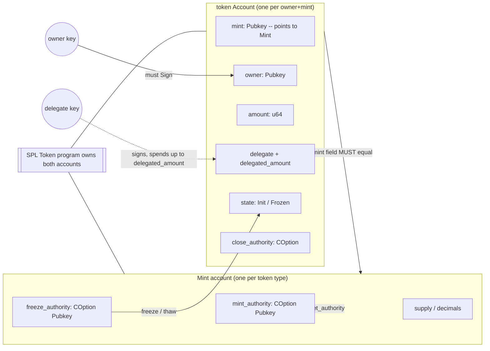

# SPL Token, read along for EVM auditors

This is a read-along tour of the classic SPL Token program for auditors who already know ERC-20. It walks the program instruction by instruction, and for each one it shows a short illustrative source excerpt, the account table, and the concrete checks the program performs. The goal is to make the SPL Token trust model legible so that when you review a protocol that *uses* tokens, you can tell which checks the token program already guarantees and which checks the integrating program still owes you.

For the separate Token-2022 program and its extensions, read this alongside [token-2022-extensions.md](token-2022-extensions.md).

## How to read this doc

- **Program in scope:** the classic SPL Token program, program ID `TokenkegQfeZyiNwAJbNbGKPFXCWuBvf9Ss623VQ5DA`. Token-2022 is a *different* program with a different ID and is covered in [token-2022-extensions.md](token-2022-extensions.md).
- **Crate:** behavior here tracks the `spl-token` crate (the `processor.rs` logic). Pin the exact version in scope from the project's `Cargo.lock`; instruction set and edge-case behavior are version-sensitive.
- **Accuracy stance (per the repo README):** program IDs, crate versions, and cluster deployments are version- and cluster-sensitive. The IDs and behavior described here are the mainnet-canonical classic Token program, but you should verify every claim against the exact in-scope crate version rather than `/latest/` docs. Where a check matters, confirm it in the pinned `processor.rs`, not in this summary.
- **The source excerpts below are illustrative**, conservatively paraphrased to show *which* checks the processor performs. They are not exact line-for-line quotes and carry no line numbers; treat them as a map to the real code, not a substitute for reading it.
- **Reading order:** start with the ERC-20 analogy and the account model, then the per-instruction sections, then the cross-cutting auditor lens.

## SPL Token as the ERC-20 analog

In ERC-20, a single contract holds one `mapping(address => uint256) balances` plus `allowances`, and `msg.sender` is the implicit authority for `transfer`/`approve`. SPL Token decomposes all of that into separate accounts and an explicit authority model.

| ERC-20 concept | SPL Token equivalent | Note |
| --- | --- | --- |
| One ERC-20 contract = one token | A `Mint` account = one token type | The mint stores supply, decimals, mint authority, freeze authority. |
| `balances[owner]` slot | A token `Account` (often an ATA) per `(owner, mint)` pair | Balance is data inside a separate account, not a slot in the mint. |
| `msg.sender` | A `Signer` account, or a `delegate` | There is no implicit caller; authority must sign or be a validated PDA. |
| `allowance[owner][spender]` | `delegate` + `delegated_amount` fields on the token account | One delegate per token account, not a 2D mapping. |
| `decimals()` view | `decimals` on the mint | Callers must pass and the program checks decimals on `*_checked` ops. |
| Ownership of the token | The token account's `owner` field (an SPL field) | Distinct from the Solana account `owner`, which is the Token program itself. |

Two separations are easy to miss coming from EVM:

1. **Authority/mint/owner separation.** The *mint authority* can mint new supply, the *freeze authority* can freeze accounts, and the token-account *owner* controls transfers. These are three different powers on potentially three different keys. ERC-20 collapses them into contract logic and `Ownable`.
2. **No `msg.sender`.** A pubkey appearing in a token account's `owner` field is not authorization. The Token program requires that the relevant authority be an actual `Signer` on the instruction, or a `delegate` that signs, or a PDA signing via `invoke_signed`. This is the same lesson as [core-solana-security.md](core-solana-security.md) #1 (missing signer), applied to tokens.

## The account model behind every instruction

Three account types and one option type drive everything below.

**`Mint`** (fixed layout): `mint_authority: COption<Pubkey>`, `supply: u64`, `decimals: u8`, `is_initialized: bool`, `freeze_authority: COption<Pubkey>`.

**`Account`** (the token account / balance holder): `mint: Pubkey`, `owner: Pubkey`, `amount: u64`, `delegate: COption<Pubkey>`, `state: AccountState` (Uninitialized / Initialized / Frozen), `is_native: COption<u64>` (set for wrapped SOL), `delegated_amount: u64`, `close_authority: COption<Pubkey>`.

**`Multisig`**: `m: u8`, `n: u8`, `is_initialized: bool`, plus up to 11 signer pubkeys. Any "authority" slot below (mint authority, owner, freeze authority, close authority, delegate) may be a multisig account instead of a single key; in that case the instruction must include `m` of the configured signers as signers.

**`COption<Pubkey>`** is Solana's serialized `Option`. `COption::None` for an authority means *that authority is permanently unset* — there is no key that can ever exercise it again. This is load-bearing: a mint with `mint_authority = None` has a fixed supply forever; a freeze authority of `None` can never be re-enabled.

**Rent-exemption:** mints and token accounts must be rent-exempt (hold the minimum balance for their size) or initialization is rejected. Closing returns those lamports.



Read the diagram as the core invariant set: a token account is only meaningful *relative to its mint*, the `owner` (or delegate) is the spend authority, and only the SPL Token program may write either account's data.

## initialize_mint

```rust
// processor.rs (illustrative): InitializeMint
let mut mint = Mint::unpack_unchecked(&mint_info.data.borrow())?;
if mint.is_initialized {
    return Err(TokenError::AlreadyInUse.into());
}
// rent-exemption is required for the mint account
if !rent.is_exempt(mint_info.lamports(), mint_info.data_len()) {
    return Err(TokenError::NotRentExempt.into());
}
mint.mint_authority = COption::Some(mint_authority);
mint.decimals = decimals;
mint.freeze_authority = freeze_authority; // COption: may be None
mint.is_initialized = true;
```

| Account | Signer? | Writable? | Owner / program | Relationship / check |
| --- | --- | --- | --- | --- |
| mint | No | Yes | SPL Token program | Must be uninitialized; must be rent-exempt; sized for a `Mint`. |
| rent sysvar | No | No | Sysvar | Used to check rent-exemption (or `Rent::get()`); address must be the rent sysvar. |

> **What an auditor checks here.** No signer is required to *initialize* a mint, so anyone can create a mint and set its `mint_authority`/`freeze_authority` — the authority comes from whatever pubkeys are passed, not from a signature. `AlreadyInUse` prevents re-initializing an existing mint (the reinit class, [core-solana-security.md](core-solana-security.md) #5). Note the freeze authority is a `COption`: passing `None` here means the token can *never* be frozen, permanently. The account must already be owned by the Token program and rent-exempt before this call. `initialize_mint2` is the same logic without the rent sysvar account (uses `Rent::get()`); confirm which variant the in-scope program uses.

## initialize_account / initialize_account3

```rust
// processor.rs (illustrative): InitializeAccount
let mut account = Account::unpack_unchecked(&account_info.data.borrow())?;
if account.is_initialized() {
    return Err(TokenError::AlreadyInUse.into());
}
// the mint account must itself be a valid, initialized mint owned by this program
let _ = Mint::unpack(&mint_info.data.borrow())?;
if !rent.is_exempt(account_info.lamports(), account_info.data_len()) {
    return Err(TokenError::NotRentExempt.into());
}
account.mint = *mint_info.key;
account.owner = *owner_info.key;
account.state = AccountState::Initialized;
// wrapped SOL (native mint) gets is_native set and amount from lamports
```

| Account | Signer? | Writable? | Owner / program | Relationship / check |
| --- | --- | --- | --- | --- |
| token account | No | Yes | SPL Token program | Must be uninitialized and rent-exempt; sized for an `Account`. |
| mint | No | No | SPL Token program | Bound into `account.mint`; must be an initialized `Mint`. |
| owner | No | No | any | Recorded as `account.owner`; not required to sign at init. |
| rent sysvar | No | No | Sysvar | Rent-exemption check (omitted by `initialize_account2/3`, which take owner as arg). |

> **What an auditor checks here.** The new token account is permanently **bound to its mint** here — `account.mint` is set once and every later instruction cross-checks it. This is the mint-binding invariant that downstream protocols rely on; if your protocol accepts a token account, it must still verify `token_account.mint == expected_mint` because the *owner* of these bytes is only proven to be the Token program, not that it is the *right* token account ([core-solana-security.md](core-solana-security.md) #2/#3). The mint must itself be a real initialized mint owned by the Token program, which blocks type-cosplay where arbitrary bytes pose as a mint. `initialize_account3` folds the owner into instruction data and drops the rent sysvar account; the binding semantics are identical.

## transfer / transfer_checked

```rust
// processor.rs (illustrative): Transfer / TransferChecked
let mut source = Account::unpack(&source_info.data.borrow())?;
let dest = Account::unpack(&dest_info.data.borrow())?;
if source.is_frozen() || dest.is_frozen() {
    return Err(TokenError::AccountFrozen.into());
}
if source.mint != dest.mint {
    return Err(TokenError::MintMismatch.into());
}
// TransferChecked ONLY: caller passes mint + expected_decimals
if let Some((mint_info, expected_decimals)) = checked {
    let mint = Mint::unpack(&mint_info.data.borrow())?;
    if expected_decimals != mint.decimals { return Err(TokenError::MintDecimalsMismatch.into()); }
    if *mint_info.key != source.mint { return Err(TokenError::MintMismatch.into()); }
}
// authority is either the owner, or a delegate spending delegated_amount
self.validate_owner(/* owner or delegate */, authority_info, signers)?;
source.amount = source.amount.checked_sub(amount).ok_or(TokenError::InsufficientFunds)?;
dest.amount = dest.amount.checked_add(amount).ok_or(...)?;
```

| Account | Signer? | Writable? | Owner / program | Relationship / check |
| --- | --- | --- | --- | --- |
| source token account | No | Yes | SPL Token program | Not frozen; `amount >= transfer`; `mint` must equal dest's mint. |
| destination token account | No | Yes | SPL Token program | Not frozen; same `mint` as source. |
| mint (`transfer_checked` only) | No | No | SPL Token program | Must equal `source.mint`; `decimals` must equal the caller-passed value. |
| authority (owner or delegate) | Yes (or multisig signers) | No | any | Must match `source.owner`, or `source.delegate` with sufficient `delegated_amount`. |

> **What an auditor checks here.** The authority must actually **sign** (or be the recorded delegate, or `m`-of-`n` multisig signers); `validate_owner` enforces this — a key that merely equals `source.owner` without signing is rejected. The program enforces the **mint-binding** invariant `source.mint == dest.mint`, but plain `transfer` does **not** verify decimals — that is exactly why `transfer_checked` exists: the caller asserts the expected `decimals`, and the program rejects a `MintDecimalsMismatch`, defending integrators against being handed the wrong mint with a surprising decimal scale ([patterns.json](../data/patterns.json) `math`). Both endpoints are checked for frozen state. Watch for **aliasing**: if `source` and `dest` are the same writable account, naive integrator logic that reads `source.amount` before and `dest.amount` after can be confused — see the cross-cutting note. Prefer `transfer_checked` in any reviewed protocol; flag bare `transfer` on a caller-supplied mint.

## approve / revoke

```rust
// processor.rs (illustrative): Approve / Revoke
let mut source = Account::unpack(&source_info.data.borrow())?;
if source.is_frozen() { return Err(TokenError::AccountFrozen.into()); }
self.validate_owner(&source.owner, owner_info, signers)?; // ONLY the owner may delegate
// Approve:
source.delegate = COption::Some(*delegate_info.key);
source.delegated_amount = amount;
// Revoke:
source.delegate = COption::None;
source.delegated_amount = 0;
```

| Account | Signer? | Writable? | Owner / program | Relationship / check |
| --- | --- | --- | --- | --- |
| source token account | No | Yes | SPL Token program | Not frozen; owner must authorize. |
| delegate (approve only) | No | No | any | Recorded into `source.delegate`. |
| mint (`approve_checked` only) | No | No | SPL Token program | `decimals` checked, as in `transfer_checked`. |
| owner authority | Yes (or multisig) | No | any | Must equal `source.owner` and sign. |

> **What an auditor checks here.** Only the **owner** can set or clear a delegate — a delegate cannot re-delegate or raise its own allowance. `Approve` overwrites any prior delegate (there is a single delegate slot, unlike ERC-20's 2D allowance map), so a fresh approval replaces, it does not add. `delegated_amount` is the cap a delegate may spend; when a delegated transfer consumes it down to zero the program clears the delegate. `Revoke` requires only the owner's signature and resets both fields. For integrators: never assume an allowance persists across a transfer, and remember that a permanent delegate concept does **not** exist in classic SPL Token — that is a Token-2022 extension ([token-2022-extensions.md](token-2022-extensions.md)).

## mint_to

```rust
// processor.rs (illustrative): MintTo / MintToChecked
let mut dest = Account::unpack(&dest_info.data.borrow())?;
let mut mint = Mint::unpack(&mint_info.data.borrow())?;
if dest.is_frozen() { return Err(TokenError::AccountFrozen.into()); }
if mint_info.key != &dest.mint { return Err(TokenError::MintMismatch.into()); }
match mint.mint_authority {
    COption::Some(authority) => self.validate_owner(&authority, authority_info, signers)?,
    COption::None => return Err(TokenError::FixedSupply.into()),
}
mint.supply = mint.supply.checked_add(amount).ok_or(...)?;
dest.amount = dest.amount.checked_add(amount).ok_or(...)?;
```

| Account | Signer? | Writable? | Owner / program | Relationship / check |
| --- | --- | --- | --- | --- |
| mint | No | Yes | SPL Token program | `mint_authority` must be `Some`; supply incremented. |
| destination token account | No | Yes | SPL Token program | Not frozen; `dest.mint` must equal this mint. |
| mint (checked only) | — | — | — | `MintToChecked` also verifies caller-passed `decimals`. |
| mint authority | Yes (or multisig) | No | any | Must equal `mint.mint_authority` and sign. |

> **What an auditor checks here.** Minting is gated by the **mint authority signing**, and the **mint-binding** check `dest.mint == mint` blocks minting one token's supply into an account bound to a different mint. The decisive economic check: if `mint_authority == COption::None`, minting fails with `FixedSupply` — the supply is permanently capped and no key can change that. When you audit a protocol whose value depends on a fixed-supply token, verify the mint authority is `None` (or held by an immutable PDA/governance), because a live mint authority means unbounded inflation. `MintToChecked` adds the decimals assertion.

## burn

```rust
// processor.rs (illustrative): Burn / BurnChecked
let mut source = Account::unpack(&source_info.data.borrow())?;
let mut mint = Mint::unpack(&mint_info.data.borrow())?;
if source.is_frozen() { return Err(TokenError::AccountFrozen.into()); }
if mint_info.key != &source.mint { return Err(TokenError::MintMismatch.into()); }
// owner OR delegate (consuming delegated_amount) may burn
self.validate_owner(/* owner or delegate */, authority_info, signers)?;
source.amount = source.amount.checked_sub(amount).ok_or(TokenError::InsufficientFunds)?;
mint.supply = mint.supply.checked_sub(amount).ok_or(...)?;
```

| Account | Signer? | Writable? | Owner / program | Relationship / check |
| --- | --- | --- | --- | --- |
| source token account | No | Yes | SPL Token program | Not frozen; `amount >= burn`; `mint` must equal the mint account. |
| mint | No | Yes | SPL Token program | `source.mint` must equal it; supply decremented. |
| authority (owner or delegate) | Yes (or multisig) | No | any | Owner, or delegate spending `delegated_amount`. |

> **What an auditor checks here.** Burn enforces the same **frozen-state gate** and **mint-binding** as transfer, and supply is decremented in lockstep with the account `amount`, so total-supply accounting stays consistent. Like transfer, a **delegate** may burn up to `delegated_amount` — auditors reviewing a protocol that approves a delegate must realize that delegate can *destroy* tokens, not only move them. `BurnChecked` adds the decimals assertion. Frozen accounts cannot be burned, which matters if a protocol assumes it can always reclaim/clear a user's balance.

## set_authority

```rust
// processor.rs (illustrative): SetAuthority
match authority_type {
    AuthorityType::MintTokens => {
        self.validate_owner(&mint.mint_authority?, current_authority_info, signers)?;
        mint.mint_authority = new_authority; // COption: Some(new) or None
    }
    AuthorityType::FreezeAccount => { /* requires existing freeze_authority; set/clear */ }
    AuthorityType::AccountOwner => {
        self.validate_owner(&account.owner, current_authority_info, signers)?;
        account.owner = new_authority.ok_or(TokenError::InvalidInstruction)?; // cannot be None
    }
    AuthorityType::CloseAccount => { /* set/clear close_authority */ }
}
```

| Account | Signer? | Writable? | Owner / program | Relationship / check |
| --- | --- | --- | --- | --- |
| target (mint or token account) | No | Yes | SPL Token program | The authority field being changed must currently be `Some`. |
| current authority | Yes (or multisig) | No | any | Must equal the current value of the targeted authority. |

> **What an auditor checks here.** Each authority change requires the **current** holder to sign. The permanence rule is the headline: setting `mint_authority` or `freeze_authority` to `COption::None` makes that power **permanently unsettable** — there is no recovery path, by design. Auditors should treat "set authority to None" as an irreversible, often *good* (trust-minimizing) action, but verify it is intended. Note `AccountOwner` cannot be set to `None` (a token account always has an owner), while mint/freeze/close authorities can be cleared. If a freeze authority was `None` at mint init, no `set_authority` call can ever introduce one. Confirm who holds each authority and whether it is a single hot key, a multisig, a PDA, or `None`.

## close_account

```rust
// processor.rs (illustrative): CloseAccount
let source = Account::unpack(&source_info.data.borrow())?;
if !source.is_native() && source.amount != 0 {
    return Err(TokenError::NonNativeHasBalance.into()); // must be empty to close
}
let authority = source.close_authority.unwrap_or(source.owner);
self.validate_owner(&authority, authority_info, signers)?;
// move all lamports to destination, then zero/deinitialize the account
let dest_starting = destination_info.lamports();
**destination_info.lamports.borrow_mut() = dest_starting + source_info.lamports();
**source_info.lamports.borrow_mut() = 0;
delete_account(source_info)?; // data cleared
```

| Account | Signer? | Writable? | Owner / program | Relationship / check |
| --- | --- | --- | --- | --- |
| source token account | No | Yes | SPL Token program | `amount == 0` (unless wrapped SOL); not the mint. |
| destination | No | Yes | any | Receives the rent lamports. |
| close authority | Yes (or multisig) | No | any | `close_authority` if set, else `owner`. |

> **What an auditor checks here.** A token account with a **non-zero balance is rejected** (`NonNativeHasBalance`) — you cannot close away real tokens; wrapped SOL is the exception (its balance is lamports being unwrapped). The **lamport refund goes to the caller-supplied `destination`**, so an integrator that closes accounts must be sure `destination` is the intended recipient, not an attacker's account ([core-solana-security.md](core-solana-security.md) #13). The close authority defaults to the owner unless a `close_authority` was set. Beware **revival** ([patterns.json](../data/patterns.json) `close-revival`): the account is zeroed, but in a single transaction lamports can be transferred back in and the account re-initialized, so any program-side logic that branches on "this token account is closed / has zero lamports" can be fooled by same-transaction composition. Validate token-account state at point of use, not by lamport balance.

## freeze_account / thaw_account

```rust
// processor.rs (illustrative): FreezeAccount / ThawAccount
let mut source = Account::unpack(&source_info.data.borrow())?;
let mint = Mint::unpack(&mint_info.data.borrow())?;
if source.mint != *mint_info.key { return Err(TokenError::MintMismatch.into()); }
match mint.freeze_authority {
    COption::Some(authority) => self.validate_owner(&authority, authority_info, signers)?,
    COption::None => return Err(TokenError::MintCannotFreeze.into()),
}
source.state = AccountState::Frozen; // or Initialized for thaw
```

| Account | Signer? | Writable? | Owner / program | Relationship / check |
| --- | --- | --- | --- | --- |
| target token account | No | Yes | SPL Token program | `mint` must equal the mint account; state flipped. |
| mint | No | No | SPL Token program | `freeze_authority` must be `Some`. |
| freeze authority | Yes (or multisig) | No | any | Must equal `mint.freeze_authority` and sign. |

> **What an auditor checks here.** Freeze/thaw require the **mint's freeze authority to sign**, and the **mint-binding** check ties the target account to that mint. If `freeze_authority == COption::None`, freezing is impossible forever (`MintCannotFreeze`). The security consequence flows to the other instructions: a **frozen account cannot transfer, burn, mint-to, or approve** — every relevant processor path checks `is_frozen()`. So a live freeze authority is a censorship/seizure-adjacent power: whoever holds it can unilaterally immobilize any holder's balance. When auditing a protocol that holds user funds in token accounts, ask whether a third-party freeze authority could freeze the *protocol's* vaults and brick withdrawals. Treat the freeze authority as a privileged trust assumption to document.

## Cross-cutting auditor lens

Reading the per-instruction checks together, the recurring questions for any token-touching protocol are:

- **Owner is the Token program, not authorization.** `token_account.owner` (the SPL field) and the Solana account `owner` are different things. The Token program proves the *bytes* are token-account bytes; it does not prove this is the *right* account for your protocol. You still owe mint/authority/PDA/ATA relationship checks ([core-solana-security.md](core-solana-security.md) #2, #3).
- **Mint binding is the spine.** Every transfer/mint/burn/freeze cross-checks `account.mint`. Integrators must additionally pin the *expected* mint; an attacker can supply a self-created mint and a matching token account that internally agree but are not your token.
- **Prefer `*_checked`.** `transfer_checked`, `mint_to_checked`, `burn_checked`, `approve_checked` add a decimals assertion. On caller-supplied mints this is your defense against decimal-scale confusion; flag bare variants.
- **Delegate vs owner.** A delegate can transfer *and burn* up to `delegated_amount`. Approvals overwrite, not accumulate, and there is a single delegate slot.
- **`COption::None` is permanent.** A `None` mint/freeze authority is irreversible. Verify intent for fixed-supply and unfreezable claims.
- **Frozen state gates value movement.** Freeze authority is a seizure-grade power; document who holds it for any mint your protocol must keep liquid.
- **Aliasing / duplicate writable accounts.** Passing one account as two roles (self-transfer, vault == user account, payer == recipient on close) can subvert integrator logic that assumes distinct accounts ([core-solana-security.md](core-solana-security.md) #10). Require `a.key() != b.key()` where roles must differ.
- **Close, refund, revival.** Non-zero balances block close; the refund recipient is caller-chosen; a zeroed account can be revived in the same transaction. Never trust "closed" as a security state from lamport balance alone.
- **Token-2022 follow-up.** Everything above is the *classic* program. If the in-scope protocol accepts Token-2022 mints, fees, hooks, frozen-by-default, permanent delegates, and confidential transfers change these invariants — continue to [token-2022-extensions.md](token-2022-extensions.md).

## References

- https://spl.solana.com/token
- https://docs.rs/spl-token/latest/spl_token/
- https://github.com/solana-program/token
- https://solana.com/docs/tokens
- https://github.com/solana-foundation/developer-content/blob/main/content/courses/program-security/owner-checks.md
- https://github.com/solana-foundation/developer-content/blob/main/content/courses/program-security/type-cosplay.md
