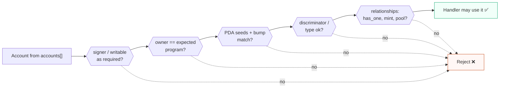

# Solana audit workflow for Solidity auditors

Use this as a first-pass workflow before deep protocol-specific analysis.

## 1. Inventory

- Program IDs and deployed addresses.
- Upgradeability and upgrade authority / buffer authority.
- Anchor version, Solana/SPL crate versions, Token vs Token-2022 support.
- Admin/governance/multisig/timelock accounts.

## 2. Instruction-by-instruction account validation matrix

For every instruction, build a matrix for every account:

- Role / account name
- Signer required?
- Writable required?
- Expected owner / program id
- Executable?
- PDA seeds and canonical/stored bump
- Discriminator/type/version
- Relationship checks: `has_one`, pool/user/mint/market/config links
- Token checks: token program, mint, authority, ATA derivation, delegates, close/freeze authority, Token-2022 extensions
- Sysvar address check

Think of it as a gauntlet every account must pass *before* the handler trusts it. Any gate skipped is a candidate finding.

## 3. CPI review

- Pin CPI target program IDs.
- Ensure CPI account metas are the already-validated accounts.
- Minimize writable/signer privileges.
- Re-load accounts after CPI before post-condition checks.

## 4. Lifecycle review

- Init/reinit/`init_if_needed`.
- Realloc size, rent payer, zeroing, max growth.
- Close/refund recipient and same-transaction reuse.
- Native SOL lamport movement and rent floors.

## 5. Math and accounting

- Checked arithmetic and `u128` intermediates.
- Decimal/exponent normalization.
- Rounding direction and repeated-small-action attacks.
- Token-2022 fees/hooks/extensions if accepted.

## 6. Oracle/economic/MEV review

- Feed identity, owner/program, freshness, confidence, status.
- Liquidity and manipulation cost.
- Slippage and stale quote protections.
- Priority fees, private orderflow, bundles, liquidations, auctions.

## 7. Native/non-Anchor deep checks

- `next_account_info` order assumptions.
- Manual offsets / unchecked deserialization / zero-copy layout.
- `unsafe` blocks.
- Release overflow behavior.

## 8. Test prompts

- Can I replace one valid account with another valid account of the same type?
- Can I make fake accounts that only cross-check against each other?
- Can I pass the same writable account for two logical roles?
- Can I pass accounts in a different order?
- Can I choose the CPI target or CPI accounts?
- Can I reinitialize or revive after close/realloc?
- Can low liquidity or stale oracle data inflate collateral value?
