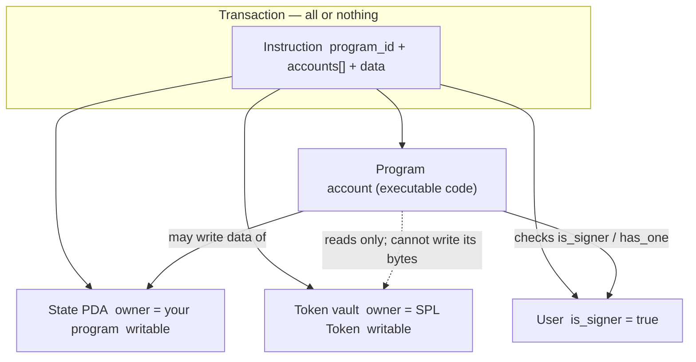
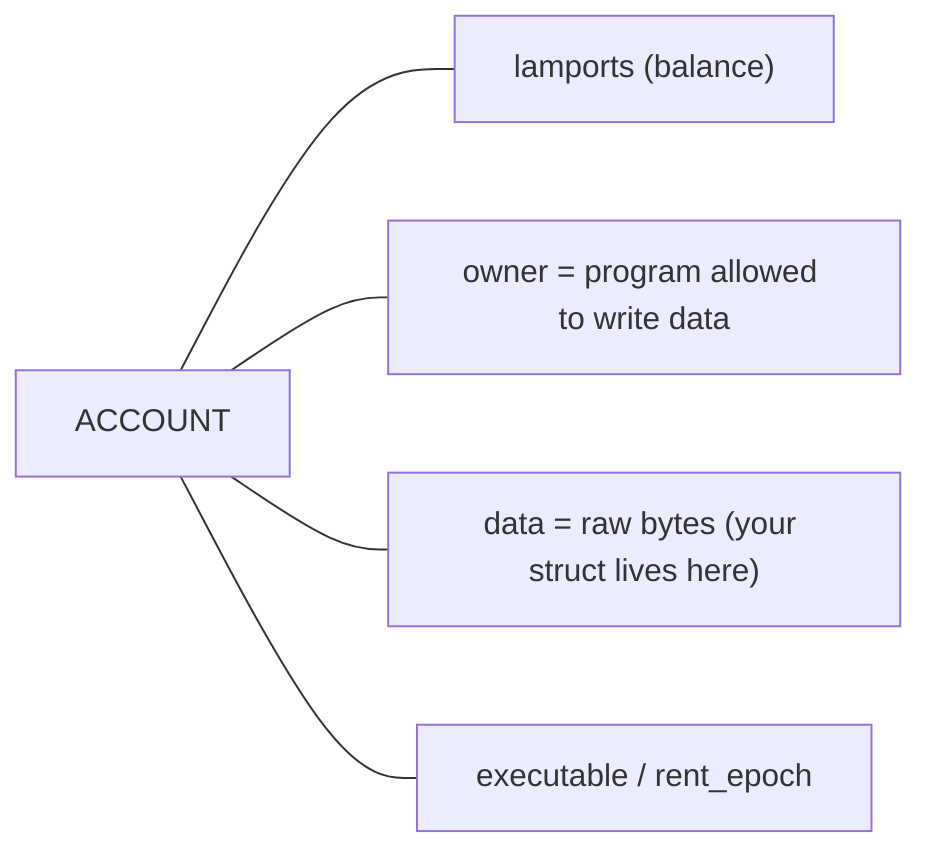
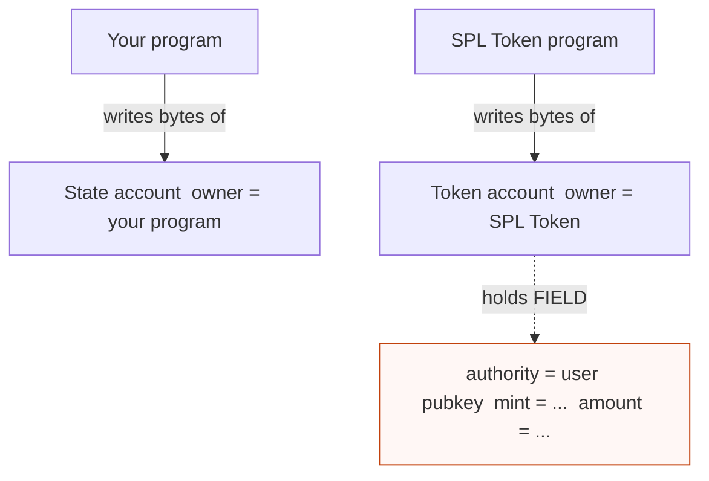
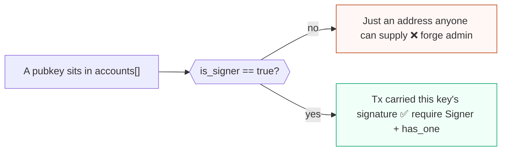
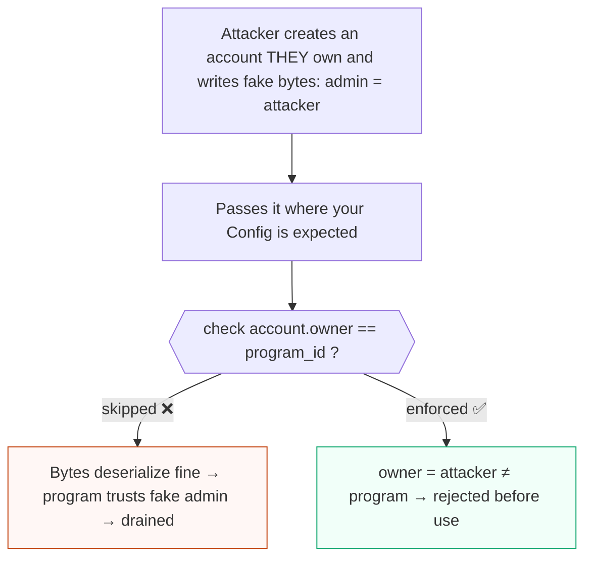
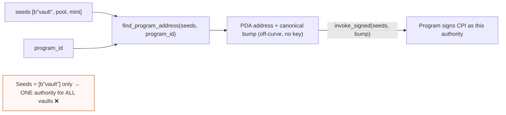
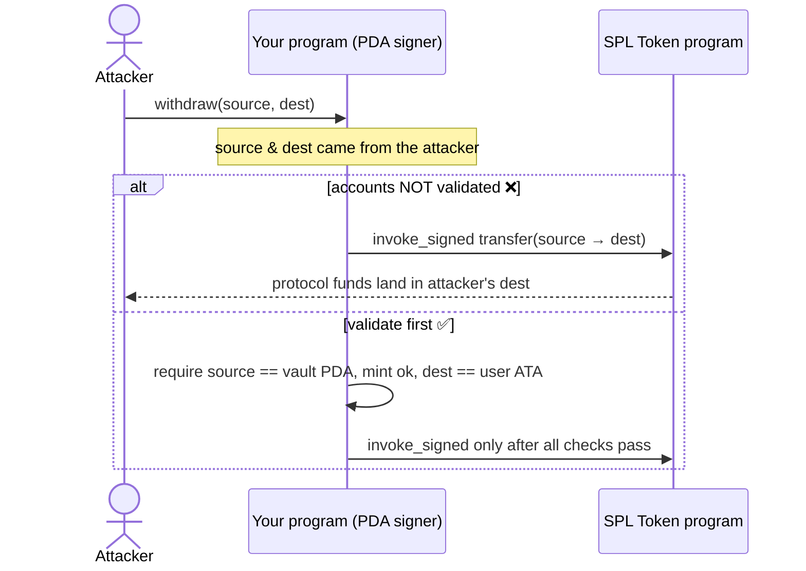
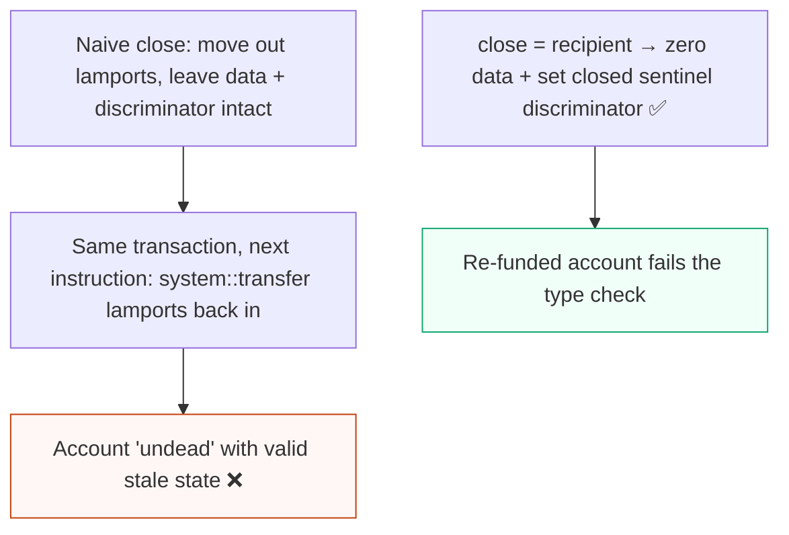

# Solana security audit notes for Solidity auditors

Audience: experienced Ethereum/Solidity auditor reviewing Solana programs. Emphasis: Solana account model, PDAs, CPI, signer/writable semantics, ownership, CTF-style bugs.

## Mental model differences vs Solidity

- **Code and state are separate.** Programs are executable accounts, often with separate ProgramData when upgradeable. They do not have implicit per-contract storage like EVM contracts; persistent protocol/user state lives in separate accounts supplied by the transaction. A handler must validate every account it uses.
- **Callers choose most accounts.** Unlike Solidity where `address(this).storage` is implicit, Solana instructions receive an arbitrary `AccountInfo[]`. Missing account validation is the root of many bugs.
- **Authorization is not `msg.sender`.** Any account can be passed; `is_signer` only means the transaction included that account's signature, and PDAs can “sign” only via `invoke_signed` with valid seeds.
- **Mutability is declared up front.** Accounts must be marked writable in the transaction/CPI to change data or lamports. Bugs often come from failing to require/check `is_writable`, duplicate writable aliases, or assuming readonly means safe.
- **Ownership is data-write authority, not asset ownership.** Only an account’s owning program may modify its data, resize it, or assign it under normal runtime rules. Lamport decreases are separately constrained by runtime ownership/signature/program rules, while lamport credits can generally be made to writable accounts. Token ownership is SPL Token state, not Solana account `owner`.
- **CPI is like an external call, but with explicit accounts and program id.** The caller supplies the callee program account and all callee accounts; arbitrary-CPI bugs occur when program IDs are not pinned.
- **Transactions are atomic, and account locks drive parallel execution.** A transaction succeeds or fails as a unit; declared writable accounts are locked and constrain parallelism. Compute and account-lock choices can become DoS surfaces.

## How an instruction executes (visual)

In EVM you call a contract and it reaches into its own storage. On Solana the **caller hands the program every account it will touch**, as a flat list, with per-account `is_signer` / `is_writable` flags. The program must prove each one is the account it expected.

The caller chooses PROG, S, V, U. Nothing is implicit — every arrow is a check the program must perform.

**Anatomy of any account.** The four runtime fields below are the *only* trust primitives the runtime gives you. Everything else (`admin`, `mint`, `amount`, `bump`) is just bytes in `data` that some program wrote.

**The trap Solidity auditors fall into: `owner` ≠ token owner.** Account `owner` is *who may write the bytes*. The token holder is a **field inside** a token account whose `owner` is the SPL Token program.

## Pitfalls / vulnerability notes

### 1. Missing signer authorization
- **Why Solana-specific / different:** There is no automatic `msg.sender` for a privileged account. A pubkey appearing in account data or in the account list is not proof of authorization.
- **Bad pattern:** `if ctx.accounts.user.key() == state.admin { ... }` but `user` is `AccountInfo`/`UncheckedAccount` and not required to sign.
- **Mitigation:** Require `account.is_signer`; in Anchor use `Signer<'info>` or `#[account(signer)]`, plus relationship constraints such as `has_one = admin`.

- **References:**
  - Solana Program Security course, signer auth: https://github.com/solana-foundation/developer-content/blob/main/content/courses/program-security/signer-auth.md
  - Anchor account constraints: https://www.anchor-lang.com/docs/references/account-constraints

### 2. Missing owner check / fake account data
- **Why different:** Account data deserialization from `AccountInfo` does not by itself prove that the data was written by the expected program. Attackers can create accounts they own with spoofed bytes unless ownership is checked.
- **Bad pattern:** Deserialize a config/vault/user state from an arbitrary account and trust fields like `admin`, `balance`, `mint`, or `bump`.
- **Mitigation:** Check `account.owner == program_id` for program state; for SPL Token accounts check owner is the SPL Token program and validate token-account fields. In Anchor prefer `Account<'info, T>`, `Program<'info, Token>`, or `#[account(owner = ...)]`.

- **References:**
  - Solana accounts docs: https://solana.com/docs/core/accounts
  - Program Security owner checks: https://github.com/solana-foundation/developer-content/blob/main/content/courses/program-security/owner-checks.md
  - Neodyme common pitfalls: https://neodyme.io/en/blog/solana_common_pitfalls/

### 3. Missing account data matching / relationship checks
- **Why different:** The user supplies all accounts, so a valid account of the correct type can still be the wrong account for this instruction.
- **Bad pattern:** Withdraw from `vault` using `user` but never verify `vault.authority == user.key()` or `position.pool == pool.key()`.
- **Mitigation:** Validate all relationships: `has_one`, stored pubkeys, mint matches, token account authority, vault PDA derivation, pool/market IDs. In Anchor use `#[account(has_one = ...)]`, `constraint = ...`, and seed constraints.
- **References:**
  - Account data matching: https://github.com/solana-foundation/developer-content/blob/main/content/courses/program-security/account-data-matching.md
  - Anchor constraints: https://www.anchor-lang.com/docs/references/account-constraints

### 4. Type cosplay / discriminator confusion
- **Why different:** Raw account bytes can be interpreted as any struct if no discriminator/type tag is enforced. This resembles storage layout confusion more than a typical Solidity bug.
- **Bad pattern:** Two account types share compatible layouts; handler deserializes unchecked bytes as `AdminConfig` when the account is actually `UserProfile`.
- **Mitigation:** Use Anchor `#[account]` types, which include an 8-byte discriminator, or implement explicit discriminators/magic/version fields in native programs.
- **References:**
  - Type cosplay: https://github.com/solana-foundation/developer-content/blob/main/content/courses/program-security/type-cosplay.md
  - Sealevel attacks examples: https://github.com/coral-xyz/sealevel-attacks

### 5. Reinitialization / initialization confusion
- **Why different:** Account allocation, ownership assignment, and initialization are explicit steps. An existing account can be reused if the program only checks size/owner loosely or forgets an initialized flag.
- **Bad pattern:** `initialize` overwrites admin/config on an already-initialized account; or `init_if_needed` is used without protecting against state reset.
- **Mitigation:** Use Anchor `init` for one-time creation; store and check `is_initialized`/version; be very cautious with `init_if_needed`; validate discriminator and expected zeroed state only for new accounts.
- **References:**
  - Reinitialization attacks: https://github.com/solana-foundation/developer-content/blob/main/content/courses/program-security/reinitialization-attacks.md
  - Anchor account constraints (`init`, `init_if_needed`): https://www.anchor-lang.com/docs/references/account-constraints

### 6. PDA seed/bump mistakes and non-canonical bumps
- **Why different:** PDAs are deterministic addresses controlled by a program, used as authorities/signers. Multiple valid bumps may exist for the same seed prefix if the bump is caller-chosen; this is not a cryptographic collision, but multiple valid PDA addresses for one logical resource.
- **Bad pattern:** Accept user-supplied bump with `create_program_address` and do not ensure it is the canonical bump from `find_program_address`; use low-entropy/shared seeds; omit domain separators.
- **Mitigation:** Use canonical bump from `find_program_address`; persist the bump when needed; in Anchor use `seeds = [...]` and `bump`; include unique domain prefixes and relevant account keys in seeds.

A PDA is a deterministic address with **no private key** — the program "signs" for it by re-supplying the seeds. Scope the seeds tightly or one authority ends up controlling everything.

- **References:**
  - Solana PDA docs: https://solana.com/docs/core/pda
  - Bump seed canonicalization: https://github.com/solana-foundation/developer-content/blob/main/content/courses/program-security/bump-seed-canonicalization.md

### 7. PDA sharing / overly broad PDA authority
- **Why different:** A PDA may act as signing authority for many resources. If seeds are global or under-scoped, privileges intended for one pool/user/market can apply to another.
- **Bad pattern:** Single `vault_authority = PDA("vault")` controls all vaults; any instruction that can sign for it can move assets across unrelated vaults.
- **Mitigation:** Scope seeds to the protected object: `PDA("vault", pool.key(), mint.key())`; validate token vault belongs to that PDA and the expected mint/pool.
- **References:**
  - PDA sharing: https://github.com/solana-foundation/developer-content/blob/main/content/courses/program-security/pda-sharing.md
  - Solana PDA docs: https://solana.com/docs/core/pda

### 8. Arbitrary CPI / missing program ID check
- **Why different:** CPI target program account is often passed by the caller. If not checked, an attacker can pass a malicious program that accepts the same accounts and returns success or performs unintended actions.
- **Bad pattern:** Build `Instruction { program_id: supplied_program.key(), ... }` and call `invoke` without ensuring it is `spl_token::ID`, System Program, associated token program, etc.
- **Mitigation:** Pin program IDs. In Anchor use `Program<'info, Token>`, `Program<'info, System>`, CPI helper crates, or explicit `require_keys_eq!(program.key(), expected_id)`.
- **References:**
  - CPI docs: https://solana.com/docs/core/cpi
  - Arbitrary CPI: https://github.com/solana-foundation/developer-content/blob/main/content/courses/program-security/arbitrary-cpi.md
  - Anchor CPI basics: https://www.anchor-lang.com/docs/basics/cpi

### 9. CPI account substitution / confused deputy
- **Why different:** Even if the callee program ID is correct, every callee account is also caller-supplied. The current program may sign with a PDA over attacker-selected token accounts.
- **Bad pattern:** Program signs an SPL Token `transfer` from `source` to `dest` but does not verify `source` is the protocol vault, `source.owner == vault_authority`, mint matches, and `dest` is the user’s expected ATA.
- **Mitigation:** Validate all CPI accounts before invoking; prefer associated token account constraints; check token account `mint`, `owner/authority`, and PDA seeds.

Even with the *right* token program, the `source`/`dest` accounts are still caller-supplied. Your PDA will happily sign a transfer out of the wrong vault if you don't pin them.

- **References:**
  - CPI docs: https://solana.com/docs/core/cpi
  - Anchor SPL constraints (`token::mint`, `token::authority`, `associated_token::*`): https://www.anchor-lang.com/docs/references/account-constraints

### 10. Duplicate mutable accounts / aliasing
- **Why different:** The same account pubkey can be supplied for multiple account parameters unless explicitly constrained. Two mutable references that the code assumes distinct can alias.
- **Bad pattern:** `transfer_rewards(from, to)` where `from` and `to` may be the same account, bypassing balance checks or causing double-credit/debit logic; game examples where player A and B accounts can be identical.
- **Mitigation:** For every pair that must be distinct, check `a.key() != b.key()`; in Anchor use `constraint = a.key() != b.key()`.
- **References:**
  - Duplicate mutable accounts: https://github.com/solana-foundation/developer-content/blob/main/content/courses/program-security/duplicate-mutable-accounts.md
  - Sealevel attacks: https://github.com/coral-xyz/sealevel-attacks

### 11. Writable/signer privilege assumptions in CPI
- **Why different:** Signer and writable privileges propagate only according to the caller’s account metas and runtime rules; a callee cannot write an account not marked writable by the transaction/CPI. Conversely, marking too many accounts writable increases attack and DoS surface.
- **Bad pattern:** Native program mutates lamports/data without checking account is writable and relying on runtime failure late; CPI marks attacker-controlled accounts writable/signer-capable unnecessarily.
- **Mitigation:** Require mutability only where needed (`#[account(mut)]`); check writable for raw `AccountInfo`; minimize CPI metas; treat `is_signer`/`is_writable` as privileges to validate, not business-logic identity.
- **References:**
  - Transactions/account metas: https://solana.com/docs/core/transactions
  - CPI docs: https://solana.com/docs/core/cpi

### 12. Sysvar spoofing
- **Why different:** Sysvars can be loaded either from trusted sysvar APIs or passed as accounts. If passed unchecked, an attacker may provide a fake account with spoofed clock/instructions/rent data.
- **Bad pattern:** Read `Clock` or `Instructions` sysvar from an arbitrary `AccountInfo` without checking the sysvar ID.
- **Mitigation:** Use `Clock::get()`, `Rent::get()`, etc. when available; otherwise check `account.key == sysvar::clock::ID` / appropriate ID and owner. In Anchor use `Sysvar<'info, Clock>`.
- **References:**
  - Solana sysvar module docs: https://docs.rs/solana-program/latest/solana_program/sysvar/index.html
  - Anchor account types/constraints: https://www.anchor-lang.com/docs/references/account-constraints

### 13. Account close, revival, and stale data
- **Why different:** Closing is usually implemented by transferring lamports and assigning/zeroing data. Historically/CTF-style, if data/discriminator remains and lamports are later restored in the same transaction, a “closed” account can be revived or reused unexpectedly.
- **Bad pattern:** Drain lamports but leave owner/data/discriminator as valid program state; later instruction in same transaction re-funds account and uses stale state. Another variant branches on `lamports == 0` or an exact rent balance even though anyone can `system::transfer` lamports into a PDA.
- **Mitigation:** Prefer Anchor `close = recipient` and verify exact behavior for the Anchor version in scope; for manual closes, clear/invalidate data, refund lamports intentionally, and ensure no subsequent same-transaction logic trusts the account. Older defensive patterns use a closed-account sentinel such as `CLOSED_ACCOUNT_DISCRIMINATOR` so a re-funded account still fails type checks.

Because everything is atomic, an attacker can re-fund a "closed" account *later in the same transaction*. If you only drained lamports, the still-valid data revives.

- **References:**
  - Closing accounts: https://github.com/solana-foundation/developer-content/blob/main/content/courses/program-security/closing-accounts.md
  - Anchor `close` constraint: https://www.anchor-lang.com/docs/references/account-constraints

### 14. Rent-exemption and storage resizing edge cases
- **Why different:** Accounts must hold enough lamports for rent-exempt storage, and reallocating data changes required balance. In current Solana practice, “rent” usually means minimum balance/account lifecycle, not an Ethereum-like recurring storage fee. Storage is not a free mapping slot as in EVM.
- **Bad pattern:** `realloc` to larger size without funding rent; shrink/grow without zeroing new bytes; leave sensitive or type-confusing stale bytes; assume closed/zero-lamport accounts cannot reappear in same transaction.
- **Mitigation:** Use Anchor `realloc`, `realloc::payer`, `realloc::zero` constraints; recompute rent for final size; zero newly allocated regions when needed; test shrink/grow/close flows.
- **References:**
  - Solana accounts/rent: https://solana.com/docs/core/accounts
  - Anchor realloc constraints: https://www.anchor-lang.com/docs/references/account-constraints

### 15. Integer overflow/underflow and precision/rounding
- **Why different:** Unlike Solidity 0.8 checked arithmetic, Rust primitive integer overflow is not automatically safe in optimized Solana program builds unless overflow checks or checked/saturating APIs are used. Solana programs commonly use fixed-point math, token decimals, and `u64` lamports/token amounts. Solidity auditors will recognize this class, but Rust/Solana APIs make checked math a conscious choice.
- **Bad pattern:** `balance -= amount`, `amount * price / scale`, or reward-per-share math without `checked_*`, larger intermediate type, rounding policy, or decimal normalization.
- **Mitigation:** Use `checked_add/sub/mul/div`, `u128` intermediates, explicit rounding direction, decimal bounds, and invariant tests/fuzzing. Be careful with division before multiplication and fee rounding that can be exploited by repeated small trades.
- **References:**
  - Neodyme common pitfalls (overflow/precision examples): https://neodyme.io/en/blog/solana_common_pitfalls/
  - Solana Program Security overview: https://github.com/solana-foundation/developer-content/tree/main/content/courses/program-security

### 16. Instruction introspection / Ed25519 or secp verification misuse
- **Why different:** Signature verification programs and the Instructions sysvar are often used to validate off-chain signatures. The verified message/signature instruction must be tied to the current instruction and expected data.
- **Bad pattern:** Check that an Ed25519 instruction exists somewhere in the transaction but not that it immediately precedes/current-index matches, or not that its message encodes this user/action/amount/nonce.
- **Mitigation:** Parse the Instructions sysvar carefully; verify program ID, instruction index, signer key, message domain separator, nonce, expiry, and exact action parameters.
- **References:**
  - Instructions sysvar docs: https://docs.rs/solana-program/latest/solana_program/sysvar/instructions/index.html
  - Sysvar docs: https://docs.rs/solana-program/latest/solana_program/sysvar/index.html

### 17. Compute budget and algorithmic DoS
- **Why different:** Every transaction has compute-unit limits and account-size limits; there is no unbounded loop over contract storage, but attackers can supply large vectors/accounts or trigger expensive CPIs until compute exhaustion.
- **Bad pattern:** Iterate over user-provided remaining accounts or vector length without bounds; O(n²) validation; repeated PDA derivations/CPIs; requiring many writable “hot” accounts that serialize all users.
- **Mitigation:** Bound input lengths; price fees by work; avoid unbounded `remaining_accounts`; cap CPIs; use efficient data structures; split work into deterministic chunks; minimize global writable accounts.
- **Useful constants:** Solana transactions have a 1.4M compute-unit hard cap by default budget rules and commonly start at 200k CU per instruction unless a Compute Budget instruction raises the limit. CPI stack depth is limited to 4 nested invocations beyond the transaction entrypoint. Legacy transactions are capped at 1232 bytes, so long router account lists often require v0 transactions with Address Lookup Tables.
- **References:**
  - Solana fees/compute budget docs: https://solana.com/docs/core/fees
  - Transactions docs: https://solana.com/docs/core/transactions

### 18. Transaction atomicity and same-transaction composition assumptions
- **Why different:** Multiple instructions from multiple programs execute atomically in one transaction. Attackers can prepare state with earlier instructions and consume/restore it with later ones; failed final instruction rolls back all effects.
- **Bad pattern:** Assume an account could not have been created, funded, closed, or modified earlier in the same transaction; rely on “temporary” imbalance or lack of post-condition after CPI.
- **Mitigation:** Validate state at the point of use and after CPIs; design instructions to be safe under arbitrary composition; be explicit about order-sensitive flows using nonces/status flags.
- **References:**
  - Transactions docs: https://solana.com/docs/core/transactions
  - Closing accounts course (same-transaction revival class): https://github.com/solana-foundation/developer-content/blob/main/content/courses/program-security/closing-accounts.md

### 19. Parallelization/account-lock DoS and hot accounts
- **Why different:** Solana parallelizes transactions whose writable account sets do not conflict. A design with one global writable config/counter/vault can serialize all activity and be spammed.
- **Bad pattern:** Every trade/deposit writes the same global state account; admin/config unnecessarily marked mutable in all user flows.
- **Mitigation:** Keep immutable config readonly; shard state by market/user; avoid global mutable counters where possible; only mark accounts mutable when actually changed.
- **References:**
  - Transactions/account locking: https://solana.com/docs/core/transactions
  - Accounts docs: https://solana.com/docs/core/accounts

### 20. SPL Token / Token-2022 account validation gaps
- **Why different:** Token balances/authority are data inside SPL Token accounts owned by token programs. Native SOL lamports and SPL tokens have different rules; Token-2022 can add extensions/transfer hooks/confidential features.
- **Bad pattern:** Accept any token account as a vault; check only token account owner authority but not mint; assume ATA address without deriving; ignore Token-2022 extensions or transfer fees in accounting.
- **Mitigation:** Check token program ID, mint, token account authority, ATA derivation when required, decimals, extensions/fees/hooks; use Anchor SPL constraints and test both SPL Token and Token-2022 if supported. Routers need explicit policy for transfer hooks that require extra CPI accounts, transfer fees where amount in differs from amount out, permanent delegates that can move funds, interest-bearing mints where UI amounts drift from raw amounts, and confidential/non-transferable extensions that break normal transfer assumptions. ATA derivation must thread the intended token program with `get_associated_token_address_with_program_id`, not assume classic SPL Token.
- **References:**
  - Anchor SPL constraints: https://www.anchor-lang.com/docs/references/account-constraints
  - Solana token program docs: https://spl.solana.com/token
  - Token-2022 docs: https://spl.solana.com/token-2022

### 21. Address Lookup Tables as a trust boundary
- **Why different:** Versioned transactions resolve Address Lookup Table entries before the program executes. A program that stores or accepts an ALT pubkey is only storing metadata unless it validates the ALT account and its state.
- **Bad pattern:** Store an ALT pubkey in config and later assume routes using that ALT resolve to approved vaults/reserves without checking the table owner, authority, deactivation slot, or resolved account keys.
- **Mitigation:** If an ALT account is passed to the program, require the Address Lookup Table program as owner, parse table state, verify authority/deactivation status, and bind expected indexes to expected pubkeys. Remember that the executing program normally sees resolved account keys, not the ALT itself; validate the actual accounts used by the instruction.
- **References:**
  - Address Lookup Tables: https://solana.com/docs/advanced/lookup-tables
  - Transactions docs: https://solana.com/docs/core/transactions

## CTF-style audit checklist

- Can I pass a fake account with matching serialized bytes?
- Can I pass the same writable account for two roles?
- Can I swap one valid account of the right type for another user/pool/mint?
- Can I omit a signature or use a signer that is unrelated to stored authority?
- Can I choose a malicious CPI target program or malicious CPI accounts?
- Can I make the program sign for a PDA over assets it did not intend to authorize?
- Can I choose non-canonical PDA seeds/bumps or collide/shared PDA authority scope?
- Can I re-run initialize, reset state, or use `init_if_needed` to revive/reset data?
- Can I close/refund/recreate an account within the same transaction and reuse stale state?
- Can I spoof sysvars or instruction introspection inputs?
- Can I exploit overflow, decimal mismatch, or rounding by splitting actions?
- Can I exhaust compute with long `remaining_accounts`, large vectors, many CPIs, or hot writable accounts?
- Are all post-CPI invariants rechecked, especially balances and token account state?

## High-signal reference set

- Solana docs: accounts: https://solana.com/docs/core/accounts
- Solana docs: transactions: https://solana.com/docs/core/transactions
- Solana docs: programs: https://solana.com/docs/core/programs
- Solana docs: PDAs: https://solana.com/docs/core/pda
- Solana docs: CPIs: https://solana.com/docs/core/cpi
- Solana docs: fees/compute: https://solana.com/docs/core/fees
- Solana Foundation Program Security course: https://github.com/solana-foundation/developer-content/tree/main/content/courses/program-security
- Anchor account constraints: https://www.anchor-lang.com/docs/references/account-constraints
- Anchor CPI docs: https://www.anchor-lang.com/docs/basics/cpi
- Coral/Anchor Sealevel attacks repo: https://github.com/coral-xyz/sealevel-attacks
- Neodyme Solana common pitfalls: https://neodyme.io/en/blog/solana_common_pitfalls/
- Solana sysvar docs: https://docs.rs/solana-program/latest/solana_program/sysvar/index.html
- SPL Token docs: https://spl.solana.com/token
- Token-2022 docs: https://spl.solana.com/token-2022

## Additional expert-review patterns added to the site

The interactive site now includes dedicated cards for several patterns that were previously only implicit or missing:

- Stale account data after CPI / missing Anchor `reload()`
- Instruction introspection and Ed25519/secp signature verification misuse
- Insecure randomness from slots/timestamps/blockhash-like values
- Detailed oracle feed validation: feed identity, freshness, confidence, exponent/decimals, liquidity
- `remaining_accounts` count/order/type assumptions
- Native SOL lamport accounting and rent floors
- Zero-copy / bytemuck / POD layout hazards
- Event/log reliance as non-authoritative state
- Governance/multisig/timelock validation gaps
- Native parser hazards: manual offsets, unchecked deserialization, versioned layouts

For concrete native and Anchor bad/good snippets, see `data/patterns.json` or the website cards.
