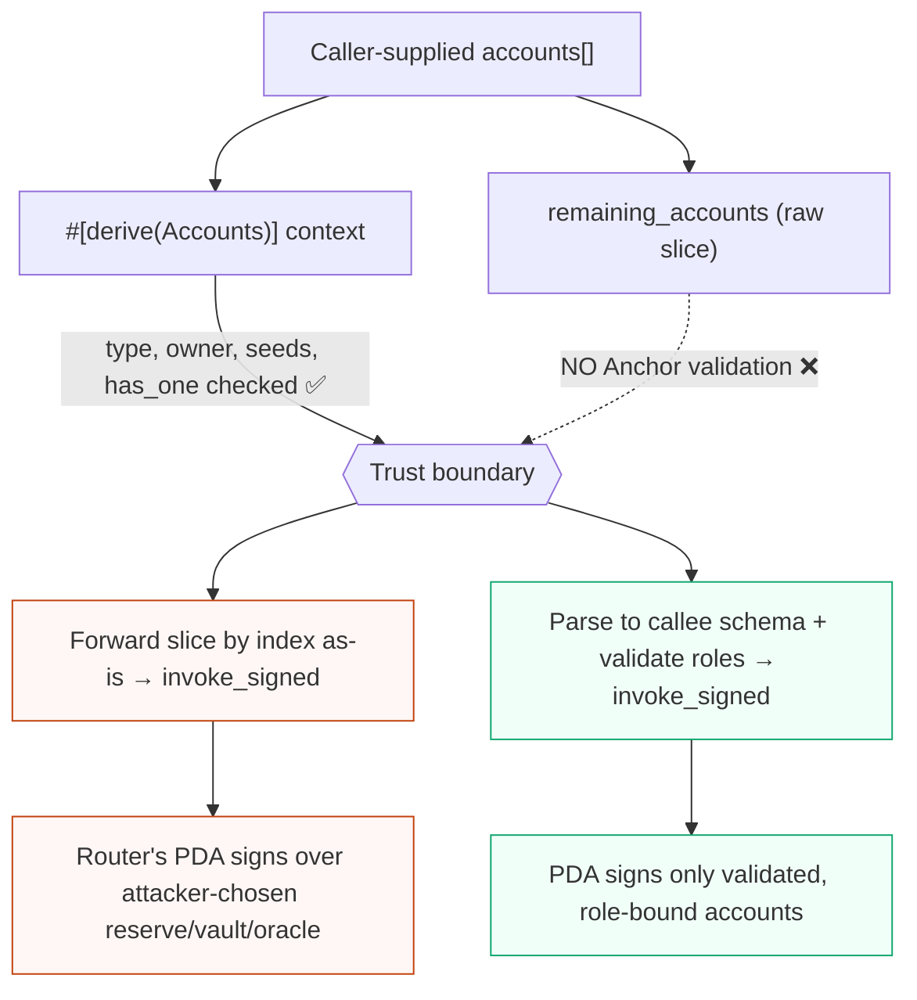

# `remaining_accounts` as a CPI trust boundary

`ctx.remaining_accounts` is outside Anchor's `#[derive(Accounts)]` validation. Router-style programs often forward that slice into another protocol CPI. In that design, the boundary between validated context accounts and forwarded accounts is security-critical.

Anchor's `#[derive(Accounts)]` is a wall: everything *inside* the struct is type/owner/seed/relationship checked. `remaining_accounts` arrives **outside that wall** — raw, caller-ordered, unchecked — and the router carries it straight into a CPI that the router's own PDA signs.



## Core rule

Forwarded accounts must be validated against the callee's account schema before the CPI. "The downstream program will fail if wrong" is not enough when the current program signs with a PDA, marks accounts writable, or relies on the CPI outcome for accounting.

## Subset and disjointness checks

Decide which validated context accounts may appear in the forwarded slice:

- If a validated account must be forwarded, require it at the exact callee slot.
- If a validated account must not be forwarded, reject it from the slice.
- If duplicate roles are unsafe, reject duplicate keys across the fixed context and the slice.

Bad:
```rust
let cpi_accounts = ctx.remaining_accounts.to_vec();
invoke(&ix, &cpi_accounts)?;
```

Good:
```rust
let reserve = &ctx.remaining_accounts[RESERVE_INDEX];
require_keys_eq!(reserve.key(), ctx.accounts.expected_reserve.key());

for acc in ctx.remaining_accounts {
    require_keys_neq!(acc.key(), ctx.accounts.user_authority.key(), ErrorCode::Alias);
}
```

The exact allowed-overlap policy is protocol-specific. Make it explicit.

## Writable and signer flag rules

Writable status is a privilege. A router should not silently upgrade an account to writable for the CPI if the user or validated context treated it as readonly. It should also not drop writable flags required by the callee and then rely on confusing downstream failures.

Review every forwarded meta:

- Does the callee need this account writable?
- Was the account writable in the outer transaction?
- Is any readonly validated account reintroduced as writable in `remaining_accounts`?
- Are signer bits expected, or is PDA signing performed with explicit `invoke_signed` seeds?

Adding `is_signer` in an `AccountMeta` does not create a signature; runtime signer privilege must already exist or be supplied by `invoke_signed`. Adding `is_writable` can expand mutation authority when the original transaction made the account writable somewhere in the account list.

## Read the callee IDL

For Kamino kvault, KLend reserve, and similar account-heavy CPIs, read the callee IDL or source and map:

- Required account order.
- Which accounts must be writable.
- Which accounts must sign.
- Which program IDs are expected.
- Event-authority and program trailing slots.
- Instructions sysvar expectations.
- Reserve, market, vault, mint, token-account, and oracle relationships.

Anchor's IDL is not just documentation here. It is the schema the router must enforce before it forwards accounts.

## Router forwarding pattern

Risky router pattern:
```rust
let metas = ctx
    .remaining_accounts
    .iter()
    .map(|acc| AccountMeta {
        pubkey: acc.key(),
        is_signer: acc.is_signer,
        is_writable: acc.is_writable,
    })
    .collect::<Vec<_>>();

invoke_signed(&Instruction { program_id: kamino_program.key(), accounts: metas, data }, all_accounts, seeds)?;
```

Safer shape:
```rust
let schema = KaminoDepositAccounts::parse(ctx.remaining_accounts)?;
schema.validate_against(&ctx.accounts)?;

let metas = schema.to_account_metas(); // derived from validated roles, not raw caller order
invoke_signed(&Instruction { program_id: KAMINO_ID, accounts: metas, data }, schema.infos(), seeds)?;
```

The helper can still be small, but it should make account roles explicit rather than forwarding an arbitrary slice by index.

## Audit checklist

- Is the expected `remaining_accounts` length bounded or exact?
- Is the fixed-account / remaining-account split impossible to shift?
- Are forwarded accounts checked against the callee IDL/source, not just local assumptions?
- Are context accounts required, forbidden, or allowed in the forwarded slice by explicit policy?
- Are writable and signer privileges minimized and checked?
- Are callee program ID, event authority, instructions sysvar, reserve/market/oracle, and token program accounts pinned where required?
